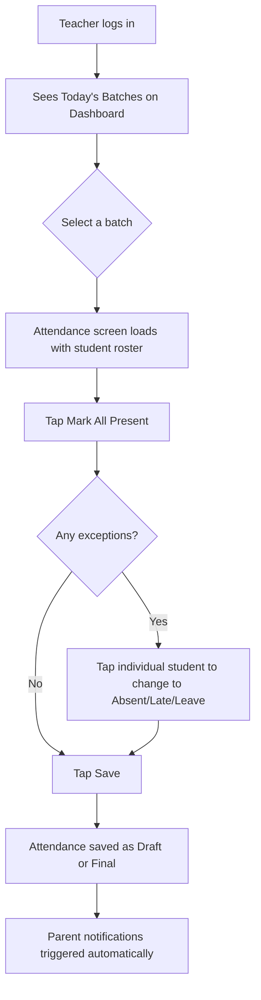
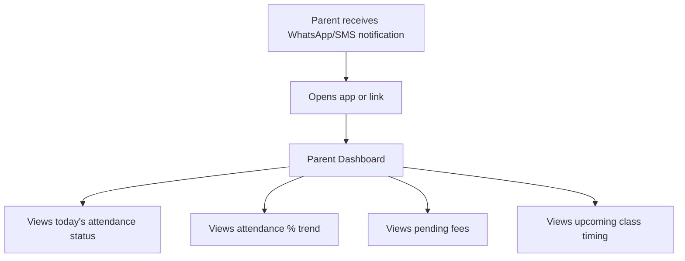
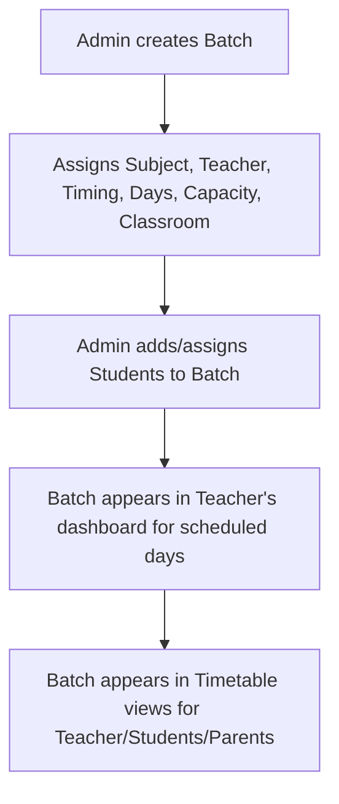

# Product Requirements Document — Attendance Management System for Coaching Institutes

## 1. Document Purpose & Scope of This File

This document is the **primary product reference** for the Attendance Management System (AMS). It defines *what* the system must do, *for whom*, *why*, and *under what rules and constraints* — independent of technology stack, database schema, or UI component design (those belong in separate architecture, data-model, and design documentation).

This document is written to be directly consumable by AI coding agents and human developers as the ground truth for feature scope, business rules, and acceptance criteria. Where a requirement was ambiguous in the source feature list, a practical, production-ready assumption has been made and explicitly flagged as **[ASSUMPTION]**.

---

## 2. Product Vision

Small and mid-sized coaching institutes (tuition classes, exam-prep centers, skill academies) in India currently manage attendance, batches, and parent communication manually — via registers, WhatsApp groups, or spreadsheets. This is slow, error-prone, and gives owners no real-time visibility into operations.

**Vision:** Give coaching institute owners a mobile-first, dead-simple system where a teacher can mark a batch's attendance in under 15 seconds, parents are notified automatically, and the owner can see the health of the entire institute (attendance %, dues, admissions) from a single dashboard — without needing training or technical staff.

---

## 3. Objectives

| # | Objective | Why it matters |
|---|---|---|
| O1 | Reduce attendance-marking time to under 15 seconds per batch | Teachers won't adopt a tool that's slower than a paper register |
| O2 | Automate parent communication on attendance | Removes manual WhatsApp messaging burden from owners/teachers |
| O3 | Give owners a real-time operational dashboard | Replaces end-of-month manual reconciliation |
| O4 | Provide historical, exportable attendance records | Needed for parent disputes, audits, and compliance-style record keeping |
| O5 | Support multi-batch, multi-teacher institutes | Coaching institutes rarely run just one batch |
| O6 | Be usable entirely from a phone | Primary persona (teacher, owner) is often not desk-bound |
| O7 | Be architected to extend into a full learning platform | Homework, notes, and announcements are the first steps toward this |

---

## 4. Target Audience

### 4.1 Primary Market
Small-to-mid-sized coaching institutes, tuition classes, and skill-training academies, typically:
- 1–10 teachers
- 50–1,000 students
- 1–20 active batches
- Located in Tier-1/Tier-2 Indian cities (e.g., Pune, Mumbai)
- Currently using registers, Excel, or WhatsApp for attendance and communication

### 4.2 User Personas

| Persona | Role | Primary Device | Core Need |
|---|---|---|---|
| **Owner/Director** | Admin | Phone + occasional desktop | Visibility & control across the whole institute |
| **Subject Teacher** | Teacher | Phone | Fast attendance marking, minimal typing |
| **Parent** | Parent | Phone (WhatsApp-first) | "Is my child okay / did they attend?" |
| **Student** | Student | Phone | "What's my attendance %? Did I miss homework?" |

---

## 5. User Roles & Permissions

### 5.1 Role Definitions

| Role | Description |
|---|---|
| **Admin (Coaching Owner)** | Full control over the institute's data, staff, students, batches, and settings |
| **Teacher** | Operates day-to-day for their assigned batches |
| **Student** | Read-only access to their own academic data |
| **Parent** | Read-only access to their child(ren)'s academic and fee data |

### 5.2 Permission Matrix

| Capability | Admin | Teacher | Student | Parent |
|---|:---:|:---:|:---:|:---:|
| Create/edit/delete students | ✅ | ❌ | ❌ | ❌ |
| Create/edit/delete batches | ✅ | ❌ | ❌ | ❌ |
| Assign teachers to batches | ✅ | ❌ | ❌ | ❌ |
| Mark attendance (own batches) | ✅ | ✅ | ❌ | ❌ |
| Mark attendance (any batch) | ✅ | ❌ | ❌ | ❌ |
| Edit past attendance | ✅ | ✅ (own batch, time-limited — see §8.4) | ❌ | ❌ |
| View attendance (own/child) | ✅ | ✅ (own batches) | ✅ (self only) | ✅ (own children only) |
| View attendance (institute-wide) | ✅ | ❌ | ❌ | ❌ |
| Generate reports | ✅ | ✅ (own batches only) | ❌ | ❌ |
| View/manage fees | ✅ | ❌ | ❌ (view own, if enabled) | ✅ (view own children) |
| Post announcements | ✅ | ❌ (view only) | View only | View only |
| Upload homework/notes | ✅ | ✅ (own batches) | View/download only | View only (if child enrolled) |
| Manage timetable | ✅ | View only (own schedule) | View only (own schedule) | View only (child's schedule) |
| System settings (notification channels, etc.) | ✅ | ❌ | ❌ | ❌ |

**[ASSUMPTION]** A Teacher account can be assigned to multiple batches, and all Teacher-scoped permissions apply only to their assigned batches — never institute-wide.

**[ASSUMPTION]** A Parent account can be linked to **multiple students** (siblings enrolled at the same institute) and must be able to switch between children in the UI.

### 5.3 Authentication Requirements

- Login via **phone number + OTP** is the primary method **[ASSUMPTION]** — this matches the target audience's comfort level (WhatsApp-native, not email-native) far better than email/password.
- Admin and Teacher accounts may additionally support email + password as a fallback.
- Parent/Student accounts are provisioned by the Admin at the time of student creation (no self-signup) — see §7.7.
- Session handling, token expiry, and OTP-provider integration are **out of scope for this document** and belong in the technical architecture doc.

---

## 6. Core User Journeys

### 6.1 Teacher — Daily Attendance Flow



### 6.2 Parent — Checking Child's Status



### 6.3 Admin — Onboarding a New Batch



---

## 7. Functional Requirements

Each module below maps to the finalized feature list. Requirements are written to be directly testable.

### 7.1 Authentication & Roles

- FR-1.1: System must support 4 distinct roles: Admin, Teacher, Student, Parent.
- FR-1.2: A single phone number **[ASSUMPTION]** may be associated with only one role per institute, but the same phone number may hold different roles across different institutes (multi-tenant safe).
- FR-1.3: Role-based access control (RBAC) must be enforced at the API level, not just hidden in the UI.
- FR-1.4: Unauthorized access attempts must return a clear, non-leaking error (no information about resource existence).
- FR-1.5: An Admin must be able to deactivate any user account without deleting historical data tied to it.

### 7.2 Student Management

**Fields:**

| Field | Type | Required | Validation |
|---|---|---|---|
| Full Name | Text | ✅ | 2–100 chars |
| Photo | Image | ❌ | Max 5MB, JPG/PNG |
| Admission Date | Date | ✅ | Cannot be in the future |
| Roll Number | Text/Number | ✅ | Unique within a batch **[ASSUMPTION]** |
| Phone Number | Phone | ❌ | Valid 10-digit Indian format if entered |
| Parent Phone Number | Phone | ✅ | Valid 10-digit Indian format; required for notifications |
| Email | Email | ❌ | Valid email format if entered |
| Address | Text | ❌ | Max 250 chars |
| School | Text | ❌ | Max 100 chars |
| Standard/Class | Text/Enum | ✅ | e.g., "8th", "10th", "12th", "Dropper" |
| Batch Assignment | Reference (1-to-many) | ✅ | Student may belong to multiple batches **[ASSUMPTION]** (e.g., Maths batch + Science batch) |
| Status | Enum | ✅ | `Active`, `Left Coaching`, `Suspended` — default `Active` |

**Business Rules:**
- BR-2.1: A student **cannot** be marked present in attendance if their status is `Left Coaching` or `Suspended`. The system should prevent this at the UI and API level.
- BR-2.2: Deleting a student is a **soft delete** — attendance history must be preserved for reporting/audit purposes. A hard delete option may exist for Admin but must show an explicit warning that historical reports referencing this student will be affected.
- BR-2.3: Changing a student's status to `Left Coaching` should prompt the Admin to also deactivate the linked Parent/Student login accounts.
- BR-2.4: Roll numbers should be unique per batch, not globally, since institutes commonly reuse roll numbers across different batches/classes.

**Error Scenarios:**
- Duplicate parent phone number across siblings is allowed (same family) but must trigger a "Link as sibling?" prompt to the Admin.
- Attempting to assign a student to a batch that has reached `Capacity` should block the action and prompt Admin to either increase capacity or choose another batch.

### 7.3 Batch Management

**Fields:**

| Field | Type | Required | Validation |
|---|---|---|---|
| Batch Name | Text | ✅ | Unique per institute |
| Subject | Text | ✅ | — |
| Teacher | Reference | ✅ | Must be an active Teacher account |
| Timing | Time range | ✅ | Start time < end time |
| Days | Multi-select (Mon–Sun) | ✅ | At least 1 day |
| Capacity | Number | ✅ | > 0 |
| Classroom | Text | ❌ | — |

**Example:**
```
Batch: Class 10 Maths
Days: Mon, Wed, Fri
Timing: 6:00 PM – 7:00 PM
Teacher: Raj
Capacity: 30
Classroom: Room 2
```

**Business Rules:**
- BR-3.1: A teacher **cannot** be assigned two batches with overlapping day + time ranges. System must validate for scheduling conflicts on batch creation/edit.
- BR-3.2: A classroom **cannot** be double-booked for overlapping day + time ranges **[ASSUMPTION]** (only enforced if Classroom field is populated).
- BR-3.3: Batches at capacity should be visually flagged (e.g., "30/30 Full") when Admin attempts new enrollments.
- BR-3.4: Deleting a batch with attendance history is a soft delete (archive), not a hard delete.

### 7.4 Attendance System (Core Feature)

This is the highest-priority module in the entire product; performance and simplicity here directly determine adoption.

**Status Values:**

| Status | Symbol | Meaning |
|---|---|---|
| Present | ✓ | Student attended the full session |
| Absent | ✗ | Student did not attend, no leave applied |
| Late | L | Student attended but arrived after start time |
| Leave | LV | Pre-informed absence |

**Interaction Requirements:**
- FR-4.1: "Mark All Present" must be a single tap that sets the entire roster to Present, after which the teacher only needs to tap exceptions.
- FR-4.2: One-click status cycling per student (tap cycles Present → Absent → Late → Leave → Present).
- FR-4.3: Bulk edit — Admin/Teacher can select multiple students and apply one status to all selected.
- FR-4.4: "Save Draft" allows a teacher to save partial attendance and resume later (e.g., mid-class).
- FR-4.5: "Update Attendance" allows editing of already-submitted (final) attendance — subject to the edit-window rule in §7.4 Business Rules.
- FR-4.6: Each attendance record must capture: Date, Status, Batch, Subject, Teacher who marked it, Timestamp of marking.

**Business Rules:**
- BR-4.1: Attendance can only be marked for a date that is on/before today. Future-dating attendance is not allowed.
- BR-4.2: **[ASSUMPTION]** Once attendance is marked "Final" (not draft) for a session, Teachers may edit it only within a **24-hour edit window**; after that, only Admin can edit, and the edit must be logged (who edited, when, previous value) for audit purposes.
- BR-4.3: A student not currently `Active` in the batch cannot be marked (see BR-2.1).
- BR-4.4: If a class is cancelled (see Holiday marking, §7.10), the system should not require or allow attendance marking for that date.
- BR-4.5: Attendance defaults to unmarked (no auto-Absent) until the teacher explicitly marks it — this avoids silently penalizing students due to teacher inaction. **[ASSUMPTION — alternative: auto-mark Absent after N hours; flagged for product decision, default behavior described here is safer]**.

### 7.5 Attendance History

- FR-5.1: For every student, the system must show a chronological, filterable history containing: Date, Status, Teacher, Subject, Time Marked.
- FR-5.2: History must be filterable by date range, batch, and status.
- FR-5.3: Edited attendance records must show an "edited" indicator with audit trail visible to Admin (see BR-4.2).

### 7.6 Attendance Reports

**Report Types Required:**

| Report | Grouped By | Available To |
|---|---|---|
| Daily Report | Date | Admin, Teacher (own batches) |
| Weekly Report | Week | Admin, Teacher (own batches) |
| Monthly Report | Month | Admin, Teacher (own batches) |
| Student-wise Report | Student | Admin, Teacher (own batches), Parent (own child), Student (self) |
| Batch-wise Report | Batch | Admin, Teacher (own batch) |
| Teacher-wise Report | Teacher | Admin only |
| Overall Attendance % | Institute-wide | Admin only |

- FR-6.1: All reports must be exportable **[ASSUMPTION]** (PDF and/or CSV) — exact export format is a technical decision but the capability is a hard requirement given the target audience needs printable/shareable records.
- FR-6.2: Attendance % must be calculated as `(Present + Late) / (Total Scheduled Sessions) × 100`, with Leave excluded from the denominator **[ASSUMPTION — configurable per institute in future]**.

### 7.7 Parent Notifications

**Templates:**

Present:
```
{StudentName} attended today's class.
Date: {Date}
Time: {Time}
Batch: {BatchName}
```

Absent:
```
{StudentName} was absent today.
Date: {Date}
Batch: {BatchName}
```

**Business Rules:**
- BR-7.1: Notification triggers automatically the moment attendance is saved as Final (not Draft) for that student.
- BR-7.2: Notification channel priority order: **WhatsApp → SMS → Email** **[ASSUMPTION]**, falling back to the next channel only if the preferred one fails or is not configured for that parent.
- BR-7.3: If a parent phone number is missing/invalid, the system must flag this to the Admin rather than silently failing.
- BR-7.4: Notification failures must be logged and retryable, not silently dropped.
- BR-7.5: Parents must be able to opt into/out of specific notification types (attendance, fees, announcements) independently **[ASSUMPTION]**.

### 7.8 Dashboards

**Owner (Admin) Dashboard:**
- Today's attendance summary (count present/absent)
- Students present / absent (today)
- Attendance % (today, and rolling trend)
- New admissions (this week/month)
- Today's batches (schedule)
- Pending fees (total outstanding, count of students with dues)

**Teacher Dashboard:**
- Today's classes (their batches only)
- Pending attendance (batches not yet marked today)
- Student count (per batch)

**Parent Dashboard:**
- Attendance % (per child, switchable if multiple children)
- Recent attendance (last 5–10 sessions)
- Upcoming class (next scheduled session)
- Fees (outstanding balance, due date)

- FR-8.1: "Pending attendance" on Teacher Dashboard must be computed from batches scheduled for today whose attendance has not yet been saved as Final.
- FR-8.2: Dashboards must load in under 2 seconds on a typical mid-range Android phone on 4G **[Non-functional — see §9]**.

### 7.9 Student Search

- FR-9.1: Search must support querying by: Name, Phone, Roll Number, Batch, Standard, Parent Name.
- FR-9.2: Search must support partial-match on Name and Parent Name (not exact-match only).
- FR-9.3: Search results must respect role-based visibility (Teacher sees only students in their batches; Parent/Student search is not applicable — no institute-wide search access).

### 7.10 Timetable

- FR-10.1: Weekly timetable view, filterable by Teacher, Student, or Batch.
- FR-10.2: Teacher schedule view — auto-derived from batches assigned to that teacher.
- FR-10.3: Student schedule view — auto-derived from batches the student is enrolled in.
- FR-10.4: Holiday marking — Admin can mark specific dates as institute-wide holidays. On holiday dates:
  - No attendance marking is required or allowed for affected batches.
  - Timetable views show the date as "Holiday" instead of scheduled classes.
  - **[ASSUMPTION]** Holidays can be institute-wide or batch-specific (e.g., one batch cancelled, others running).

### 7.11 Reports & Analytics (Graphs)

Required visualizations:
- Monthly attendance % trend (line chart)
- Top attendance students (leaderboard/table, e.g., top 10)
- Least attendance students (leaderboard/table — used for early intervention/parent outreach)
- Batch comparison (bar chart comparing attendance % across batches)
- Attendance trends over time (line/area chart, filterable by batch/student/date range)

- FR-11.1: "Least attendance students" view exists specifically to help Admin/Teacher identify at-risk students for proactive parent outreach — this should be treated as a priority operational tool, not just a vanity chart.

### 7.12 Announcements

- FR-12.1: Admin can post announcements with a type: `Holiday`, `Exam`, `Fees Reminder`, or `General` **[ASSUMPTION — extensible enum]**.
- FR-12.2: Announcements can be scoped to: entire institute, a specific batch, or a specific standard/class **[ASSUMPTION]**.
- FR-12.3: Parents (and Students) receive a notification when a new announcement is posted, using the same channel logic as §7.7.
- FR-12.4: Announcements should support an optional expiry/relevance date (e.g., a "Holiday" announcement is no longer surfaced as "new" after the date passes).

### 7.13 Homework

- FR-13.1: Teacher can upload homework for a batch, with attachments: PDF, Images.
- FR-13.2: Homework entries should include: Title, Description, Batch, Subject, Due Date (optional), Attachments.
- FR-13.3: Students (and Parents, view-only) can view/download homework assigned to batches they belong to.
- FR-13.4: **[ASSUMPTION]** No submission/grading workflow is included in this phase — homework is one-directional (Teacher → Student) distribution only, matching the source feature list. Submission workflows are a future extension (see §13).

### 7.14 Notes

- FR-14.1: Teacher/Admin can upload learning materials: PDF, Video, Images, scoped to a batch or subject.
- FR-14.2: Students can view/stream/download notes for batches they belong to.
- FR-14.3: **[ASSUMPTION]** Video uploads should support external links (e.g., YouTube unlisted links) in addition to direct file upload, since large video hosting is a significant infrastructure cost most small institutes won't want to bear early on. Direct file upload should have a size cap (technical doc to define exact limit).
- FR-14.4: This module exists to lay groundwork for the platform's future evolution into a full LMS (see §13).

### 7.15 Mobile-Friendly UI (Cross-Cutting Requirement)

This is not a discrete module but a constraint that governs every screen in the product.

- FR-15.1: All core workflows (attendance marking, dashboard viewing, report viewing) must be fully usable on a screen width of 360–420px.
- FR-15.2: Tap targets for attendance status buttons must be large enough for one-handed, fast repeated tapping (minimum 44x44px touch target — standard mobile accessibility baseline).
- FR-15.3: The attendance-marking flow must minimize typing to near-zero — status changes should be tap/toggle-based, not text-entry-based.
- FR-15.4: The attendance screen must be optimized as the **fastest, most frequently used screen in the app** — this is the single highest-priority UX surface in the product.
- FR-15.5: All list-heavy screens (student list, batch list, reports) must support pagination or lazy loading to remain performant on low-end devices.

---

## 8. Business Rules Summary (Cross-Module)

| ID | Rule |
|---|---|
| BR-A | Attendance cannot be marked for `Suspended` or `Left Coaching` students |
| BR-B | Attendance cannot be future-dated |
| BR-C | Teacher edit window for finalized attendance: 24 hours; after that, Admin-only with audit log |
| BR-D | All deletions of entities with historical dependencies (students, batches) are soft deletes |
| BR-E | Notifications trigger only on Final (not Draft) attendance save |
| BR-F | Role-based access is enforced server-side, never trusted from client alone |
| BR-G | A student can belong to multiple batches; a parent can be linked to multiple students |
| BR-H | Holidays suppress attendance requirements for affected batch(es)/institute-wide |

---

## 9. Non-Functional Requirements

| Category | Requirement |
|---|---|
| **Performance** | Attendance screen must load in <2s and save in <1s on 4G/mid-range Android |
| **Availability** | Target 99.5% uptime for core attendance + auth flows (small-institute SaaS tier) |
| **Scalability** | Must support multi-tenant architecture — one deployment serving many institutes, each with isolated data |
| **Security** | Role-based access control; encrypted storage of phone numbers/PII; OTP-based auth to reduce password-related breaches |
| **Data Retention** | Attendance and student records retained indefinitely unless institute explicitly requests deletion (soft-delete model) |
| **Usability** | No training required for Teacher/Parent roles — first-use success without a manual |
| **Localization** | UI text and notification templates must support English + at least one regional language in future (e.g., Hindi/Marathi) **[ASSUMPTION — not required at launch, but architecture should not block it]** |
| **Auditability** | All edits to finalized attendance must be logged with actor, timestamp, and previous value |
| **Accessibility** | Minimum touch target sizes, sufficient color contrast for status indicators (not color-alone — pair color with symbol, per §7.4) |

---

## 10. Project Scope

### 10.1 In Scope (v1)
- All modules described in §7 (Authentication through Mobile UI)
- Multi-batch, multi-teacher, multi-role support
- WhatsApp/SMS/Email notification integration (channel abstraction; provider selection is a technical decision)
- Reports, analytics, and dashboards as specified
- Homework and Notes distribution (one-directional, no grading)

### 10.2 Out of Scope (v1)
- Online fee payment/gateway integration (fee **viewing** is in scope; fee **collection** is not, unless separately commissioned)
- Homework submission and grading workflows
- Live/video classes
- Exam/test result management
- Biometric or RFID-based attendance hardware integration
- Multi-language UI (architecture should allow it later; not built at launch)
- Native mobile apps (v1 assumed to be a responsive mobile-first web app **[ASSUMPTION]** — native app packaging is a future phase)

---

## 11. Assumptions

1. Primary login is phone + OTP, not email/password, given the target user's habits.
2. A "batch" is the core scheduling/attendance unit; a student can be in multiple batches.
3. Attendance percentage excludes "Leave" from the denominator by default.
4. No auto-marking of Absent — attendance requires explicit teacher action.
5. v1 targets a responsive mobile web app rather than native iOS/Android apps.
6. Notification channel fallback order is WhatsApp → SMS → Email.
7. Multi-tenancy (many institutes on one platform) is assumed as the deployment model, not single-institute-per-deployment, since this product is being built by an agency for resale — this significantly affects data isolation requirements in the technical architecture doc.

---

## 12. Constraints

- Target users have low tolerance for complex UI — every added field or step reduces adoption.
- Many institutes have unreliable/slow internet connectivity — offline-tolerant behavior (e.g., draft attendance queued for sync) should be considered in technical design, though full offline-first is not a hard v1 requirement.
- Budget/infra constraints typical of small institute clients mean notification costs (WhatsApp Business API, SMS gateway) must be kept low — batching/rate-limiting notification sends should be considered.

---

## 13. Success Metrics

| Metric | Target |
|---|---|
| Time to mark attendance for a 30-student batch | < 15 seconds |
| Teacher daily active usage (of institutes onboarded) | > 90% of scheduled batches marked same-day |
| Parent notification delivery success rate | > 95% |
| Dashboard load time | < 2 seconds |
| Report export usage | Tracked as adoption signal for Admin engagement |
| Institute retention (renewal after first term) | Primary business success metric (agency-level, not purely product-level) |

---

## 14. Future Scalability Goals

The system is deliberately architected so the following can be added without a rebuild:

1. **Full LMS evolution** — Homework/Notes modules become submission + grading workflows; add quizzes/tests.
2. **Fee collection** — Integrate payment gateway (Razorpay/UPI) for online fee payment, not just fee viewing.
3. **Biometric/RFID attendance** — Hardware-based auto-attendance feeding into the same attendance data model.
4. **Native mobile apps** — Wrap or rebuild the mobile-first web app as native iOS/Android apps once usage justifies it.
5. **Multi-language support** — UI and notification templates in Hindi/Marathi/regional languages.
6. **Multi-branch institutes** — Support institutes with multiple physical locations under one Admin account.
7. **AI-assisted insights** — Auto-flag at-risk students (declining attendance trend) proactively rather than requiring Admin to check the "Least Attendance" report manually.
8. **Attendance-linked fee automation** — e.g., pro-rated fee adjustments based on attendance in per-session-billing institutes.

---

## 15. Glossary

| Term | Definition |
|---|---|
| **Batch** | A recurring class group defined by subject, teacher, timing, and days |
| **Final Attendance** | Attendance marked and saved (not draft) — triggers notifications, subject to edit-window rules |
| **Draft Attendance** | Attendance saved mid-entry, not yet finalized, no notifications triggered |
| **Institute** | A single coaching business/tenant using the platform |
| **Standard/Class** | The academic grade/level of a student (e.g., 10th, 12th), distinct from "Batch" |
