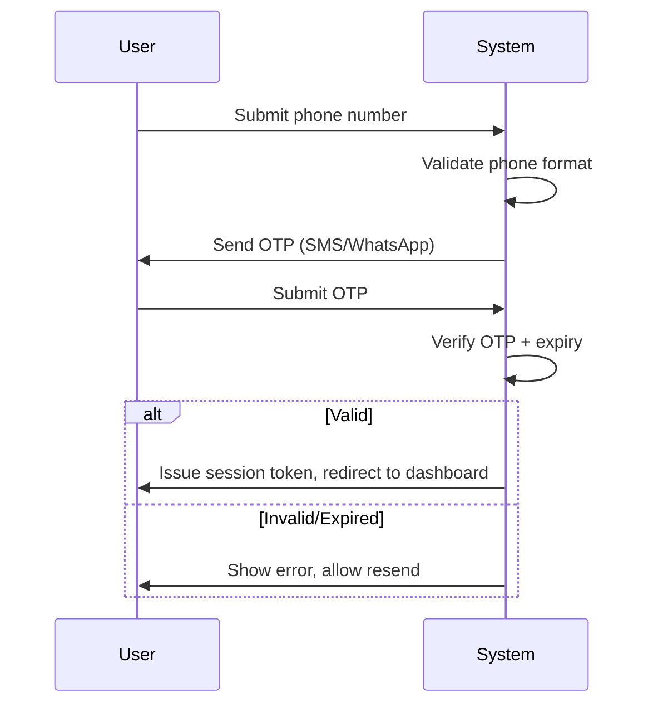
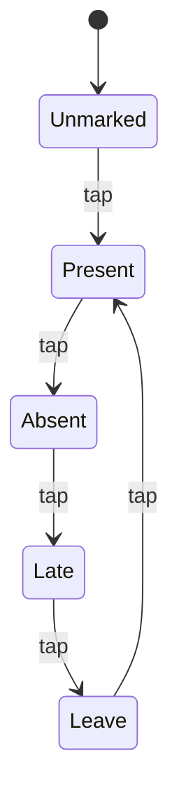
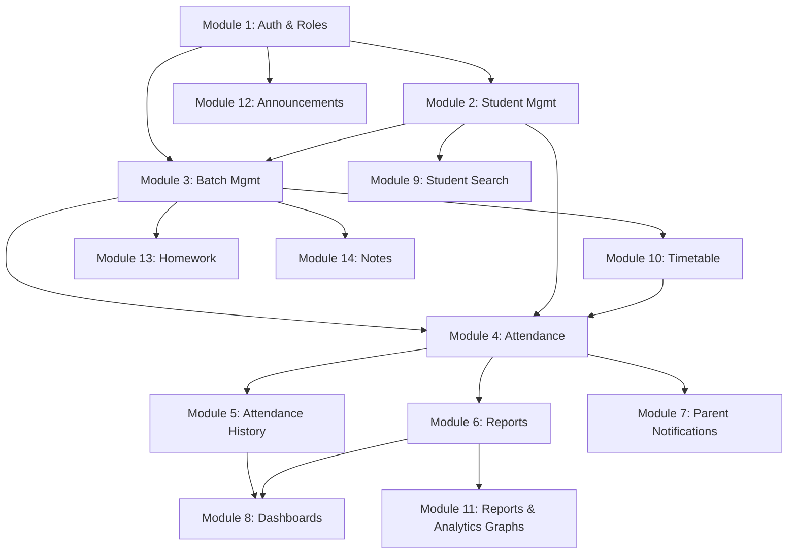

# Feature Documentation — Attendance Management System for Coaching Institutes

## Document Purpose

This document is the **implementation-level reference** for every feature in the system. Where `01-product.md` defines *what the product is and why*, this document defines *how each feature behaves* — every interaction, validation, business rule, edge case, and dependency required to build it correctly.

Features are organized module-wise, matching the finalized feature list. Each feature entry follows a consistent structure so it can be picked up independently by a developer or AI coding agent without needing to read the entire document first.

Cross-references to `01-product.md` are made for role definitions and high-level business rules rather than repeating them.

---

## Module 1: Authentication & Roles

### 1.1 Feature: Phone + OTP Login

**Purpose:** Primary authentication method for all roles, matching target users' comfort with WhatsApp-style OTP flows over email/password.

**User Interaction / Workflow:**
1. User enters phone number.
2. System sends a 6-digit OTP via SMS (or WhatsApp, if configured — see Module 7).
3. User enters OTP within the validity window.
4. On success, system issues a session token and routes the user to their role-specific dashboard.

**Validation Rules:**
- Phone number must be a valid 10-digit Indian mobile number.
- OTP is numeric, 6 digits, expires after 5 minutes **[ASSUMPTION]**.
- Maximum 5 OTP verification attempts per OTP before requiring a new OTP request.
- Maximum 3 OTP requests per phone number per 10 minutes (rate limiting to prevent abuse/SMS-cost exploitation).

**Business Logic:**
- If the phone number is not associated with any active account in any institute, show "No account found — contact your coaching institute" rather than a generic error (Admin/Teacher/Student/Parent accounts are provisioned by Admin, not self-registered — see 1.3).
- If a phone number is linked to accounts in multiple institutes (e.g., a teacher who works at two coaching centers, or a parent with children at two institutes), prompt an institute-selection screen after successful OTP verification.

**Edge Cases:**
- SMS delivery failure/delay: provide a visible "Resend OTP" action with a cooldown timer (e.g., 30 seconds) rather than an unlimited resend button.
- User changes phone number after OTP sent: must restart the flow, previous OTP is invalidated.
- Same phone number, multiple roles at the same institute (e.g., a Teacher who is also a Parent of an enrolled student): see 1.4.

**Dependencies:** SMS/WhatsApp gateway provider (technical decision, out of scope here).

**Implementation Notes:**
- OTP verification and session issuance must happen server-side; never trust a client-side "OTP verified" flag.
- Store only hashed/short-lived OTP values, never log raw OTP in plaintext logs.

**Future Enhancements:**
- Biometric login (fingerprint/face unlock) on repeat devices once native apps exist.

---

### 1.2 Feature: Email + Password Login (Admin/Teacher Fallback)

**Purpose:** Secondary login method for Admin and Teacher roles who prefer desktop access or where OTP delivery is unreliable.

**User Interaction / Workflow:** Standard email + password form → forgot-password flow via email link.

**Validation Rules:**
- Password minimum 8 characters, at least 1 letter and 1 number **[ASSUMPTION]**.
- Email must be unique per institute.

**Business Logic:**
- Not available to Student/Parent roles at launch (they are OTP-only) to reduce support overhead for the least tech-savvy user segment.

**Edge Cases:**
- Admin sets up email/password but never uses it (OTP remains default) — both methods must remain valid simultaneously, not mutually exclusive.

**Implementation Notes:** Passwords must be hashed (bcrypt/argon2) — never stored or logged in plaintext.

---

### 1.3 Feature: User Provisioning (No Self-Signup)

**Purpose:** Prevent unauthorized account creation; ensures every account is tied to a real, Admin-verified relationship with the institute.

**User Interaction / Workflow:**
- Admin creates Teacher accounts directly (Module: Staff Management, implied by role model — see Developer Note below).
- Student and Parent accounts are auto-provisioned when Admin creates a Student profile (see 2.1) using the Student's and Parent's phone numbers.

**Business Logic:**
- Creating a Student record with a Parent Phone Number automatically creates (or links to, if it already exists) a Parent account.
- If the same Parent Phone Number is used for a second student, the system links the new student to the existing Parent account instead of creating a duplicate — see BR-Sibling below.

**Business Rule — Sibling Linking:**
- BR-Sibling: When a Parent Phone Number matches an existing Parent account within the same institute, the Admin is prompted: *"This number is already linked to [Existing Student Name]. Link [New Student Name] as a sibling under the same Parent account?"* Admin must confirm before linking.

**Edge Cases:**
- Parent phone number typo creates an unintended "sibling" link — Admin must be able to unlink students from a Parent account after the fact.
- A phone number is reused by an unrelated family after the original student leaves — Admin must be able to detach a Parent account from a `Left Coaching` student and reassign the number.

**Developer Note:** Staff (Teacher) account creation is treated as part of this module even though it wasn't a separately numbered feature in the source list, because Teacher accounts are prerequisite data for Module 3 (Batch Management). Implement a minimal "Add Teacher" flow (Name, Phone, Email, Subject specialties) here.

---

### 1.4 Feature: Role-Based Access Control (RBAC) Enforcement

**Purpose:** Ensure every action is authorized server-side according to the permission matrix in `01-product.md` §5.2.

**Business Logic:**
- Every API request must resolve: (a) the authenticated user's role(s) for the current institute, (b) whether the requested resource belongs within their permitted scope (e.g., Teacher can only mark attendance for batches they're assigned to).
- A user with multiple roles at the same institute (e.g., Teacher + Parent) must be able to switch "active role context" via a role-switcher UI element, since permissions and dashboards differ significantly.

**Edge Cases:**
- A Teacher who is also a Parent must not see their own child's grades/attendance with Teacher-level edit permissions "leaking" into Parent view — role context must be fully isolated per session view.
- Deactivated Teacher account: existing attendance records they created must remain visible and attributed, but they can no longer log in or mark new attendance.

**Implementation Notes:** RBAC checks belong in a shared middleware/policy layer, not duplicated per endpoint — critical for maintainability as features grow.

---

## Module 2: Student Management

### 2.1 Feature: Add Student

**Purpose:** Core data-entry point for enrolling a student into the institute.

**User Interaction / Workflow:**
1. Admin opens "Add Student" form.
2. Fills required + optional fields (see `01-product.md` §7.2 for field table).
3. Assigns to one or more batches.
4. Optionally uploads a photo.
5. On save: Student record created, Parent account provisioned/linked (see 1.3), Student account provisioned (if Student self-login is enabled for this institute — see Developer Note).

**Validation Rules:** See field table in `01-product.md` §7.2. Additionally:
- Cannot assign a student to a batch that is at capacity (see 3.x) unless Admin explicitly overrides with a confirmation dialog **[ASSUMPTION — allow override since real-world institutes often accept one or two extra students]**.
- Admission Date cannot be in the future.

**Business Logic:**
- New student defaults to `Active` status.
- If added to a batch mid-term, attendance history for that student starts from their admission date — historical sessions before admission are not shown as "absent" retroactively.

**Edge Cases:**
- Admin adds a student without a photo — system should show a default avatar (e.g., initials-based), not a broken image icon.
- Admin adds a student with no Parent Phone Number — system should block save with a required-field error, since parent notifications are a core feature dependent on this.
- Duplicate student entry (same name + school + standard) — system should show a soft warning ("Similar student already exists — continue anyway?") rather than hard-blocking, since duplicate names are common.

**Developer Note:** Whether Students get their own login (vs. only Parents having access) should be a per-institute toggle in settings, since some institutes (especially for younger students) may prefer Parent-only access.

**Future Enhancements:** Bulk import via CSV/Excel upload for institutes onboarding with existing student registers.

---

### 2.2 Feature: Edit Student

**Purpose:** Keep student records accurate as circumstances change (batch changes, contact updates, etc.).

**Business Logic:**
- Editing Batch Assignment does not retroactively alter past attendance records tied to the previous batch.
- Editing Parent Phone Number should prompt: "Update linked Parent account's phone number too?" since the Parent account is keyed to that number.

**Edge Cases:**
- Changing a student's Standard/Class mid-year (e.g., promoted) — historical batch/attendance records should retain the standard value at the time, not be rewritten.

---

### 2.3 Feature: Delete Student

**Purpose:** Remove a student record while preserving historical integrity.

**Business Logic (see `01-product.md` BR-2.2):**
- Default action is **soft delete**: student is hidden from active rosters/search but attendance history remains intact for reports.
- Hard delete is a separate, explicitly-labeled destructive action, gated behind a confirmation step that names the consequences ("This will permanently remove [Student Name] and cannot be undone. Historical reports referencing this student may show gaps.").

**Edge Cases:**
- Attempting to delete a student who is the only student in a batch — system should still allow it (batch simply becomes empty), not block the deletion.

---

### 2.4 Feature: Student Profile View

**Purpose:** Single-page summary of a student's full record — the canonical reference view used by Admin/Teacher during parent calls or reviews.

**Contents:** All fields from §7.2 of `01-product.md`, plus:
- Attendance % (overall and per-batch)
- Recent attendance history (last 10 sessions)
- Linked Parent account details
- Batch assignments with links to each batch page

**Permissions:** Admin sees full profile; Teacher sees profile only for students in their assigned batches, with fee information hidden (fees are Admin/Parent-only per the permission matrix).

---

### 2.5 Feature: Student Status Management

**Purpose:** Track lifecycle state of a student's enrollment.

**Status Values:** `Active`, `Left Coaching`, `Suspended` (see `01-product.md` §7.2).

**Business Logic:**
- `Left Coaching` and `Suspended` students are excluded from attendance-marking rosters (BR-2.1) but remain visible in historical reports.
- Changing status to `Left Coaching` triggers the prompt described in BR-2.3 (deactivate linked accounts).
- `Suspended` is a temporary state — Admin can reactivate back to `Active` at any time; `Left Coaching` is treated as a more final state but is still reversible by Admin (e.g., student re-enrolls later).

**Edge Cases:**
- A `Suspended` student's parent should still be able to log in and view historical data (suspension affects attendance eligibility, not account access) **[ASSUMPTION]**.

---

## Module 3: Batch Management

### 3.1 Feature: Create Batch

**Purpose:** Define the recurring scheduling unit that all attendance, timetable, and dashboard features hang off of.

**User Interaction / Workflow:** See field table in `01-product.md` §7.3.

**Validation Rules:**
- BR-3.1 (Teacher scheduling conflict) and BR-3.2 (Classroom double-booking) must be validated at creation time, not just at save — show inline conflict warnings as the Admin selects Teacher/Timing/Days.
- At least one day must be selected.
- End time must be after start time; minimum session duration of 15 minutes **[ASSUMPTION, sanity check]**.

**Business Logic:**
- A batch's "active" schedule is defined by Days + Timing; Holiday marking (Module 13) overrides specific dates without altering the batch definition itself.

**Edge Cases:**
- Admin creates a batch with a Teacher who doesn't exist yet — Admin should be prompted to create the Teacher account inline rather than blocking batch creation entirely.
- Two batches with identical name — should be blocked (BR-3 unique name per institute, per `01-product.md` §7.3 field table).

---

### 3.2 Feature: Edit Batch

**Business Logic:**
- Changing Timing/Days for a batch does not retroactively alter past attendance records (which store their own date/time-marked independent of the batch's current schedule).
- Reducing Capacity below current enrolled student count should warn Admin but not automatically unenroll students.
- Reassigning a batch to a different Teacher should preserve historical attendance records' original "Teacher who marked it" field (§7.5) — the batch's *current* teacher and the *historical* marker of a given day's attendance are independent facts.

---

### 3.3 Feature: Delete Batch

**Business Logic:** Soft delete (archive) per BR-3.4 — batch disappears from active scheduling/timetable but historical attendance/reports referencing it remain intact.

**Edge Cases:** Archiving a batch with currently-enrolled active students should prompt Admin to reassign those students to another batch or explicitly confirm they'll be left batch-less.

---

## Module 4: Attendance System (Core Feature)

This module is the highest-implementation-priority feature in the entire product. Build and optimize this before any other module beyond basic Auth/Student/Batch CRUD.

### 4.1 Feature: Attendance Marking Screen

**Purpose:** The single most-used screen in the app — must be fast, thumb-friendly, and typing-free.

**User Interaction / Workflow:**
1. Teacher selects a batch (from "Today's Batches" on their dashboard, or manually from batch list for backdated entry within the edit window).
2. Roster loads, showing every `Active` student in that batch with a default "unmarked" state.
3. Teacher taps "Mark All Present" **or** taps individual students to cycle status.
4. Teacher taps "Save" (Draft or Final — see 4.3).

**Validation Rules:**
- Only `Active` students in the selected batch appear on the roster (BR-2.1, BR-4.3).
- Date defaults to today; backdating is allowed only within the edit window (BR-4.2) and only for dates the batch was actually scheduled (no marking attendance on a non-scheduled day, except explicit makeup-class handling — see Future Enhancements).
- Cannot mark attendance on a date marked as Holiday for that batch (BR-4.4).

**Business Logic:**
- BR-4.5 (no auto-Absent): students remain "unmarked" until explicit teacher action; the Save action should visibly block/warn if any students remain unmarked ("3 students unmarked — mark them before saving?") rather than silently treating unmarked as Absent.

**Edge Cases:**
- Teacher's session times out mid-marking — Draft state (4.3) exists specifically to prevent data loss; auto-save to Draft every N seconds or on every tap **[ASSUMPTION — implementation detail, but strongly recommended given target users' network reliability constraints]**.
- Student added to batch mid-session (e.g., walk-in during class) — roster should support "Add student to today's attendance" without requiring a full Add Student flow (link to existing student search or full add flow inline).
- Teacher accidentally marks the wrong batch — must be able to discard/reset before Final save without penalty.

**Dependencies:** Module 2 (Active student roster), Module 3 (Batch schedule/day validation), Module 13 (Holiday check).

**Implementation Notes:**
- This screen's performance budget (<2s load per `01-product.md` §9) should be treated as a hard constraint — avoid over-fetching unrelated data on this screen.
- Status cycling and Mark-All-Present must work with optimistic UI updates (instant visual feedback, sync in background) to feel "instant" on slow connections.

---

### 4.2 Feature: One-Click / Mark All Present

**Purpose:** Since the overwhelming majority of students attend most sessions, defaulting to "all present, then flag exceptions" is dramatically faster than marking each student individually.

**Business Logic:** Sets every unmarked, `Active` student on the roster to Present in a single action; does not overwrite students already explicitly marked (i.e., if a teacher already tapped 2 students to Absent, then taps "Mark All Present," those 2 remain Absent — only untouched students are affected) **[ASSUMPTION — this is the more intuitive/safe behavior vs. a full overwrite]**.

---

### 4.3 Feature: Draft vs. Final Attendance

**Purpose:** Allow partial/in-progress attendance entry without triggering premature parent notifications.

**Business Logic:**
- Draft: saved to the system, visible to the Teacher/Admin, editable freely, **does not** trigger notifications (BR-E).
- Final: locked into the official record, triggers notifications (7.7), subject to the 24-hour Teacher edit window (BR-4.2).
- A batch can only have one Final attendance record per student per date — resaving as Final updates the existing record rather than creating a duplicate.

**Edge Cases:**
- Teacher saves as Draft and never returns to finalize it — Admin Dashboard's "Pending Attendance" (§7.8 FR-8.1) should surface these as outstanding, and a background reminder notification to the Teacher is a reasonable enhancement (see Future Enhancements).

---

### 4.4 Feature: Bulk Edit

**Purpose:** Apply one status to multiple selected students at once (e.g., a group of students on a field trip, marked Leave together).

**User Interaction:** Multi-select mode (checkbox or long-press) → select students → choose status → apply.

**Edge Cases:** Bulk edit respects the same eligibility rules as individual marking (only `Active` students selectable).

---

### 4.5 Feature: Update Attendance (Post-Save Edit)

**Purpose:** Correct mistakes after Final save.

**Business Logic (BR-4.2):**
- Within 24 hours of Final save: Teacher (who owns the batch) or Admin can edit.
- After 24 hours: Admin-only, and every edit must write an audit record: `{editedBy, editedAt, previousStatus, newStatus, studentId, attendanceRecordId}`.
- Editing a Final record that already triggered a notification does **not** automatically re-notify the parent by default **[ASSUMPTION]** — but the Attendance History view must show an "edited" badge. A manual "notify parent of correction" action can be offered as an explicit opt-in.

**Edge Cases:** Editing attendance for a student who has since become `Left Coaching`/`Suspended` should still be allowed for historical correction purposes (editing history ≠ marking new attendance).

---

## Module 5: Attendance History

### 5.1 Feature: Per-Student Attendance History View

**Purpose:** Chronological audit trail for a single student, used by Admin/Teacher/Parent/Student to answer "what happened on X date."

**Contents (per `01-product.md` §7.5):** Date, Status, Teacher, Subject, Time Marked, plus edited-indicator if applicable (5.2 below).

**Permissions:** Admin (any student), Teacher (own-batch students), Parent (own children), Student (self).

**Validation/Business Logic:** Filterable by date range and batch; default view shows most recent 30 days, with pagination/load-more for older records (performance — avoid loading a student's entire multi-year history by default).

### 5.2 Feature: Edit Audit Trail Display

**Purpose:** Transparency for corrections (ties to 4.5).

**Business Logic:** Any record with an audit log entry shows a small "Edited" tag; tapping/clicking reveals the audit details (who, when, what changed) — visible to Admin only; Teacher/Parent/Student see the tag but not the detailed diff **[ASSUMPTION — avoids exposing internal staff actions to parents, while still being transparent that a correction occurred]**.

---

## Module 6: Attendance Reports

### 6.1 Feature: Report Generation (Daily/Weekly/Monthly/Student-wise/Batch-wise/Teacher-wise/Overall)

**Purpose:** Structured, aggregated views of attendance data for operational and communication purposes (see report type table in `01-product.md` §7.6).

**User Interaction / Workflow:**
1. User selects report type + scope (date range, batch, student, or teacher, depending on type).
2. System computes aggregation.
3. Report is displayed on-screen and offered for export (PDF/CSV).

**Business Logic:**
- Attendance % formula: `(Present + Late) / Total Scheduled Sessions × 100`, Leave excluded from denominator (per `01-product.md` §7.6 FR-6.2).
- "Total Scheduled Sessions" must correctly exclude Holiday dates (Module 13) and any dates before the student's admission date to that batch — otherwise attendance % will be artificially deflated for newly joined students.

**Validation Rules:**
- Date range selection cannot exceed a sane maximum for on-screen rendering (e.g., 1 year) without triggering an async/background export instead of a live view **[ASSUMPTION — performance guard]**.

**Edge Cases:**
- A batch with zero scheduled sessions in the selected range (e.g., all holidays) should show "No sessions in this period" rather than a divide-by-zero error or 0%.
- Teacher-wise report for a Teacher assigned to multiple batches must aggregate correctly across all their batches, not just one.

**Permissions:** Enforced per the report-access table in `01-product.md` §7.6.

**Future Enhancements:** Scheduled/automated report delivery (e.g., auto-email Admin a weekly summary every Monday morning).

---

## Module 7: Parent Notifications

### 7.1 Feature: Automatic Attendance Notifications

**Purpose:** Eliminate manual parent communication burden (Objective O2 in `01-product.md`).

**Trigger:** Fires immediately on Final (not Draft) attendance save, per BR-E.

**Templates:** See exact templates in `01-product.md` §7.7.

**Business Logic:**
- Channel fallback order: WhatsApp → SMS → Email (BR-7.2), attempted in sequence only on failure of the prior channel, not sent redundantly across all three.
- Each notification attempt and its outcome (sent/failed/channel used) is logged for support/debugging purposes (BR-7.4).

**Validation Rules:**
- No notification is sent if Parent Phone Number is missing/invalid — instead, this is surfaced to Admin as a flagged item (BR-7.3), ideally on the Admin Dashboard as a "Data Issues" widget.

**Edge Cases:**
- Multiple children of the same parent have attendance finalized around the same time (e.g., two siblings in different batches, same evening) — notifications should be sent per student, not batched into one combined message **[ASSUMPTION — simpler to implement and clearer for the parent, though batching is a reasonable future optimization]**.
- Parent has opted out of attendance notifications (BR-7.5) — system must respect this and skip sending, while still recording the attendance normally.

**Dependencies:** Requires a configured messaging provider (WhatsApp Business API / SMS gateway / Email service) — provider selection and integration details belong in the technical architecture document.

**Future Enhancements:** Digest mode (one end-of-day summary message instead of per-session) as an opt-in for parents with children in multiple batches.

---

### 7.2 Feature: Notification Preferences

**Purpose:** Let parents control which notification types they receive (BR-7.5).

**Business Logic:** Preferences apply per notification category (Attendance, Fees, Announcements) — not an all-or-nothing switch. Default state for all categories is **opted-in** at account creation **[ASSUMPTION]**.

---

## Module 8: Dashboards

### 8.1 Feature: Owner (Admin) Dashboard

**Contents and computation logic:** See `01-product.md` §7.8.

**Business Logic:**
- "Today's attendance" and "% present" figures should update in near-real-time as Teachers finalize attendance throughout the day, not just on page load (poll or push-based refresh — technical decision).
- "Pending fees" requires a Fees data model — if Fees management is not yet built in early implementation phases, this widget should degrade gracefully (hidden or "Coming soon") rather than break the dashboard.

**Edge Cases:** Zero batches scheduled today (e.g., Sunday, all-holiday) — dashboard should show an empty/positive state ("No classes scheduled today"), not an error or misleading 0%.

### 8.2 Feature: Teacher Dashboard

**Business Logic (FR-8.1):** "Pending attendance" = batches assigned to this Teacher, scheduled for today, with no Final attendance record yet saved. Must exclude batches marked as Holiday for today.

### 8.3 Feature: Parent Dashboard

**Business Logic:** If a Parent has multiple children, dashboard must support switching between children via a clear selector (tabs or dropdown) — see `01-product.md` §5.2 assumption on multi-child parent accounts. "Upcoming class" should look ahead across all the child's batches and show the single next chronological session.

---

## Module 9: Student Search

### 9.1 Feature: Search by Name / Phone / Roll Number / Batch / Standard / Parent Name

**Purpose:** Fast lookup for Admin/Teacher during calls, walk-ins, or admin tasks.

**Business Logic:**
- Name and Parent Name support partial/fuzzy match (FR-9.2); Phone and Roll Number support exact match (with partial-digit prefix matching as a reasonable enhancement).
- Search scope is permission-bound: Teacher search results are pre-filtered to only students in their assigned batches (FR-9.3).

**Edge Cases:** Search with no results should suggest "Did you mean...?" only for name/parent-name fuzzy fields, not for phone/roll number (exact-match fields shouldn't offer misleading fuzzy suggestions).

**Implementation Notes:** For institutes with 500+ students, ensure search is backed by an indexed query, not a full client-side filter — this is a common performance failure point.

---

## Module 10: Timetable

### 10.1 Feature: Weekly Timetable View

**Purpose:** Visual weekly schedule, auto-derived from Batch definitions (Module 3) — not manually maintained separately.

**Business Logic:** Timetable is a *read/query view* over Batch data (Days + Timing), not an independent data entity, to avoid data-sync issues between "the batch schedule" and "the timetable."

**Filters:** By Teacher, Student, or Batch (FR-10.1–10.3).

### 10.2 Feature: Holiday Marking

**Purpose:** Suppress attendance requirements and reflect non-teaching days.

**User Interaction:** Admin selects a date (or date range) and marks it Holiday, scoped to either the entire institute or specific batch(es) (FR-10.4, `01-product.md` §7.10 assumption).

**Business Logic:**
- Institute-wide holiday: no batch has a scheduled session that date; attendance marking is disabled system-wide for that date.
- Batch-specific holiday: only the selected batch(es) are suppressed; other batches proceed normally.
- Affects Report Generation (Module 6) denominator calculations — holiday dates must never count as a "missed scheduled session."

**Edge Cases:** Marking a date as Holiday *after* attendance has already been marked for that date for some batch — system should warn Admin ("Attendance already exists for 2 batches on this date — mark holiday anyway?") rather than silently orphaning that data.

---

## Module 11: Reports & Analytics (Graphs)

### 11.1 Feature: Monthly Attendance % Trend

**Chart type:** Line chart, X-axis = time (weeks/months), Y-axis = attendance %. Scope-filterable by institute/batch/student.

### 11.2 Feature: Top / Least Attendance Students

**Purpose:** Operational tool for recognition (top) and early intervention (least) — treated as a priority feature per `01-product.md` FR-11.1, not a cosmetic widget.

**Business Logic:** Ranking computed over a configurable window (default: current month **[ASSUMPTION]**), excluding students with fewer than a minimum number of scheduled sessions in that window (avoids a student with 1 session and 1 absence unfairly appearing at the bottom of "Least Attendance").

**Edge Cases:** Tie-breaking for students with identical attendance % — sort secondarily by total sessions attended (more data = more reliable ranking) **[ASSUMPTION]**.

### 11.3 Feature: Batch Comparison

**Chart type:** Bar chart comparing attendance % across all batches for a selected period — Admin-only (cross-batch visibility restriction per the permission matrix).

### 11.4 Feature: Attendance Trends

**Purpose:** General-purpose trend exploration, filterable by batch/student/date range — effectively a flexible version of 11.1 with more filter dimensions.

---

## Module 12: Announcements

### 12.1 Feature: Post Announcement

**Purpose:** One-to-many broadcast communication from Admin to relevant Parents/Students (see `01-product.md` §7.12).

**User Interaction / Workflow:**
1. Admin composes announcement: Title, Body, Type (`Holiday`/`Exam`/`Fees Reminder`/`General`), Scope (institute-wide / batch / standard).
2. Optional expiry date.
3. On publish, notification dispatched to all Parents/Students within scope (using the same channel logic as Module 7).

**Validation Rules:** Title required, max ~100 chars; Body required, reasonable max length (e.g., 1000 chars) to keep notification payloads manageable.

**Business Logic:** Scope resolution must correctly compute the recipient list at *send time* (e.g., a batch-scoped announcement should reach all currently-`Active` students' parents in that batch, not a stale snapshot).

**Edge Cases:** Announcement posted, then a new student joins the scoped batch afterward — new student's parent does **not** retroactively receive the original notification but should still be able to see the announcement in-app if not yet expired **[ASSUMPTION]**.

**Future Enhancements:** Read-receipt tracking (has the parent viewed the announcement).

---

## Module 13: Homework

### 13.1 Feature: Upload Homework

**Purpose:** One-directional distribution of assignments from Teacher to enrolled students (see `01-product.md` §7.13 — no submission/grading in this phase).

**User Interaction / Workflow:** Teacher selects batch → enters Title, Description, optional Due Date → attaches PDF/Image(s) → publishes.

**Validation Rules:** At least a Title is required; attachments optional but if present must be PDF/JPG/PNG within a defined size cap (technical doc to specify exact limit).

**Business Logic:** Homework is scoped to a batch — all `Active` students in that batch (and their linked Parents, view-only) can see it.

**Edge Cases:** Homework posted with a Due Date in the past (e.g., backdated entry for record-keeping) should be allowed but visually flagged as "Overdue" rather than blocked.

### 13.2 Feature: View/Download Homework (Student/Parent)

**Business Logic:** Read-only list, filterable by batch/subject, sorted by most recent first, with clear due-date indicators (Overdue / Due Today / Upcoming).

---

## Module 14: Notes

### 14.1 Feature: Upload Notes (PDF/Video/Image)

**Purpose:** Learning-material distribution; foundation for future LMS evolution (`01-product.md` §13).

**Business Logic:**
- Video supports either direct file upload (with size cap) or an external link (e.g., unlisted YouTube URL) per `01-product.md` FR-14.3, to avoid heavy video-hosting infrastructure costs at this stage.
- Notes scoped to batch or subject, same visibility model as Homework.

**Edge Cases:** Broken/removed external video link — system cannot control this, but should allow Teacher/Admin to edit the link post-publish without deleting and recreating the whole Notes entry.

### 14.2 Feature: View/Stream/Download Notes (Student)

**Business Logic:** Same read-only, scoped-visibility model as Homework §13.2.

---

## Module 15: Mobile-Friendly UI (Cross-Cutting)

This is not a standalone feature but a set of implementation constraints applied to every feature above. Restated here for completeness at the feature-documentation level:

| Constraint | Applies To |
|---|---|
| Large tap targets (min 44x44px) | Attendance marking (4.1), Bulk edit (4.4), all list actions |
| Minimal typing | Attendance marking (near-zero typing), Search (Module 9) |
| Fast load (<2s) | Dashboards (Module 8), Attendance screen (4.1) |
| Pagination/lazy-load | Student list (2.x), Attendance History (5.1), Reports (6.1) |
| One-handed usability | Attendance marking screen specifically — this is the screen used most, often while physically standing in a classroom |

**Implementation Note:** Treat Module 4 (Attendance System) as the reference implementation for mobile UX quality — every other module should be held to the same bar, but Module 4 is where regressions are least tolerable.

---

## Cross-Module Dependency Map

**Recommended build order (implementation-level):** Module 1 → Module 2 → Module 3 → Module 4 → Module 5 → Module 8 (basic) → Module 7 → Module 6 → Module 10 → Module 9 → Module 11 → Module 12 → Module 13 → Module 14. This order prioritizes the attendance-marking core loop (the product's central value) before secondary modules like Homework/Notes, which are explicitly future-facing extensions per `01-product.md` §14.
