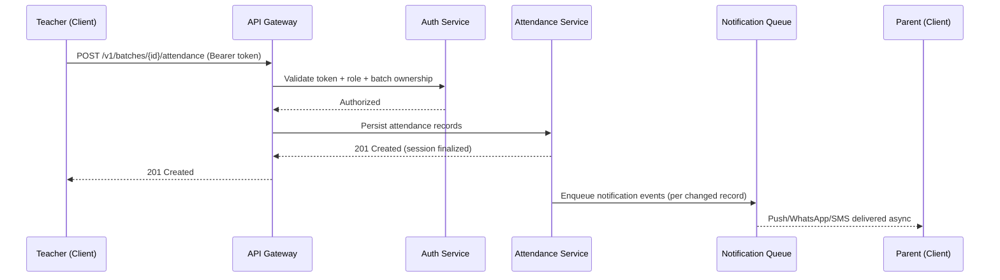

# API Specification — Attendance Management System for Coaching Institutes

## 1. Overview

This document defines the complete REST API contract for the Attendance Management System. It is the single source of truth for all endpoints, request/response schemas, authentication, validation, error handling, and API conventions. It does not cover database schema design, frontend implementation, or infrastructure/deployment — those are addressed in separate documents.

### 1.1 Scope

Covers APIs for: Authentication & Roles, Student Management, Batch Management, Attendance (marking, history, reports), Parent Notifications, Dashboards, Search, Timetable, Reports & Analytics, Announcements, Homework, and Notes.

### 1.2 Design Principles

- **Resource-oriented REST** — nouns for resources, HTTP verbs for actions.
- **Stateless** — every request carries full auth context via a bearer token; no server-side session state.
- **Predictable envelope** — every response (success or error) follows the same top-level shape.
- **Role-aware** — the same endpoint may return different data shapes/visibility depending on the caller's role (enforced server-side, never trust client-supplied role).
- **Idempotent where possible** — `PUT`/`DELETE` are idempotent; `PATCH` for partial updates; `POST` for creation and non-idempotent actions.
- **Backward-compatible evolution** — additive changes only within a version; breaking changes require a new version.

---

## 2. Base URL & Versioning

```
https://api.<domain>.com/v1
```

- Version is embedded in the URL path (`/v1`, `/v2`, ...). Header-based versioning is not used, to keep it simple for coaching-institute-scale clients (mobile apps, low-tech environments).
- **Deprecation policy:** A version is supported for a minimum of 12 months after a successor version is released. Deprecated versions return a `Deprecation` and `Sunset` HTTP header on every response.
- **Breaking change definition:** removing/renaming a field, changing a field's type, changing status codes for existing flows, tightening validation on existing fields. Non-breaking: adding new optional fields, adding new endpoints, adding new enum values (clients must ignore unknown enum values gracefully — noted as an implementation requirement for client teams).

---

## 3. Authentication & Authorization

### 3.1 Mechanism

- **JWT Bearer tokens** via the `Authorization: Bearer <token>` header.
- Access token lifetime: **15 minutes**. Refresh token lifetime: **30 days**, rotated on every use (refresh token reuse detection invalidates the entire token family — assumption: this is a standard security best practice suitable for a multi-tenant SaaS).
- Tokens are institute-scoped: every JWT payload includes `institute_id`, `user_id`, `role`, and `token_version` (incremented on password change / forced logout to invalidate old tokens).

### 3.2 Token Payload (informational, not an endpoint)

| Claim | Type | Description |
|---|---|---|
| `sub` | string | User ID |
| `institute_id` | string | Tenant/institute scope |
| `role` | enum | `admin`, `teacher`, `student`, `parent` |
| `token_version` | integer | Used to invalidate stale tokens |
| `iat` / `exp` | integer | Issued-at / expiry (Unix epoch) |

### 3.3 Roles & Permission Matrix

| Capability | Admin | Teacher | Student | Parent |
|---|---|---|---|---|
| Manage users/roles | ✅ | ❌ | ❌ | ❌ |
| Create/edit/delete students | ✅ | ❌ (view only, within assigned batches) | ❌ | ❌ |
| Create/edit batches | ✅ | ❌ | ❌ | ❌ |
| Mark/edit attendance | ✅ | ✅ (own batches only) | ❌ | ❌ |
| View own attendance | ✅ | ✅ | ✅ | ✅ (for linked child) |
| View all attendance/reports | ✅ | ✅ (own batches only) | ❌ | ❌ |
| View fees | ✅ | ❌ | ❌ | ✅ (linked child) |
| Post announcements | ✅ | ❌ | ❌ | ❌ |
| Upload homework/notes | ✅ | ✅ (own batches) | ❌ | ❌ |
| View homework/notes | ✅ | ✅ | ✅ (own batch) | ✅ (linked child's batch) |

- Authorization is enforced at the resource level, not just the endpoint level (e.g., a Teacher can `GET /batches/{id}/attendance` only if `teacher_id` on that batch matches the caller).
- A Parent's access to a Student resource requires an active `parent_student_link` record (see §6.1) — this is validated on every request, not cached in the token, since links can be revoked.

### 3.4 Auth Endpoints

#### `POST /v1/auth/login`

**Request**
```json
{
  "email": "raj.teacher@example.com",
  "password": "string"
}
```

**Response `200 OK`**
```json
{
  "success": true,
  "data": {
    "access_token": "eyJ...",
    "refresh_token": "eyJ...",
    "expires_in": 900,
    "user": {
      "id": "usr_123",
      "name": "Raj Sharma",
      "role": "teacher",
      "institute_id": "inst_001"
    }
  }
}
```

**Errors:** `401 INVALID_CREDENTIALS`, `403 ACCOUNT_SUSPENDED`, `429 TOO_MANY_ATTEMPTS`

- **Validation:** `email` — valid email format, required. `password` — required, min 8 chars.
- **Rate limiting:** 5 failed attempts per email per 15 minutes → temporary lockout (`429`), escalating backoff.

#### `POST /v1/auth/refresh`

**Request**
```json
{ "refresh_token": "eyJ..." }
```

**Response `200 OK`** — same shape as login. Old refresh token is invalidated (rotation).

**Errors:** `401 INVALID_REFRESH_TOKEN`, `401 TOKEN_REUSE_DETECTED` (triggers full session family revocation).

#### `POST /v1/auth/logout`

Invalidates the current refresh token. **Response `204 No Content`**.

#### `POST /v1/auth/forgot-password`

**Request:** `{ "email": "string" }` → **Response `200 OK`** (always generic success message to prevent user enumeration).

#### `POST /v1/auth/reset-password`

**Request:** `{ "token": "string", "new_password": "string" }` → **Response `200 OK`**. Increments `token_version` to invalidate all existing sessions.

#### `GET /v1/auth/me`

Returns the authenticated user's profile + role + institute context. **Response `200 OK`**.

---

## 4. API Conventions

### 4.1 Standard Response Envelope

**Success:**
```json
{
  "success": true,
  "data": { },
  "meta": { }
}
```

**Error:**
```json
{
  "success": false,
  "error": {
    "code": "VALIDATION_ERROR",
    "message": "Human-readable summary",
    "details": [
      { "field": "phone", "issue": "must be a valid 10-digit number" }
    ]
  }
}
```

- `meta` is present only where relevant (pagination, counts). `details` is present only for validation-class errors (`400`, `422`).

### 4.2 HTTP Status Codes Used

| Code | Meaning | Usage |
|---|---|---|
| 200 | OK | Successful GET/PUT/PATCH |
| 201 | Created | Successful POST creating a resource |
| 204 | No Content | Successful DELETE / actions with no body |
| 400 | Bad Request | Malformed request (bad JSON, missing required field) |
| 401 | Unauthorized | Missing/invalid/expired token |
| 403 | Forbidden | Valid token, insufficient role/resource permission |
| 404 | Not Found | Resource doesn't exist or not visible to caller |
| 409 | Conflict | Duplicate resource, state conflict (e.g., double attendance mark) |
| 422 | Unprocessable Entity | Semantically invalid data (fails business rule validation) |
| 429 | Too Many Requests | Rate limit exceeded |
| 500 | Internal Server Error | Unhandled server fault |
| 503 | Service Unavailable | Downstream dependency (e.g., WhatsApp gateway) down |

### 4.3 Error Code Registry (non-exhaustive, extensible)

| Code | HTTP Status | Description |
|---|---|---|
| `VALIDATION_ERROR` | 400/422 | Field-level validation failed |
| `INVALID_CREDENTIALS` | 401 | Login failure |
| `TOKEN_EXPIRED` | 401 | Access token expired |
| `FORBIDDEN_ROLE` | 403 | Role lacks permission for this action |
| `FORBIDDEN_RESOURCE` | 403 | Role has permission type but not for this specific resource (e.g., teacher accessing another teacher's batch) |
| `RESOURCE_NOT_FOUND` | 404 | Entity not found or not visible |
| `DUPLICATE_ENTRY` | 409 | Unique constraint violated (e.g., roll number already exists in batch) |
| `ATTENDANCE_ALREADY_MARKED` | 409 | Attendance for this student/date/batch already exists (use PATCH to update) |
| `BATCH_CAPACITY_EXCEEDED` | 422 | Adding student would exceed batch capacity |
| `INVALID_STATE_TRANSITION` | 422 | E.g., marking attendance for a student with status `left_coaching` |
| `RATE_LIMIT_EXCEEDED` | 429 | Too many requests |
| `INTERNAL_ERROR` | 500 | Unexpected server error |

### 4.4 Pagination

Cursor-based pagination is used for high-volume, frequently-mutated lists (attendance records); offset-based for smaller, stable lists (students, batches) — chosen because attendance data grows unbounded and offset pagination degrades and can skip/duplicate rows under concurrent writes.

**Offset-based (default for most list endpoints):**

Query params: `?page=1&limit=25` (max `limit`: 100, default: 25)

```json
{
  "success": true,
  "data": [ ],
  "meta": {
    "pagination": {
      "page": 1,
      "limit": 25,
      "total_items": 342,
      "total_pages": 14
    }
  }
}
```

**Cursor-based (attendance history, activity logs):**

Query params: `?cursor=eyJpZCI6MTIzfQ&limit=25`

```json
{
  "success": true,
  "data": [ ],
  "meta": {
    "pagination": {
      "next_cursor": "eyJpZCI6MTQ4fQ",
      "has_more": true,
      "limit": 25
    }
  }
}
```

### 4.5 Filtering, Sorting, Field Selection

- **Filtering:** `?filter[field]=value`, e.g. `?filter[status]=active&filter[batch_id]=btch_12`. Range filters use suffixes: `?filter[date][gte]=2026-06-01&filter[date][lte]=2026-06-30`.
- **Sorting:** `?sort=-created_at,name` (comma-separated; `-` prefix = descending).
- **Field selection (sparse fieldsets):** `?fields=id,name,roll_number` — optional optimization for low-bandwidth mobile clients, a key constraint for this product per the mobile-friendly requirement.
- Unsupported filter/sort fields on a given endpoint return `400 VALIDATION_ERROR` rather than being silently ignored.

### 4.6 Rate Limiting

| Tier | Limit |
|---|---|
| Authenticated (standard) | 300 requests / minute / user |
| Auth endpoints (login, forgot-password) | 5 requests / 15 min / IP+email combination |
| Bulk operations (bulk attendance) | 20 requests / minute / user |

Response headers on every request: `X-RateLimit-Limit`, `X-RateLimit-Remaining`, `X-RateLimit-Reset`. Exceeding the limit returns `429` with a `Retry-After` header (seconds).

### 4.7 Idempotency for Non-Idempotent POSTs

For POST actions with real-world side effects that must not be duplicated on retry (e.g., bulk attendance submission, notification dispatch), clients must send an `Idempotency-Key` header (UUID). The server caches the response for that key for 24 hours and returns the cached result on retry instead of reprocessing.

### 4.8 Multi-Tenancy

Every request is scoped to a single `institute_id` derived from the JWT — never accepted as a client-supplied parameter for data access, to prevent cross-tenant data leakage. Institute switching (for future multi-institute admin support) requires re-authentication or a dedicated `POST /v1/auth/switch-institute` (future extensibility, not in current scope).

---

## 5. Common Data Types & Enums

| Enum | Values |
|---|---|
| `role` | `admin`, `teacher`, `student`, `parent` |
| `student_status` | `active`, `left_coaching`, `suspended` |
| `attendance_status` | `present`, `absent`, `late`, `leave` |
| `notification_channel` | `whatsapp`, `sms`, `email`, `push` |
| `announcement_type` | `holiday`, `exam`, `fee_reminder`, `general` |
| `day_of_week` | `mon`, `tue`, `wed`, `thu`, `fri`, `sat`, `sun` |

- All timestamps are ISO 8601 UTC (`2026-07-02T14:30:00Z`). Clients handle local timezone conversion for display.
- All dates (attendance date, admission date) are `YYYY-MM-DD`, timezone-less, representing the institute's local calendar day (assumption: single-timezone-per-institute; multi-timezone chains are out of scope).
- All IDs are opaque strings, prefixed by resource type (`stu_`, `btch_`, `usr_`, `att_`) for readability/debuggability.

---

## 6. Student Management

### 6.1 Resource Model (reference only — full schema lives in the data-model doc)

Key fields: `id`, `name`, `admission_date`, `roll_number`, `phone`, `parent_phone`, `email`, `address`, `school`, `standard`, `batch_ids[]`, `photo_url`, `status`, `created_at`, `updated_at`.

`parent_student_link`: separate join entity connecting a Parent `user_id` to one or more Student `id`s, supporting the common case of one parent account with multiple children.

### 6.2 `POST /v1/students`

**Role:** Admin only.

**Request**
```json
{
  "name": "Raj Kumar",
  "admission_date": "2026-06-01",
  "roll_number": "C10M-014",
  "phone": "9876543210",
  "parent_phone": "9876500000",
  "email": "raj.kumar@example.com",
  "address": "12 MG Road, Mumbai",
  "school": "St. Xavier's High School",
  "standard": "10",
  "batch_ids": ["btch_012"],
  "photo_url": null
}
```

**Validation Rules**

| Field | Rule |
|---|---|
| `name` | Required, 2–100 chars |
| `admission_date` | Required, valid date, not in the future |
| `roll_number` | Required, unique **per institute** (not per batch — assumption: roll numbers are institute-wide to avoid duplicate-detection ambiguity across batches) |
| `phone` | Required, 10-digit numeric (configurable regex per country — assumption: India-first, E.164 support noted as future extensibility) |
| `parent_phone` | Optional but strongly recommended; same format as `phone` |
| `email` | Optional, valid email format if provided |
| `standard` | Required, non-empty string (free text to support varied class-naming across schools) |
| `batch_ids` | Optional at creation (student can be added before batch assignment); each ID must reference an existing batch in the same institute |
| `photo_url` | Optional; must be a pre-uploaded media asset URL (see §14 Notes/Media for upload flow) |

**Response `201 Created`** — full student object including generated `id` and `status: "active"` (default).

**Errors:** `409 DUPLICATE_ENTRY` (roll number exists), `422 VALIDATION_ERROR`, `404` if a referenced `batch_id` doesn't exist.

### 6.3 `GET /v1/students`

**Role:** Admin (all students), Teacher (only students in their assigned batches — enforced server-side), Parent (only linked children).

Supports pagination, filtering (`status`, `batch_id`, `standard`, `school`), sorting, and search (see §10).

### 6.4 `GET /v1/students/{id}`

Full profile. **403 FORBIDDEN_RESOURCE** if caller's role doesn't grant visibility into this specific student.

### 6.5 `PUT /v1/students/{id}` / `PATCH /v1/students/{id}`

**Role:** Admin only. `PUT` replaces the full editable profile; `PATCH` for partial updates (e.g., just `status`). Same validation rules as create, minus uniqueness re-check unless `roll_number` changes.

### 6.6 `DELETE /v1/students/{id}`

**Role:** Admin only. **Soft delete** is used — the record is retained (status/flag) rather than hard-deleted, since attendance history references it and financial/audit compliance is expected for a business tool. Response `204 No Content`. A hard-delete/GDPR-style purge endpoint is a future extensibility item, not in current scope.

### 6.7 `POST /v1/students/{id}/batches`

Assign student to an additional batch. **Request:** `{ "batch_id": "btch_012" }`. Fails with `422 BATCH_CAPACITY_EXCEEDED` if the batch is full.

### 6.8 `DELETE /v1/students/{id}/batches/{batch_id}`

Remove student from a batch. `204 No Content`.

---

## 7. Batch Management

### 7.1 `POST /v1/batches`

**Role:** Admin only.

**Request**
```json
{
  "name": "Class 10 Maths",
  "subject": "Mathematics",
  "teacher_id": "usr_045",
  "days": ["mon", "wed", "fri"],
  "start_time": "18:00",
  "end_time": "19:00",
  "capacity": 30,
  "classroom": "Room 2"
}
```

**Validation Rules**

| Field | Rule |
|---|---|
| `name` | Required, unique per institute |
| `teacher_id` | Required, must reference a user with role `teacher` in the same institute |
| `days` | Required, ≥1 valid `day_of_week` value, no duplicates |
| `start_time` / `end_time` | Required, `HH:mm` 24-hour format; `end_time` > `start_time` |
| `capacity` | Required, integer ≥ 1 |
| `classroom` | Optional free text |

**Business rule — scheduling conflict:** Creating/updating a batch checks for overlapping `days` + `time range` + same `classroom` (or same `teacher_id`) against existing batches. On conflict, returns `409 CONFLICT` with details of the clashing batch, unless the client explicitly passes `"force": true` (assumption: admins occasionally need to override, e.g. shared classroom split by different weeks — override is logged for audit).

**Response `201 Created`** — full batch object.

### 7.2 `GET /v1/batches`

Filterable by `subject`, `teacher_id`, `day`, `status`. Role-scoped: Teacher sees only their own batches; Admin sees all; Student/Parent see batches relevant to their (linked) enrollment.

### 7.3 `GET /v1/batches/{id}`

Returns batch detail plus a `student_count` summary field (`enrolled` vs `capacity`).

### 7.4 `PUT/PATCH /v1/batches/{id}` — Admin only. Same validation as create.

### 7.5 `DELETE /v1/batches/{id}`

**Role:** Admin only. Soft delete (`status: archived`). Blocked with `409 CONFLICT` if the batch has attendance records for the current term unless `?force=true` is passed — deletion never cascades to historical attendance data.

### 7.6 `GET /v1/batches/{id}/students`

Paginated roster for the batch.

---

## 8. Attendance System (Core Feature)

### 8.1 Design Notes

- Attendance is recorded per **(student, batch, date)** triple — a student in multiple batches gets independent attendance rows per batch, since batches may meet on different days.
- One row per student per class session, not per calendar day, to correctly represent students attending multiple batches on the same day.

### 8.2 `POST /v1/batches/{batch_id}/attendance`

Mark attendance for a session. **Role:** Admin, Teacher (own batch only).

**Request**
```json
{
  "date": "2026-07-02",
  "records": [
    { "student_id": "stu_101", "status": "present" },
    { "student_id": "stu_102", "status": "absent" },
    { "student_id": "stu_103", "status": "late", "note": "Arrived 15 min late" },
    { "student_id": "stu_104", "status": "leave", "note": "Informed in advance" }
  ],
  "draft": false
}
```

**Validation Rules**

- `date` — required; cannot be in the future; cannot pre-date the batch's/student's admission; a configurable institute setting limits how many days back edits are allowed (default: 7 days) — returns `422 INVALID_STATE_TRANSITION` beyond that window unless caller is Admin.
- `records[].student_id` — must be actively enrolled in this batch; status `left_coaching`/`suspended` students return `422`.
- `records[].status` — required, one of `attendance_status` enum.
- `draft: true` — persists as a draft (not yet finalized, no parent notification triggered). `draft: false` finalizes and triggers §9 notifications.
- **Idempotency / duplicate protection:** if attendance for this `(batch_id, date)` already exists and is finalized, this endpoint returns `409 ATTENDANCE_ALREADY_MARKED` — client should call `PATCH` (§8.3) instead. This prevents accidental double-submission from the "one-click mark all present" UI flow.

**Response `201 Created`**
```json
{
  "success": true,
  "data": {
    "session_id": "att_ses_9001",
    "batch_id": "btch_012",
    "date": "2026-07-02",
    "marked_by": "usr_045",
    "marked_at": "2026-07-02T13:05:11Z",
    "status": "finalized",
    "records": [ ]
  }
}
```

### 8.3 `PATCH /v1/batches/{batch_id}/attendance/{date}`

Update an existing session (correct a mistake, finalize a draft, add late-marked students). **Role:** Admin, Teacher (own batch, within the edit window described above).

**Request:** same `records[]` shape; only included students are updated (partial patch). Re-triggers parent notification **only** for records whose `status` actually changed (prevents notification spam).

### 8.4 `POST /v1/batches/{batch_id}/attendance/{date}/mark-all-present`

Convenience one-click endpoint. **Role:** Teacher/Admin. Marks every actively-enrolled, not-yet-marked student in the batch as `present` for that date. Students already marked (e.g. pre-marked absent for a known leave) are left untouched, not overwritten.

### 8.5 `GET /v1/batches/{batch_id}/attendance/{date}`

Returns the session detail (draft or finalized) for review before finalizing.

### 8.6 `GET /v1/students/{id}/attendance`

Attendance history for a student across all batches. **Role:** Admin, Teacher (if student is in one of their batches), Student (self), Parent (linked child).

Cursor-paginated, filterable by `filter[batch_id]`, `filter[date][gte/lte]`, `filter[status]`, sortable by `-date`.

**Response item shape**
```json
{
  "id": "att_rec_55231",
  "date": "2026-07-02",
  "status": "present",
  "batch_id": "btch_012",
  "batch_name": "Class 10 Maths",
  "subject": "Mathematics",
  "teacher_name": "Raj Sharma",
  "marked_at": "2026-07-02T13:05:11Z",
  "note": null
}
```

---

## 9. Attendance Reports

All report endpoints are **read-only, role-scoped** (Admin: all; Teacher: own batches; Parent: linked child; Student: self — self/parent access limited to `student-wise` report type only).

| Endpoint | Description |
|---|---|
| `GET /v1/reports/attendance/daily?date=YYYY-MM-DD&batch_id=` | Single-day snapshot |
| `GET /v1/reports/attendance/weekly?week_start=YYYY-MM-DD&batch_id=` | 7-day rollup |
| `GET /v1/reports/attendance/monthly?month=YYYY-MM&batch_id=` | Monthly rollup |
| `GET /v1/reports/attendance/student/{id}?from=&to=` | Student-wise % and record list |
| `GET /v1/reports/attendance/batch/{id}?from=&to=` | Batch-wise % and per-student breakdown |
| `GET /v1/reports/attendance/teacher/{id}?from=&to=` | Sessions conducted, average attendance across their batches |
| `GET /v1/reports/attendance/overall?from=&to=` | Institute-wide % (Admin only) |

**Common response shape**
```json
{
  "success": true,
  "data": {
    "scope": "batch",
    "reference_id": "btch_012",
    "period": { "from": "2026-06-01", "to": "2026-06-30" },
    "total_sessions": 13,
    "attendance_percentage": 87.4,
    "breakdown": {
      "present": 340, "absent": 32, "late": 18, "leave": 10
    },
    "per_student": [
      { "student_id": "stu_101", "name": "Raj Kumar", "percentage": 92.3 }
    ]
  }
}
```

- All percentage figures are computed as `present + late` counted toward attendance, `leave` excluded from the denominator entirely, `absent` counted against — a business rule assumption made explicit here because it directly affects every percentage figure across the system; should be confirmed with the institute and made configurable in a future version.
- `?format=csv` or `?format=pdf` query param triggers an async export job instead of inline JSON — see §9.1.

### 9.1 Async Report Export

For large exports: `POST /v1/reports/attendance/monthly/export` returns `202 Accepted` with a `job_id`; client polls `GET /v1/reports/jobs/{job_id}` until `status: completed`, which returns a signed, time-limited download URL. Synchronous inline generation is only used for small/fast reports (single batch, single month); anything institute-wide or multi-month goes through the async path to avoid request timeouts.

---

## 10. Student Search

### `GET /v1/search/students?q=<term>&type=<field>`

**Role:** Admin, Teacher (scoped to own batches), Parent (scoped to linked children).

- `q` — free-text term, min 2 characters.
- `type` (optional) — restrict to one of `name`, `phone`, `roll_number`, `batch`, `standard`, `parent_name`; omitted = search across all fields.
- Returns the same paginated student list shape as §6.3, ranked by relevance (exact match > prefix match > substring match).
- Phone-number search normalizes input (strips spaces/dashes/`+91`) before matching.

---

## 11. Dashboards

Read-only aggregation endpoints, one per role, each returning a purpose-built payload (not a generic report) to keep mobile payloads small — a direct requirement from the mobile-first, fast-loading UI goal.

### `GET /v1/dashboard/owner`
```json
{
  "success": true,
  "data": {
    "date": "2026-07-02",
    "todays_attendance_marked_batches": 4,
    "todays_attendance_pending_batches": 2,
    "students_present_today": 118,
    "students_absent_today": 14,
    "attendance_percentage_today": 89.4,
    "new_admissions_this_month": 7,
    "todays_batches": [ ],
    "pending_fees_amount": 45200,
    "pending_fees_students_count": 12
  }
}
```

### `GET /v1/dashboard/teacher`
Returns `todays_classes[]`, `pending_attendance_batches[]` (sessions not yet marked today), `total_student_count` across their batches.

### `GET /v1/dashboard/parent`
Returns, per linked child: `attendance_percentage` (rolling 30 days), `recent_attendance[]` (last 5 records), `upcoming_class` (next scheduled session), `fees_due`.

### `GET /v1/dashboard/student`
Self-service, subset of parent dashboard minus fees (Student role has no fee visibility per the permission matrix in §3.3).

---

## 12. Parent Notifications

### 12.1 Trigger Model

Notifications are **event-driven**, dispatched asynchronously (never inline/blocking within the attendance-marking request) via a message queue — attendance marking must remain fast even if the WhatsApp/SMS gateway is slow or down.

| Trigger Event | Recipient | Channel(s) |
|---|---|---|
| Attendance finalized (`present`/`late`) | Linked parent(s) | Configured channel(s) |
| Attendance finalized (`absent`) | Linked parent(s) | Configured channel(s), high priority |
| Announcement posted | All parents in scope | Configured channel(s) |
| Homework uploaded | Parents of enrolled batch | Push/Email only (not SMS, to control cost) |

### 12.2 `GET /v1/notifications/templates`

Admin-configurable message templates. **Role:** Admin.

```json
{
  "id": "tmpl_absent",
  "event": "attendance.absent",
  "channel": "whatsapp",
  "body": "{{student_name}} was absent today ({{date}}) in {{batch_name}}."
}
```

Placeholders are validated against a whitelist of allowed variables per event type at save time — `422 VALIDATION_ERROR` for unknown placeholders.

### 12.3 `GET /v1/notifications/logs`

**Role:** Admin. Delivery audit trail: `status` (`queued`, `sent`, `delivered`, `failed`), `channel`, `recipient`, `error_reason` if failed. Paginated, filterable by `status`, `channel`, `date`.

### 12.4 `POST /v1/notifications/{id}/retry`

Manually retry a `failed` notification. **Role:** Admin.

### 12.5 Channel Failure Handling

If the primary configured channel (e.g. WhatsApp) fails, the system falls back to the next configured channel per institute settings (e.g. SMS) rather than silently dropping the notification — configurable fallback order per institute, default `whatsapp → sms → email`.

---

## 13. Timetable

### `GET /v1/timetable/weekly?scope=institute|teacher|student&id=`

Returns a `day_of_week`-keyed grid of batch sessions. Role-scoped by default to the caller's own relevant schedule; Admin can query any scope/id.

### `POST /v1/holidays` — Admin only

**Request:** `{ "date": "2026-08-15", "name": "Independence Day", "applies_to": "all" | ["btch_012"] }`. Marking a holiday auto-excludes that date from attendance-required sessions and from denominator calculations in §9 reports.

### `GET /v1/holidays?from=&to=`

Public (any authenticated role) — used to render calendars and to suppress "pending attendance" prompts on the teacher dashboard.

---

## 14. Reports & Analytics (Graphs)

Distinct from §9's tabular reports — these endpoints return pre-aggregated time-series/ranked data shaped for direct charting (avoids requiring the frontend to do heavy aggregation on-device, important for low-end mobile devices).

| Endpoint | Returns |
|---|---|
| `GET /v1/analytics/attendance-trend?scope=&id=&granularity=day\|week\|month&from=&to=` | Time-series array of `{ period, percentage }` |
| `GET /v1/analytics/top-attendance?batch_id=&limit=10` | Ranked students by % descending |
| `GET /v1/analytics/least-attendance?batch_id=&limit=10` | Ranked students by % ascending — used for at-risk flagging |
| `GET /v1/analytics/batch-comparison?batch_ids=btch_1,btch_2&from=&to=` | Per-batch % side by side |

**Role:** Admin (all scopes), Teacher (own batches only). Not exposed to Student/Parent (assumption: comparative/ranked analytics across peers is an institute-management concern, not appropriate to surface to individual families — a privacy-motivated default, revisit if product requirements say otherwise).

---

## 15. Announcements

### `POST /v1/announcements` — Admin only

**Request**
```json
{
  "type": "fee_reminder",
  "title": "July Fee Due",
  "body": "Please clear July fees by 10th.",
  "audience": { "scope": "batch", "batch_ids": ["btch_012"] },
  "publish_at": "2026-07-03T09:00:00Z"
}
```

- `audience.scope` — `all` | `batch` | `standard`; `publish_at` optional (immediate if omitted, scheduled otherwise).
- On publish, fans out a notification (§12) to every parent/student in the resolved audience.

### `GET /v1/announcements` — role-scoped feed, paginated, newest first.

### `PATCH/DELETE /v1/announcements/{id}` — Admin only; delete is soft (marks `withdrawn`, stops further notification fan-out, does not un-notify already-sent recipients).

---

## 16. Homework

### `POST /v1/batches/{batch_id}/homework` — Admin, Teacher (own batch)

**Request (multipart or pre-uploaded asset reference — see §17.1 upload flow)**
```json
{
  "title": "Chapter 4 Exercise",
  "description": "Complete Q1-10",
  "due_date": "2026-07-05",
  "attachments": [{ "type": "pdf", "url": "https://.../file.pdf" }]
}
```

**Validation:** `attachments[].type` ∈ `pdf, image`; max 5 attachments; each ≤ 20 MB (enforced at upload time, §17.1); `due_date` optional but if present must be ≥ session date.

### `GET /v1/batches/{batch_id}/homework` — paginated, role-scoped (Student/Parent see only their batch's homework).

### `PATCH/DELETE /v1/homework/{id}` — Admin, owning Teacher only.

---

## 17. Notes (Learning Material)

Structurally identical pattern to Homework but without `due_date`, and supporting `video` as an additional attachment type.

### `POST /v1/batches/{batch_id}/notes` — Admin, Teacher (own batch)
### `GET /v1/batches/{batch_id}/notes` — role-scoped, paginated, filterable by `attachment_type`.
### `DELETE /v1/notes/{id}` — Admin, owning Teacher.

### 17.1 Media Upload Flow

Binary uploads are handled out-of-band from JSON endpoints:

1. `POST /v1/media/upload-url` → returns a signed, short-lived direct-upload URL (to object storage) plus a `media_id`.
2. Client uploads the binary directly to that URL.
3. Client references the returned `media_id`/`url` when creating the Homework/Notes/Student-photo resource.

This keeps the API servers stateless for large binary transfer and is significantly more mobile-network-friendly than proxying uploads through the API — an important constraint given the product's mobile-first, often low-bandwidth usage context.

**Validation at upload-url issuance:** `content_type` must be in an allowed whitelist (`application/pdf`, `image/jpeg`, `image/png`, `video/mp4`), `max_size_bytes` enforced server-side on the storage bucket policy, not just client-side.

---

## 18. Request/Response Flow (Reference Diagram)



---

## 19. Cross-Cutting Error Scenarios

| Scenario | Response |
|---|---|
| Expired access token | `401 TOKEN_EXPIRED` — client should silently call `/auth/refresh` and retry once |
| Teacher tries to mark attendance for a batch not theirs | `403 FORBIDDEN_RESOURCE` |
| Parent queries a student not linked to them | `404 RESOURCE_NOT_FOUND` (not `403`, to avoid confirming the student ID exists — enumeration protection) |
| Duplicate roll number on student create | `409 DUPLICATE_ENTRY` |
| Marking attendance for a `suspended` student | `422 INVALID_STATE_TRANSITION` |
| Malformed JSON body | `400 BAD_REQUEST` (generic, before validation layer even runs) |
| Downstream WhatsApp gateway timeout | Does not fail the triggering API request (async); logged as `failed` in `notification_logs`, auto-retried per §12.5 |
| Client retries a POST after network timeout without `Idempotency-Key` | Best-effort duplicate detection via natural uniqueness (e.g., `ATTENDANCE_ALREADY_MARKED`); for actions without a natural unique constraint, duplication is possible — clients are **required** to send `Idempotency-Key` for such calls per §4.7 |

---

## 20. Future Extensibility (Not in Current Scope)

- Fee payment collection/gateway integration endpoints (`/v1/fees/*`) — current scope only surfaces fee *status*, sourced from an external/linked fees module.
- Multi-institute admin switching (`/v1/auth/switch-institute`).
- Bulk CSV import/export for students (`/v1/students/import`).
- Webhook subscriptions for third-party integrations (e.g., institute's own website).
- GraphQL gateway layer over these same resources, if client teams need flexible querying beyond sparse fieldsets.
- Hard-delete/data-purge endpoints for regulatory compliance (e.g., DPDP Act / GDPR-style right-to-erasure).

---

## 21. Developer Notes

- All list endpoints must apply role-scoping **before** pagination/filtering, never after, to keep `total_items` counts accurate and avoid leaking existence of out-of-scope records via count metadata.
- Every mutating endpoint must write to an audit log (`actor_id`, `action`, `resource`, `before/after diff`, `timestamp`) — referenced here as a cross-cutting requirement even though the audit-log API itself is out of scope for this document.
- Percentage/aggregation business rules (§9) are centralized in one shared calculation module server-side — must not be duplicated/reimplemented per report endpoint, to avoid drift.
- Enum values should be treated as **open for extension**; clients must not hard-fail on an unrecognized enum value, only degrade gracefully (e.g., render as plain text).
