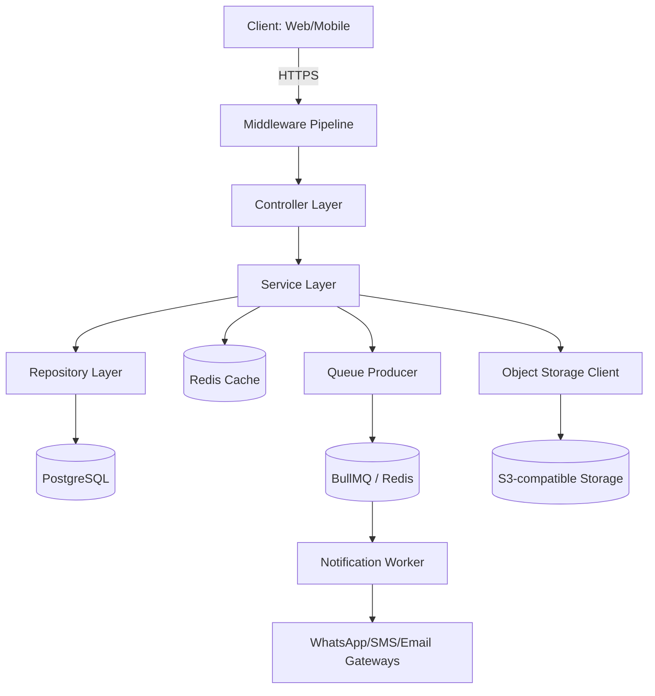
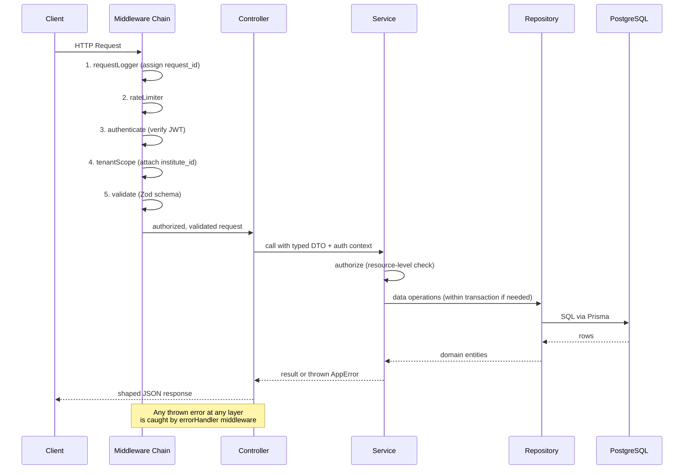

# Backend Architecture — Attendance Management System for Coaching Institutes

## 1. Overview

This document defines the backend architecture, code organization, and engineering standards for the Attendance Management System. It is the primary implementation reference for backend developers and AI coding agents. It complements `api.md` (contract definitions) and does not redefine endpoints, request/response shapes, or the database schema — it defines **how the backend is structured internally to implement that contract**.

### 1.1 Technology Stack (Assumption — stated explicitly)

No stack was mandated in the feature list, so the following production-proven, team-scalable stack is assumed. It optimizes for: fast iteration, strong typing (fewer runtime bugs in a multi-role, permission-heavy system), a mature ecosystem for queues/caching/notifications, and low operational overhead suited to a SaaS serving many small-to-mid coaching institutes.

| Layer | Choice | Rationale |
|---|---|---|
| Language/Runtime | Node.js 20 LTS + TypeScript | Type safety for a permission-matrix-heavy domain; single language across stack |
| Web framework | Express.js | Minimal, unopinionated, huge middleware ecosystem, easy for AI agents to generate idiomatic code for |
| ORM/Query builder | Prisma | Type-safe DB access, migration tooling, good fit with TypeScript |
| Database | PostgreSQL | Relational integrity needed for attendance/fees/roles; strong multi-tenant support via schemas/row-level filtering |
| Cache | Redis | Sessions/rate-limiting/hot report caching |
| Queue | Redis-backed (BullMQ) | Async notification dispatch (per `api.md` §12) |
| Object storage | S3-compatible bucket | Homework/notes/photo uploads via signed URLs |
| Validation | Zod | Schema validation shared between request DTOs and TypeScript types |
| Auth | JWT (jsonwebtoken) + bcrypt | Stateless auth per `api.md` §3 |
| Logging | Pino | Structured JSON logging, low overhead |
| Testing | Vitest + Supertest | Unit + integration testing |

This stack is a recommendation, not a hard constraint on future services (e.g., an analytics microservice could be added in a different language) — see §14 Future Extensibility.

---

## 2. Architectural Style

### 2.1 Layered (N-Tier) Monolith with Modular Boundaries

A **modular monolith** is used rather than microservices at this stage — the domain (single coaching institute's operations) does not yet justify distributed-system complexity, and a monolith is dramatically easier for a small team (or AI agent) to reason about, test, and deploy correctly. Module boundaries are still enforced in code (no cross-module direct DB access — see §3.4) so the system can be split into services later without a rewrite.



### 2.2 Layer Responsibilities

| Layer | Responsibility | Must NOT do |
|---|---|---|
| **Middleware** | Cross-cutting concerns: auth, request parsing, rate limiting, request logging | Business logic |
| **Controller** | HTTP concerns only: parse request, call service, shape HTTP response, map errors to status codes | Business rules, direct DB access |
| **Service** | Business logic, orchestration, transaction boundaries, authorization decisions at resource level | Know about `req`/`res`, HTTP status codes |
| **Repository** | Data access only (Prisma queries), no business logic | Business rules, validation |
| **DTO/Validator** | Shape and validate input/output at the boundary | — |

This strict separation is the single most important convention in this codebase — it is what allows AI coding agents to safely regenerate/modify one layer without breaking others, and keeps business rules in exactly one place (services) rather than scattered across controllers and repositories.

---

## 3. Project Structure

```
src/
├── config/                  # Environment & app configuration (see §9)
│   ├── env.ts
│   ├── database.ts
│   ├── redis.ts
│   └── constants.ts
├── modules/                 # Feature modules — one folder per bounded domain area
│   ├── auth/
│   │   ├── auth.controller.ts
│   │   ├── auth.service.ts
│   │   ├── auth.routes.ts
│   │   ├── auth.validators.ts
│   │   └── auth.types.ts
│   ├── students/
│   │   ├── students.controller.ts
│   │   ├── students.service.ts
│   │   ├── students.repository.ts
│   │   ├── students.routes.ts
│   │   ├── students.validators.ts
│   │   └── students.types.ts
│   ├── batches/
│   ├── attendance/
│   ├── reports/
│   ├── notifications/
│   ├── dashboard/
│   ├── timetable/
│   ├── announcements/
│   ├── homework/
│   ├── notes/
│   └── media/
├── middleware/
│   ├── authenticate.ts       # JWT verification
│   ├── authorize.ts          # Role/resource permission checks
│   ├── validate.ts           # Zod schema validation wrapper
│   ├── rateLimiter.ts
│   ├── requestLogger.ts
│   ├── errorHandler.ts       # Centralized error-to-HTTP mapping
│   └── tenantScope.ts        # Injects/enforces institute_id scoping
├── shared/
│   ├── errors/                # Custom error classes (see §7)
│   ├── utils/
│   ├── pagination/
│   └── audit/                 # Audit log writer (see §11)
├── jobs/                     # BullMQ queue producers/consumers
│   ├── notification.queue.ts
│   └── notification.worker.ts
├── integrations/             # External service clients
│   ├── whatsapp.client.ts
│   ├── sms.client.ts
│   ├── email.client.ts
│   └── storage.client.ts
├── db/
│   ├── prisma/schema.prisma
│   └── migrations/
├── app.ts                    # Express app assembly (middleware + routes)
└── server.ts                 # Process entrypoint
tests/
├── unit/
├── integration/
└── fixtures/
```

### 3.1 Module Anatomy (per feature)

Every module follows the identical file pattern above (`controller → service → repository → routes → validators → types`). This consistency is deliberate: it lets a developer or AI agent locate any concern for any feature in a predictable place without re-learning structure per module.

### 3.2 Routing Assembly

Each module exports an Express `Router`; `app.ts` mounts them under their versioned base path:

```typescript
// app.ts
app.use('/v1/auth', authRoutes);
app.use('/v1/students', studentsRoutes);
app.use('/v1/batches', batchesRoutes);
app.use('/v1/batches/:batchId/attendance', attendanceRoutes);
// ...
```

### 3.3 Naming Conventions

| Item | Convention | Example |
|---|---|---|
| Files | `kebab-case.layer.ts` | `students.service.ts` |
| Classes | `PascalCase` | `StudentsService` |
| Functions/variables | `camelCase` | `getStudentById` |
| Constants/enums | `UPPER_SNAKE_CASE` | `MAX_BATCH_CAPACITY` |
| DB tables | `snake_case`, plural | `students`, `attendance_records` |
| Route paths | `kebab-case`, plural nouns | `/v1/parent-links` |

### 3.4 Module Boundary Rule

A module's repository is only ever called by that module's own service. Cross-module data needs go **service-to-service** (e.g., `AttendanceService` calls `StudentsService.getActiveStudentsInBatch()`), never `AttendanceService` querying the `students` table directly via Prisma. This is the seam that allows future extraction into separate services (§14) without refactoring business logic.

---

## 4. Request Lifecycle & Middleware Pipeline



### 4.1 Middleware Order (fixed, applied globally in `app.ts` unless noted)

1. **`requestLogger`** — generates a `request_id` (UUID), attaches to `req`, logs method/path/duration on response finish.
2. **`helmet`** / CORS — standard HTTP security headers; CORS allowlist driven by config (§9).
3. **`rateLimiter`** — Redis-backed sliding window per `api.md` §4.6 tiers.
4. **`authenticate`** — verifies JWT signature/expiry, attaches `req.auth = { userId, role, instituteId, tokenVersion }`. Public routes (`/auth/login`, `/auth/refresh`, `/health`) are explicitly excluded via a route-level skip list, not by omission — every new route must be deliberately added to either the "protected" or "public" set, defaulting to protected, to avoid accidentally shipping an unauthenticated endpoint.
5. **`tenantScope`** — cross-checks `token_version` against the current DB value (cheap Redis-cached lookup) to support instant token invalidation on password reset/forced logout; attaches `institute_id` filter context used by all repository queries in this request.
6. **`validate(schema)`** — per-route, validates `body`/`query`/`params` against a Zod schema; on failure throws `ValidationError` (§7) before the controller runs.
7. Route handler (`controller`).
8. **`errorHandler`** — final middleware; catches all thrown/forwarded errors (see §7).

---

## 5. Authentication & Authorization Implementation

*(Contract already defined in `api.md` §3 — this section covers implementation.)*

### 5.1 Password Storage

- `bcrypt` with cost factor 12 (tunable via config, re-evaluated periodically as hardware improves).
- Passwords are never logged, never included in any response DTO (enforced by explicit DTO allow-lists — see §6.3 — not by field-blacklisting).

### 5.2 Token Issuance

- Access token: signed HS256 (or RS256 if multi-service verification is later needed — see §14), 15-minute expiry, payload per `api.md` §3.2.
- Refresh token: opaque random string (not JWT) stored hashed in DB (`refresh_tokens` table: `id, user_id, token_hash, family_id, expires_at, revoked_at`), enabling reuse-detection (§api.md 3.1) by tracking `family_id`.

### 5.3 `authenticate` Middleware — Failure Modes

| Condition | Result |
|---|---|
| No `Authorization` header | `401 UNAUTHORIZED` |
| Malformed token | `401 UNAUTHORIZED` |
| Expired token | `401 TOKEN_EXPIRED` |
| Valid token, `token_version` mismatch | `401 TOKEN_EXPIRED` (treated identically to client — forces refresh/re-login) |
| Valid token, user `status = suspended` | `403 ACCOUNT_SUSPENDED` |

### 5.4 Authorization — Two Layers

1. **Role-level (coarse):** `authorize(['admin', 'teacher'])` middleware factory, used at the route level for endpoints where role alone determines access (e.g., only Admin can `POST /v1/batches`).
2. **Resource-level (fine):** implemented **inside the service layer**, never in middleware, because it requires loading the target resource to check ownership (e.g., "is this teacher assigned to this batch?"). Pattern:

```typescript
// attendance.service.ts
async markAttendance(batchId: string, dto: MarkAttendanceDto, auth: AuthContext) {
  const batch = await this.batchesService.getById(batchId, auth.instituteId);
  if (!batch) throw new NotFoundError('RESOURCE_NOT_FOUND');

  if (auth.role === 'teacher' && batch.teacherId !== auth.userId) {
    throw new ForbiddenError('FORBIDDEN_RESOURCE');
  }
  // ...proceed with business logic
}
```

- **Parent → Student link checks** follow the same pattern via a shared `assertParentLinked(parentId, studentId)` helper in `shared/utils`, reused across every module that exposes student-scoped data to parents (attendance, reports, homework, notes), to avoid duplicating this security-critical check.

### 5.5 Multi-Tenancy Enforcement

Every repository method that queries a tenant-scoped table **requires** an `instituteId` parameter — enforced at the TypeScript type level (no repository method may omit it), and every service call site sources it from `auth.instituteId`, never from client input. This is a deliberate defense-in-depth measure against cross-tenant data leakage even if a resource-level check elsewhere is missed.

---

## 6. Validation Strategy

### 6.1 Boundary Validation (Zod)

All request input is validated at the middleware layer using Zod schemas colocated in each module's `*.validators.ts`. Example:

```typescript
// students.validators.ts
export const createStudentSchema = z.object({
  body: z.object({
    name: z.string().min(2).max(100),
    admissionDate: z.coerce.date().max(new Date(), { message: 'admission_date cannot be in the future' }),
    rollNumber: z.string().min(1),
    phone: z.string().regex(/^\d{10}$/, 'must be a valid 10-digit number'),
    parentPhone: z.string().regex(/^\d{10}$/).optional(),
    email: z.string().email().optional(),
    standard: z.string().min(1),
    batchIds: z.array(z.string().cuid()).optional(),
  }),
});
```

A validation failure short-circuits before the controller runs and returns `400`/`422` in the exact envelope shape defined in `api.md` §4.1/§4.3.

### 6.2 Business-Rule Validation (Service Layer)

Rules that require a database lookup (uniqueness, referenced-entity existence, capacity checks, scheduling conflicts) live in the **service layer**, not in Zod schemas — Zod validates shape/format; services validate state. Example: roll-number uniqueness, batch capacity, attendance-edit-window checks (`api.md` §8.2) are all service-layer checks that throw typed domain errors (§7).

### 6.3 Output Shaping (Response DTOs)

Every service/controller pair uses an explicit **allow-list mapper** to build the response object field-by-field rather than returning the raw Prisma entity — this prevents accidental leakage of sensitive/internal fields (password hashes, internal flags, other-tenant foreign keys) if the underlying table gains new columns later.

```typescript
function toStudentResponse(student: StudentEntity): StudentResponseDto {
  return {
    id: student.id,
    name: student.name,
    rollNumber: student.rollNumber,
    status: student.status,
    // ...explicitly listed fields only
  };
}
```

---

## 7. Error Handling

### 7.1 Custom Error Hierarchy

```typescript
// shared/errors/AppError.ts
export abstract class AppError extends Error {
  abstract readonly httpStatus: number;
  abstract readonly code: string;
  constructor(message: string, public details?: unknown) { super(message); }
}

export class ValidationError extends AppError { httpStatus = 400; code = 'VALIDATION_ERROR'; }
export class UnprocessableError extends AppError { httpStatus = 422; code = 'VALIDATION_ERROR'; }
export class UnauthorizedError extends AppError { httpStatus = 401; code = 'TOKEN_EXPIRED'; }
export class ForbiddenError extends AppError { httpStatus = 403; code = 'FORBIDDEN_RESOURCE'; }
export class NotFoundError extends AppError { httpStatus = 404; code = 'RESOURCE_NOT_FOUND'; }
export class ConflictError extends AppError { httpStatus = 409; code = 'DUPLICATE_ENTRY'; }
export class RateLimitError extends AppError { httpStatus = 429; code = 'RATE_LIMIT_EXCEEDED'; }
```

Business-specific subclasses extend these where a more precise error code is needed (per the registry in `api.md` §4.3), e.g. `AttendanceAlreadyMarkedError extends ConflictError`, `BatchCapacityExceededError extends UnprocessableError`.

### 7.2 Centralized `errorHandler` Middleware

- Any `AppError` thrown anywhere in the request lifecycle is caught and mapped directly to the response envelope (`api.md` §4.1) using its `httpStatus`/`code`/`message`/`details`.
- Any **unexpected** (non-`AppError`) exception is logged at `error` level with full stack trace, and a generic `500 INTERNAL_ERROR` is returned to the client — internal error details/stack traces are **never** leaked in the response body, only to logs (see §8).
- Controllers never use `try/catch` for expected domain errors — they let them propagate to `errorHandler`. `try/catch` in controllers is reserved only for cases needing response-specific cleanup (rare).
- All async route handlers are wrapped (e.g., via `express-async-errors` or an `asyncHandler` utility) so thrown errors in `async` functions are correctly forwarded to Express's error pipeline — a common source of unhandled-rejection bugs if omitted.

### 7.3 Transaction Rollback on Error

Any service method that performs multiple writes (e.g., creating a student + assigning batches) wraps them in a Prisma `$transaction`; a thrown error inside the transaction callback automatically rolls back all writes — partial-state writes must never be observable.

---

## 8. Logging

### 8.1 Structure

- **Pino**, structured JSON logs (not plain text) — required for downstream log aggregation/searchability in production.
- Every log line includes: `timestamp`, `level`, `request_id`, `institute_id` (when available), `user_id` (when available), `message`, and structured `context` object.
- `request_id` is generated once per request in `requestLogger` middleware and threaded through every subsequent log call in that request's lifecycle (via `AsyncLocalStorage`, avoiding manual passing through every function signature).

### 8.2 Log Levels & What Goes Where

| Level | Usage |
|---|---|
| `debug` | Verbose internal state, disabled in production by default |
| `info` | Request completed, notable business events (attendance finalized, student created) |
| `warn` | Recoverable anomalies (notification delivery retry, rate limit near threshold) |
| `error` | Unhandled exceptions, failed external integrations, `500`-class responses |

### 8.3 What Must NEVER Be Logged

Passwords, raw JWTs/refresh tokens, full phone numbers in `info`-level logs (mask as `98765XXXXX` — assumption: reasonable PII-minimization default for a system handling minors' data), request bodies for auth endpoints.

### 8.4 Audit Logging (distinct from application logging)

Per `api.md` §21 developer note, every mutating action writes a separate **audit record** (not just a log line) to an `audit_logs` table via a shared `AuditService.record(actorId, action, resourceType, resourceId, beforeState, afterState)` helper, called explicitly from within each service method that mutates state (student edits, attendance corrections, role changes). This is queryable/reportable data, distinguished from ephemeral operational logs which are for debugging/observability only.

---

## 9. Configuration Management

### 9.1 Environment-Based Config

- All configuration loaded from environment variables at startup, validated via a Zod schema in `config/env.ts` — the process **fails fast at boot** (not at first use) if a required variable is missing or malformed, to avoid partial startup into a broken state.

```typescript
const envSchema = z.object({
  NODE_ENV: z.enum(['development', 'staging', 'production']),
  PORT: z.coerce.number().default(4000),
  DATABASE_URL: z.string().url(),
  REDIS_URL: z.string().url(),
  JWT_ACCESS_SECRET: z.string().min(32),
  JWT_REFRESH_SECRET: z.string().min(32),
  S3_BUCKET: z.string(),
  WHATSAPP_API_KEY: z.string().optional(),
  ATTENDANCE_EDIT_WINDOW_DAYS: z.coerce.number().default(7),
});
```

### 9.2 Institute-Level Configuration

Distinct from environment config: per-institute settings (attendance edit window override, notification channel priority order, fee-visibility toggles) are stored in an `institute_settings` table, loaded and cached in Redis per `institute_id` with a short TTL (5 minutes) and explicit cache-busting on update — never read from environment variables, since they vary per tenant, not per deployment.

### 9.3 Secrets Management

- Local/dev: `.env` file (git-ignored).
- Staging/production: injected via the hosting platform's secrets manager (e.g., AWS Secrets Manager/Parameter Store) — never committed, never baked into container images. This is stated as an infrastructure assumption; deployment specifics belong in a separate deployment/DevOps document, out of scope here.

---

## 10. File Uploads

Implements the upload flow contracted in `api.md` §17.1.

### 10.1 Flow

1. `POST /v1/media/upload-url` (media module) — service validates `content_type` against an allow-list and generates a **pre-signed S3 PUT URL** with a short expiry (5 minutes) and a `Content-Length` ceiling matching the type's max size (photos: 5 MB, PDFs: 20 MB, videos: 100 MB — assumption, should be confirmed against actual institute needs/storage budget).
2. Client uploads directly to storage — the API process never buffers binary payloads through itself, keeping request handling fast and memory-bounded.
3. On successful reference (Homework/Notes/Student create-or-update calling with the returned `media_id`), the service verifies the object actually exists in storage (a `HEAD` request) before persisting the reference — preventing dangling references to never-completed uploads.

### 10.2 Orphaned Upload Cleanup

A scheduled job (§13) sweeps `media` records with `status = pending` (upload-url issued but never confirmed/referenced) older than 24 hours and deletes the corresponding storage objects — prevents unbounded storage cost accumulation from abandoned uploads.

---

## 11. Business Logic Organization

### 11.1 Where Rules Live

All domain/business rules from the feature list (attendance percentage formula, batch scheduling conflict detection, attendance-edit window, notification trigger conditions, roll-number uniqueness scope) are implemented **exclusively in the service layer**, each in the service module that owns that resource. Cross-cutting calculations used by multiple modules (e.g., the attendance-percentage formula used by both `reports` and `dashboard` modules) are extracted into a single shared calculator (`shared/utils/attendanceCalculator.ts`) and imported by both — never reimplemented per module, to prevent metric drift (this directly implements the "single shared calculation module" requirement from `api.md` §21).

### 11.2 Example: Service Method Shape

```typescript
// attendance.service.ts
async markSession(batchId: string, dto: MarkAttendanceDto, auth: AuthContext): Promise<AttendanceSessionDto> {
  const batch = await this.batchesRepo.findById(batchId, auth.instituteId);
  if (!batch) throw new NotFoundError('Batch not found');
  this.assertTeacherOwnsBatchOrIsAdmin(batch, auth);
  this.assertWithinEditWindow(dto.date, auth);

  const existing = await this.attendanceRepo.findSession(batchId, dto.date);
  if (existing?.status === 'finalized' && !dto.draft) {
    throw new AttendanceAlreadyMarkedError();
  }

  const session = await this.db.$transaction(async (tx) => {
    const created = await this.attendanceRepo.upsertSession(tx, batchId, dto);
    await this.auditService.record(auth.userId, 'ATTENDANCE_MARKED', 'attendance_session', created.id, existing, created);
    return created;
  });

  if (!dto.draft) {
    await this.notificationQueue.enqueueAttendanceEvents(session);
  }

  return toAttendanceSessionResponse(session);
}
```

### 11.3 Separation of Read and Write Paths

Report/analytics/dashboard modules (§9, §11, §14 of `api.md`) are **read-only consumers** of data owned by other modules (students, batches, attendance) — they never write, and they access data through dedicated read-optimized repository queries (often with raw aggregation SQL via Prisma's `$queryRaw` for performance) rather than reusing write-path service methods, since reporting queries have very different performance characteristics (large scans, aggregations) than transactional writes.

---

## 12. Caching Strategy

| Cached Data | Store | TTL | Invalidation |
|---|---|---|---|
| Institute settings (§9.2) | Redis | 5 min | Explicit bust on `PATCH /institute-settings` |
| Token version (for instant logout) | Redis | Until changed | Explicit bust on password reset/logout-all |
| Dashboard aggregates (`api.md` §11) | Redis | 60 sec | TTL-only (acceptable staleness for a dashboard) |
| Monthly/overall reports (`api.md` §9) | Redis | 15 min | TTL-only, plus explicit bust when attendance is amended within the reported period |
| Rate limit counters | Redis | Sliding window | N/A |

- Caching is applied **only** to read-heavy, tolerant-of-slight-staleness endpoints (dashboards, aggregate reports). Attendance marking, student/batch CRUD, and anything used to make an authorization decision are **never cached**, to avoid stale-permission or double-marking bugs.
- Cache keys are always namespaced by `institute_id` (`dash:owner:{instituteId}:{date}`) to prevent any possibility of cross-tenant cache bleed.

---

## 13. Background Jobs / Scheduled Tasks

| Job | Trigger | Purpose |
|---|---|---|
| `notification.worker` | Queue consumer (continuous) | Dispatches queued parent notifications (`api.md` §12) |
| `notification.retry` | Cron, every 10 min | Retries `failed` notifications per fallback-channel policy |
| `orphaned-upload-cleanup` | Cron, daily | Removes unconfirmed media uploads older than 24h (§10.2) |
| `report-cache-warmer` | Cron, nightly | Pre-computes previous day's dashboard/report aggregates for fast morning load — a performance optimization for the "fast attendance screen" mobile requirement |
| `token-cleanup` | Cron, daily | Purges expired/revoked refresh tokens from the DB |

All scheduled jobs are implemented as BullMQ repeatable jobs (not raw `cron` in-process) so they survive process restarts and can run on a single designated worker instance without duplicate execution across horizontally-scaled API instances.

---

## 14. Backend Coding Standards

### 14.1 General Rules

- **TypeScript `strict: true`** — no implicit `any`, no unchecked nulls.
- No business logic in controllers or route files — enforced via code review checklist, optionally via a custom ESLint rule restricting imports of Prisma client outside `repository.ts` files.
- All public service methods have explicit return-type annotations (never inferred) — keeps contracts stable and self-documenting for AI-agent-assisted edits.
- No `console.log` — use the shared `logger` instance exclusively.
- Every module's `index.ts` (if present) only re-exports its router — internal service/repository classes are not imported directly by other modules (see §3.4).

### 14.2 Testing Expectations

| Layer | Test Type | Tooling |
|---|---|---|
| Services | Unit tests, mocked repositories | Vitest + manual/DI mocks |
| Repositories | Integration tests against a test DB | Vitest + a dockerized Postgres test instance |
| Controllers/Routes | End-to-end HTTP tests | Supertest against a test app instance |
| Business-critical rules (attendance %, scheduling conflicts) | Explicit unit test suites with edge cases (0 sessions, all-leave month, single-day batch) | Vitest |

Minimum bar: every service method that implements a business rule from the feature list must have at least one happy-path and one edge-case/error-path test — enforced via CI coverage gate on the `modules/**/*.service.ts` glob specifically (not a blanket repo-wide percentage, which tends to reward low-value tests).

### 14.3 Code Review Checklist (abridged, for AI-agent-generated PRs too)

- [ ] Does every new endpoint have both role-level (`authorize` middleware) and, if resource-scoped, resource-level checks in the service?
- [ ] Is every DB query scoped by `institute_id`?
- [ ] Are all response fields going through an explicit DTO mapper (no raw Prisma entity returned)?
- [ ] Does every mutation write an audit log entry?
- [ ] Are business-rule errors thrown as typed `AppError` subclasses matching the `api.md` error registry, not generic `Error`?
- [ ] Are multi-write operations wrapped in a transaction?

---

## 15. Future Extensibility

- **Service extraction:** the module-boundary discipline (§3.4) is specifically designed so that high-load modules (e.g., `notifications`, `reports`) can later be extracted into standalone services communicating over the internal service-call interface already in place, with minimal rework.
- **GraphQL gateway:** could be layered on top of existing services without touching business logic, since services are already decoupled from HTTP concerns.
- **Multi-region deployment:** the stateless-API + externalized-cache/queue design (no in-process session state) supports horizontal scaling behind a load balancer without code changes.
- **Fee payment module:** designed as a new sibling module (`modules/fees/`) following the same anatomy, once payment gateway integration is scoped.
- **Webhook dispatch:** could reuse the existing BullMQ queue infrastructure (§13) as the delivery mechanism for third-party institute-website integrations.

---

## 16. Developer Notes

- When adding a new module, copy the file pattern from an existing module of similar shape (e.g., `homework` is the closest template for a new `notes`-like feature) rather than inventing a new structure — consistency is prioritized over local optimization.
- Prefer composing small, single-purpose service methods over large multi-responsibility ones — this materially improves the quality of AI-agent-assisted modifications, since each method's blast radius is easier to reason about.
- Any ambiguity between "is this a validation rule or a business rule" should default to: if it requires a DB read, it's a business rule (service layer); if it's checkable from the payload alone, it's validation (Zod schema).
- Do not introduce a second HTTP framework, ORM, or queue library for a new module "because it's better for this use case" without an architecture decision record — consistency across modules is a explicit priority for this codebase's long-term maintainability.
