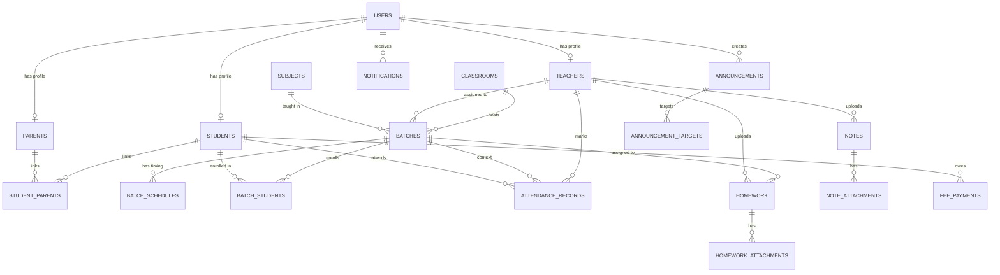

# Database Architecture — Attendance Management System for Coaching Institutes

## 1. Purpose & Scope

This document is the **single source of truth** for the database design of the Attendance Management System. It defines every entity, column, relationship, constraint, index, and data-integrity rule required to implement the persistence layer. It does **not** cover API contracts, UI/UX, business-logic services, or deployment/infra concerns — those belong in their respective documents (`api.md`, `architecture.md`, `deployment.md`, etc.).

This document is written to be directly consumable by AI coding agents and developers to generate ORM models / migrations without further design decisions.

---

## 2. Core Design Principles

| Principle | Decision |
|---|---|
| Database engine | **PostgreSQL** (assumption — chosen for native ENUM, JSONB, partial indexes, and partitioning support). If MySQL is used instead, ENUM columns should become `VARCHAR` + `CHECK` constraints. |
| Primary key strategy | **UUID (v4)** for all tables, stored as `UUID` type. Chosen over auto-increment integers to support future multi-institute sync, offline-first mobile clients, and to avoid exposing sequential IDs. |
| Table naming | `snake_case`, **plural** (e.g., `students`, `batches`). |
| Column naming | `snake_case`, **singular** (e.g., `first_name`, `batch_id`). |
| Foreign key naming | `<referenced_table_singular>_id` (e.g., `teacher_id`, `batch_id`). |
| Timestamps | All tables include `created_at`, `updated_at` (UTC, `TIMESTAMPTZ`). |
| Soft delete | All primary business tables use `deleted_at TIMESTAMPTZ NULL` (see §9). Pure junction/log tables are hard-deleted. |
| Multi-tenancy | **Not implemented in this version.** Assumption: one deployment = one coaching institute. Schema is designed so an `institute_id` column can be added later to every table with minimal refactor (see §14). |
| Normalization | 3NF baseline, with **deliberate denormalization** in `attendance_records` for historical accuracy (see §5.4 rationale). |
| Enum storage | Native Postgres `ENUM` types for closed, rarely-changing value sets (roles, statuses). Open-ended categorization uses lookup tables. |

---

## 3. Entity Overview

| Domain | Tables |
|---|---|
| Identity & Access | `users`, `password_reset_tokens`, `sessions` (optional) |
| Student Management | `students`, `parents`, `student_parents` |
| Staff | `teachers` |
| Batch Management | `subjects`, `classrooms`, `batches`, `batch_schedules`, `batch_students` |
| Attendance | `attendance_records`, `attendance_audit_log` |
| Notifications | `notifications`, `notification_preferences` |
| Announcements | `announcements`, `announcement_targets` |
| Homework | `homework`, `homework_attachments` |
| Learning Materials | `notes`, `note_attachments` |
| Timetable & Calendar | `holidays` |
| Fees (assumption — see §14) | `fee_structures`, `fee_payments` |
| System | `audit_logs` |

---

## 4. Entity-Relationship Diagram

---

## 5. Detailed Table Definitions

### 5.1 Identity & Access

#### `users`
The base identity table. Every login-capable person (Admin, Teacher, Parent, Student — if students are given login access) has exactly one row here. Role-specific data lives in satellite profile tables.

| Column | Type | Constraints | Notes |
|---|---|---|---|
| `id` | UUID | PK, default `gen_random_uuid()` | |
| `role` | ENUM(`admin`,`teacher`,`parent`,`student`) | NOT NULL | Single role per user. See §11 for permission mapping. |
| `full_name` | VARCHAR(150) | NOT NULL | |
| `email` | VARCHAR(255) | UNIQUE, NULLABLE | Nullable because rural coaching centers often lack parent emails. |
| `phone` | VARCHAR(15) | NOT NULL, UNIQUE | Primary login identifier (OTP-based auth is common in this market). |
| `password_hash` | VARCHAR(255) | NULLABLE | Nullable to support OTP-only accounts. |
| `photo_url` | TEXT | NULLABLE | |
| `status` | ENUM(`active`,`inactive`,`suspended`) | NOT NULL, DEFAULT `active` | Login gate — independent from student's coaching `status`. |
| `last_login_at` | TIMESTAMPTZ | NULLABLE | |
| `created_at` | TIMESTAMPTZ | NOT NULL, DEFAULT now() | |
| `updated_at` | TIMESTAMPTZ | NOT NULL, DEFAULT now() | |
| `deleted_at` | TIMESTAMPTZ | NULLABLE | Soft delete. |

**Validation rules**
- `phone` must be a valid 10–15 digit number (E.164 recommended).
- `email`, when present, must pass standard email regex.
- Exactly one active `role`; role is immutable after creation (changing a person's role requires deactivating and creating a new account, to preserve historical audit integrity).

**Indexes**
- Unique index on `phone`.
- Unique partial index on `email WHERE email IS NOT NULL`.
- Index on `role` (frequent filter for role-based queries).

---

#### `password_reset_tokens` (optional, standard auth support)
| Column | Type | Constraints |
|---|---|---|
| `id` | UUID | PK |
| `user_id` | UUID | FK → `users.id`, NOT NULL |
| `token_hash` | VARCHAR(255) | NOT NULL |
| `expires_at` | TIMESTAMPTZ | NOT NULL |
| `used_at` | TIMESTAMPTZ | NULLABLE |
| `created_at` | TIMESTAMPTZ | NOT NULL |

---

### 5.2 Student Management

#### `students`
| Column | Type | Constraints | Notes |
|---|---|---|---|
| `id` | UUID | PK | |
| `user_id` | UUID | FK → `users.id`, UNIQUE, NULLABLE | Nullable — many coaching centers won't issue students individual logins initially. |
| `roll_number` | VARCHAR(30) | NOT NULL | Unique **within institute**, not globally (see §14 multi-tenancy note). |
| `admission_date` | DATE | NOT NULL | |
| `first_name` | VARCHAR(100) | NOT NULL | |
| `last_name` | VARCHAR(100) | NULLABLE | |
| `phone` | VARCHAR(15) | NULLABLE | Student's own contact, distinct from parent. |
| `parent_phone` | VARCHAR(15) | NOT NULL | Denormalized primary contact for fast notification lookups even if no `parents` record exists yet. |
| `email` | VARCHAR(255) | NULLABLE | |
| `address` | TEXT | NULLABLE | |
| `school` | VARCHAR(150) | NULLABLE | Free text — not normalized into a table; low query value, high entry variability. |
| `standard` | VARCHAR(20) | NOT NULL | E.g. "10th", "12th - PCM". Kept as free text/enum-like string rather than FK to keep onboarding friction low; see §14 for optional `classes` lookup table upgrade path. |
| `photo_url` | TEXT | NULLABLE | |
| `status` | ENUM(`active`,`left`,`suspended`) | NOT NULL, DEFAULT `active` | |
| `status_reason` | TEXT | NULLABLE | Free-text reason, required at application layer when status ≠ active. |
| `created_at` | TIMESTAMPTZ | NOT NULL | |
| `updated_at` | TIMESTAMPTZ | NOT NULL | |
| `deleted_at` | TIMESTAMPTZ | NULLABLE | Soft delete — required so attendance history is never orphaned. |

**Validation rules**
- `roll_number` unique among non-deleted students (`UNIQUE` index scoped with `WHERE deleted_at IS NULL`).
- `parent_phone` required even if a linked `parents` account doesn't exist — notifications must always have a fallback delivery target.
- A student cannot be **hard deleted** if `attendance_records` exist for them — enforced at application layer; DB relationship uses `ON DELETE RESTRICT` from `attendance_records.student_id`.

**Indexes**
- Composite index on `(first_name, last_name)` for name search.
- Index on `phone`, `parent_phone` for search.
- Index on `roll_number`.
- Index on `standard`.
- Index on `status` (dashboards filter heavily by active students).

---

#### `parents`
Represents an optional login-enabled parent account. A student can have multiple linked parents (father, mother, guardian); a parent can have multiple children (siblings in the same institute) — hence a many-to-many junction.

| Column | Type | Constraints |
|---|---|---|
| `id` | UUID | PK |
| `user_id` | UUID | FK → `users.id`, UNIQUE, NOT NULL |
| `relation` | ENUM(`father`,`mother`,`guardian`,`other`) | NOT NULL, DEFAULT `guardian` |
| `created_at` | TIMESTAMPTZ | NOT NULL |
| `updated_at` | TIMESTAMPTZ | NOT NULL |
| `deleted_at` | TIMESTAMPTZ | NULLABLE |

#### `student_parents` (junction)
| Column | Type | Constraints |
|---|---|---|
| `id` | UUID | PK |
| `student_id` | UUID | FK → `students.id`, NOT NULL, `ON DELETE CASCADE` |
| `parent_id` | UUID | FK → `parents.id`, NOT NULL, `ON DELETE CASCADE` |
| `is_primary` | BOOLEAN | NOT NULL, DEFAULT false | Determines who receives notifications first if multiple parents exist. |
| `created_at` | TIMESTAMPTZ | NOT NULL |

**Constraints**
- Unique composite `(student_id, parent_id)`.
- Application-level rule: at most one `is_primary = true` per `student_id`.

---

### 5.3 Staff

#### `teachers`
| Column | Type | Constraints | Notes |
|---|---|---|---|
| `id` | UUID | PK | |
| `user_id` | UUID | FK → `users.id`, UNIQUE, NOT NULL | |
| `employee_code` | VARCHAR(30) | UNIQUE, NULLABLE | |
| `specialization` | VARCHAR(150) | NULLABLE | E.g. "Mathematics, Physics". |
| `joining_date` | DATE | NULLABLE | |
| `status` | ENUM(`active`,`inactive`) | NOT NULL, DEFAULT `active` | |
| `created_at` | TIMESTAMPTZ | NOT NULL | |
| `updated_at` | TIMESTAMPTZ | NOT NULL | |
| `deleted_at` | TIMESTAMPTZ | NULLABLE | |

---

### 5.4 Batch Management

#### `subjects`
| Column | Type | Constraints |
|---|---|---|
| `id` | UUID | PK |
| `name` | VARCHAR(100) | NOT NULL, UNIQUE |
| `created_at` | TIMESTAMPTZ | NOT NULL |
| `deleted_at` | TIMESTAMPTZ | NULLABLE |

#### `classrooms`
| Column | Type | Constraints |
|---|---|---|
| `id` | UUID | PK |
| `name` | VARCHAR(100) | NOT NULL, UNIQUE | E.g. "Room A", "Hall 2". |
| `capacity` | INTEGER | NULLABLE | |
| `created_at` | TIMESTAMPTZ | NOT NULL |
| `deleted_at` | TIMESTAMPTZ | NULLABLE |

#### `batches`
| Column | Type | Constraints | Notes |
|---|---|---|---|
| `id` | UUID | PK | |
| `name` | VARCHAR(150) | NOT NULL | E.g. "Class 10 Maths – Batch A". |
| `subject_id` | UUID | FK → `subjects.id`, NOT NULL | |
| `teacher_id` | UUID | FK → `teachers.id`, NOT NULL | Current assigned teacher. |
| `classroom_id` | UUID | FK → `classrooms.id`, NULLABLE | |
| `standard` | VARCHAR(20) | NULLABLE | E.g. "10th" — informational grouping. |
| `capacity` | INTEGER | NOT NULL, DEFAULT 30 | Enforced at application layer against `batch_students` count. |
| `status` | ENUM(`active`,`archived`) | NOT NULL, DEFAULT `active` | |
| `created_at` | TIMESTAMPTZ | NOT NULL | |
| `updated_at` | TIMESTAMPTZ | NOT NULL | |
| `deleted_at` | TIMESTAMPTZ | NULLABLE | |

**Validation rules**
- `capacity` must be > 0.
- Reassigning `teacher_id` does **not** retroactively change historical `attendance_records` (see denormalization rationale below).

#### `batch_schedules`
Normalizes the "Mon Wed Fri, 6–7 PM" pattern into queryable rows instead of a string blob.

| Column | Type | Constraints |
|---|---|---|
| `id` | UUID | PK |
| `batch_id` | UUID | FK → `batches.id`, NOT NULL, `ON DELETE CASCADE` |
| `day_of_week` | ENUM(`mon`,`tue`,`wed`,`thu`,`fri`,`sat`,`sun`) | NOT NULL |
| `start_time` | TIME | NOT NULL |
| `end_time` | TIME | NOT NULL |

**Validation rules**
- `end_time` > `start_time`.
- Application-level check: no overlapping schedule for the same `classroom_id` across batches on the same `day_of_week` (double-booking prevention).
- Unique composite `(batch_id, day_of_week, start_time)`.

#### `batch_students` (junction — student enrollment)
| Column | Type | Constraints | Notes |
|---|---|---|---|
| `id` | UUID | PK | |
| `batch_id` | UUID | FK → `batches.id`, NOT NULL | |
| `student_id` | UUID | FK → `students.id`, NOT NULL | |
| `enrolled_on` | DATE | NOT NULL, DEFAULT current_date | |
| `left_on` | DATE | NULLABLE | Set when student is removed from batch, without deleting history. |
| `status` | ENUM(`active`,`removed`) | NOT NULL, DEFAULT `active` | |
| `created_at` | TIMESTAMPTZ | NOT NULL | |

**Constraints**
- Unique composite `(batch_id, student_id) WHERE status = 'active'` — prevents duplicate active enrollment while allowing historical re-enrollment records.

**Indexes**
- Index on `student_id` (student's batch list).
- Index on `batch_id` (roster lookups — heavily used by the attendance marking screen).

---

### 5.5 Attendance (Core Domain)

#### `attendance_records`
This is the highest-write-volume, highest-query-value table in the system. Design prioritizes **historical accuracy** and **fast reporting**.

| Column | Type | Constraints | Notes |
|---|---|---|---|
| `id` | UUID | PK | |
| `student_id` | UUID | FK → `students.id`, NOT NULL, `ON DELETE RESTRICT` | |
| `batch_id` | UUID | FK → `batches.id`, NOT NULL, `ON DELETE RESTRICT` | |
| `subject_id` | UUID | FK → `subjects.id`, NOT NULL | **Denormalized snapshot** — copied from `batches.subject_id` at time of marking, so reports remain accurate even if the batch's subject changes later. |
| `teacher_id` | UUID | FK → `teachers.id`, NOT NULL | **Denormalized snapshot** of who taught that session — not necessarily today's assigned teacher (substitute teachers marking attendance). |
| `date` | DATE | NOT NULL | |
| `status` | ENUM(`present`,`absent`,`late`,`leave`) | NOT NULL | Display mapping: Present=✓, Absent=✗, Late=L, Leave=LV (UI concern, documented here for context only). |
| `remarks` | TEXT | NULLABLE | E.g. reason for leave. |
| `is_draft` | BOOLEAN | NOT NULL, DEFAULT false | Supports "save draft" workflow — draft rows are excluded from reports/notifications until finalized. |
| `marked_by` | UUID | FK → `users.id`, NOT NULL | The teacher/admin who marked it. |
| `marked_at` | TIMESTAMPTZ | NOT NULL, DEFAULT now() | |
| `updated_by` | UUID | FK → `users.id`, NULLABLE | Last editor, for corrections. |
| `updated_at` | TIMESTAMPTZ | NOT NULL, DEFAULT now() | |
| `created_at` | TIMESTAMPTZ | NOT NULL, DEFAULT now() | |
| `deleted_at` | TIMESTAMPTZ | NULLABLE | Rare — attendance is corrected via update, not delete; retained for data-integrity fixes only. |

**Why denormalize `subject_id`/`teacher_id`?**
Batches are mutable (teacher reassignment, subject correction). Attendance history must reflect the **state at the time of the class**, not the batch's current configuration — otherwise "Teacher-wise report" for a past month would silently rewrite itself when a teacher changes.

**Validation rules**
- Unique composite `(student_id, batch_id, date) WHERE deleted_at IS NULL` — one attendance record per student per batch per day. "Update attendance" is an `UPDATE`, not a new row.
- `date` cannot be in the future.
- `student_id` must have an **active** row in `batch_students` for the given `batch_id` as of `date` (enforced at application layer — DB cannot easily validate temporal membership).
- A row cannot transition from `is_draft = true` directly to deleted without an explicit discard action (audit trail via `attendance_audit_log`).

**Indexes** (critical for report performance)
- Composite index on `(batch_id, date)` — daily attendance marking screen.
- Composite index on `(student_id, date)` — student attendance history.
- Composite index on `(student_id, batch_id)` — student-wise report.
- Index on `date` alone — daily/weekly/monthly aggregate reports.
- Index on `teacher_id` — teacher-wise report.
- Partial index on `(is_draft) WHERE is_draft = true` — quickly locate unsaved drafts.

#### `attendance_audit_log`
Tracks every change to an attendance record (who changed Present→Absent, when, why) — necessary since attendance is a compliance-sensitive, fee/report-affecting record.

| Column | Type | Constraints |
|---|---|---|
| `id` | UUID | PK |
| `attendance_record_id` | UUID | FK → `attendance_records.id`, NOT NULL, `ON DELETE CASCADE` |
| `changed_by` | UUID | FK → `users.id`, NOT NULL |
| `old_status` | ENUM(`present`,`absent`,`late`,`leave`) | NULLABLE |
| `new_status` | ENUM(`present`,`absent`,`late`,`leave`) | NOT NULL |
| `changed_at` | TIMESTAMPTZ | NOT NULL, DEFAULT now() |

---

### 5.6 Notifications

#### `notifications`
| Column | Type | Constraints | Notes |
|---|---|---|---|
| `id` | UUID | PK | |
| `recipient_user_id` | UUID | FK → `users.id`, NULLABLE | Nullable when sent to a raw phone number (parent without account). |
| `recipient_phone` | VARCHAR(15) | NULLABLE | Fallback target. |
| `type` | ENUM(`attendance_present`,`attendance_absent`,`announcement`,`fee_reminder`,`homework`,`general`) | NOT NULL | |
| `channel` | ENUM(`app`,`sms`,`whatsapp`,`email`) | NOT NULL | |
| `related_entity_type` | VARCHAR(50) | NULLABLE | E.g. `attendance_records`, `announcements`. Polymorphic reference — no FK constraint (see note). |
| `related_entity_id` | UUID | NULLABLE | |
| `message` | TEXT | NOT NULL | Rendered final message body. |
| `status` | ENUM(`pending`,`sent`,`failed`) | NOT NULL, DEFAULT `pending` | |
| `sent_at` | TIMESTAMPTZ | NULLABLE | |
| `failure_reason` | TEXT | NULLABLE | |
| `created_at` | TIMESTAMPTZ | NOT NULL | |

**Note on polymorphic reference:** `related_entity_type` + `related_entity_id` intentionally has no foreign key (Postgres cannot FK against multiple tables). Referential integrity for this pair is enforced at the application/service layer. This is a deliberate, documented trade-off for extensibility over strict DB-level enforcement.

**Indexes**
- Index on `recipient_user_id`.
- Index on `status` (for retry queues on `failed`/`pending`).
- Composite index on `(related_entity_type, related_entity_id)`.

#### `notification_preferences`
| Column | Type | Constraints |
|---|---|---|
| `id` | UUID | PK |
| `user_id` | UUID | FK → `users.id`, UNIQUE, NOT NULL |
| `channel_sms` | BOOLEAN | NOT NULL, DEFAULT true |
| `channel_whatsapp` | BOOLEAN | NOT NULL, DEFAULT false |
| `channel_email` | BOOLEAN | NOT NULL, DEFAULT false |
| `channel_app` | BOOLEAN | NOT NULL, DEFAULT true |

---

### 5.7 Announcements

#### `announcements`
| Column | Type | Constraints |
|---|---|---|
| `id` | UUID | PK |
| `created_by` | UUID | FK → `users.id`, NOT NULL |
| `title` | VARCHAR(200) | NOT NULL |
| `message` | TEXT | NOT NULL |
| `category` | ENUM(`holiday`,`exam`,`fee_reminder`,`general`) | NOT NULL |
| `scheduled_at` | TIMESTAMPTZ | NULLABLE | For future-dated announcements. |
| `published_at` | TIMESTAMPTZ | NULLABLE | Null until actually sent. |
| `created_at` | TIMESTAMPTZ | NOT NULL |
| `deleted_at` | TIMESTAMPTZ | NULLABLE |

#### `announcement_targets`
Defines audience scope — supports targeting all users, a specific batch, or a specific standard.

| Column | Type | Constraints |
|---|---|---|
| `id` | UUID | PK |
| `announcement_id` | UUID | FK → `announcements.id`, NOT NULL, `ON DELETE CASCADE` |
| `target_type` | ENUM(`all`,`batch`,`standard`,`role`) | NOT NULL |
| `target_value` | VARCHAR(100) | NULLABLE | Holds `batch_id` (as text), standard name, or role name depending on `target_type`. |

---

### 5.8 Homework

#### `homework`
| Column | Type | Constraints |
|---|---|---|
| `id` | UUID | PK |
| `batch_id` | UUID | FK → `batches.id`, NOT NULL |
| `teacher_id` | UUID | FK → `teachers.id`, NOT NULL |
| `title` | VARCHAR(200) | NOT NULL |
| `description` | TEXT | NULLABLE |
| `due_date` | DATE | NULLABLE |
| `created_at` | TIMESTAMPTZ | NOT NULL |
| `deleted_at` | TIMESTAMPTZ | NULLABLE |

#### `homework_attachments`
| Column | Type | Constraints |
|---|---|---|
| `id` | UUID | PK |
| `homework_id` | UUID | FK → `homework.id`, NOT NULL, `ON DELETE CASCADE` |
| `file_url` | TEXT | NOT NULL |
| `file_type` | ENUM(`pdf`,`image`) | NOT NULL |
| `uploaded_at` | TIMESTAMPTZ | NOT NULL |

---

### 5.9 Learning Materials (Notes)

#### `notes`
| Column | Type | Constraints |
|---|---|---|
| `id` | UUID | PK |
| `teacher_id` | UUID | FK → `teachers.id`, NOT NULL |
| `batch_id` | UUID | FK → `batches.id`, NULLABLE | Nullable to support standard-wide (cross-batch) material. |
| `standard` | VARCHAR(20) | NULLABLE | |
| `title` | VARCHAR(200) | NOT NULL |
| `created_at` | TIMESTAMPTZ | NOT NULL |
| `deleted_at` | TIMESTAMPTZ | NULLABLE |

#### `note_attachments`
| Column | Type | Constraints |
|---|---|---|
| `id` | UUID | PK |
| `note_id` | UUID | FK → `notes.id`, NOT NULL, `ON DELETE CASCADE` |
| `file_url` | TEXT | NOT NULL |
| `file_type` | ENUM(`pdf`,`video`,`image`) | NOT NULL |
| `uploaded_at` | TIMESTAMPTZ | NOT NULL |

---

### 5.10 Timetable & Calendar

#### `holidays`
| Column | Type | Constraints |
|---|---|---|
| `id` | UUID | PK |
| `date` | DATE | NOT NULL, UNIQUE |
| `description` | VARCHAR(200) | NOT NULL |
| `created_by` | UUID | FK → `users.id`, NOT NULL |
| `created_at` | TIMESTAMPTZ | NOT NULL |

**Business rule:** Attendance marking UI and reports should exclude/flag dates present in `holidays`, but the DB does not hard-block attendance entry on a holiday (edge case: makeup classes can occur on marked holidays).

*(The weekly timetable itself is a derived view — computed by joining `batch_schedules` with `batches`/`teachers`/`students`, not a separate stored table.)*

---

### 5.11 Fees (Assumption)

The finalized feature list references "Pending fees" (owner/parent dashboards) and "Fees reminder" (announcements) but does not define a full fee module. The following minimal schema is assumed as a placeholder so dashboard/notification features are not blocked. **This should be revisited with a dedicated `fees.md` if fee management becomes a full feature.**

#### `fee_structures`
| Column | Type | Constraints |
|---|---|---|
| `id` | UUID | PK |
| `batch_id` | UUID | FK → `batches.id`, NULLABLE |
| `standard` | VARCHAR(20) | NULLABLE |
| `amount` | NUMERIC(10,2) | NOT NULL |
| `frequency` | ENUM(`monthly`,`quarterly`,`yearly`,`one_time`) | NOT NULL |
| `created_at` | TIMESTAMPTZ | NOT NULL |

#### `fee_payments`
| Column | Type | Constraints |
|---|---|---|
| `id` | UUID | PK |
| `student_id` | UUID | FK → `students.id`, NOT NULL |
| `fee_structure_id` | UUID | FK → `fee_structures.id`, NULLABLE |
| `amount_due` | NUMERIC(10,2) | NOT NULL |
| `amount_paid` | NUMERIC(10,2) | NOT NULL, DEFAULT 0 |
| `due_date` | DATE | NOT NULL |
| `paid_date` | DATE | NULLABLE |
| `status` | ENUM(`pending`,`paid`,`overdue`,`partial`) | NOT NULL, DEFAULT `pending` |
| `payment_mode` | ENUM(`cash`,`upi`,`card`,`bank_transfer`,`other`) | NULLABLE |
| `created_at` | TIMESTAMPTZ | NOT NULL |

**Indexes**: composite `(student_id, status)`, index on `due_date` for overdue detection.

---

### 5.12 System

#### `audit_logs`
General-purpose action log for Admin/Teacher actions not already covered by `attendance_audit_log` (e.g., student edits, deletions, status changes).

| Column | Type | Constraints |
|---|---|---|
| `id` | UUID | PK |
| `user_id` | UUID | FK → `users.id`, NOT NULL |
| `action` | VARCHAR(100) | NOT NULL | E.g. `student.update`, `student.delete`, `batch.create`. |
| `entity_type` | VARCHAR(50) | NOT NULL |
| `entity_id` | UUID | NOT NULL |
| `changes` | JSONB | NULLABLE | Before/after diff. |
| `created_at` | TIMESTAMPTZ | NOT NULL |

**Indexes**: composite `(entity_type, entity_id)`, index on `user_id`, index on `created_at` (log rotation/archival queries).

---

## 6. Soft Delete Strategy

- All entities central to historical reporting (`students`, `teachers`, `batches`, `subjects`, `classrooms`, `parents`, `homework`, `notes`, `announcements`) use `deleted_at TIMESTAMPTZ NULL`.
- **Application queries must always filter `WHERE deleted_at IS NULL`** by default; ORM-level default scopes are strongly recommended to prevent accidental leakage of deleted records.
- Junction and log tables (`student_parents`, `batch_students`, `attendance_audit_log`, `audit_logs`, `notifications`) do not soft-delete; they represent point-in-time facts, not mutable entities. `batch_students` uses a `status = 'removed'` flag instead, since "removal from batch" is itself a meaningful state, not a deletion.
- `attendance_records` are never hard-deleted by users through normal UI flows; corrections go through `UPDATE` + `attendance_audit_log`. `deleted_at` on this table is reserved for admin-only data-integrity cleanup.
- Hard deletes (data purge) are only permitted via a separate, explicitly-audited admin operation — out of scope for this document.

---

## 7. Audit Fields Strategy

| Field | Applies to | Purpose |
|---|---|---|
| `created_at` | All tables | Record creation time. |
| `updated_at` | Mutable entities | Last modification time (auto-updated via trigger or ORM hook). |
| `created_by` / `marked_by` / `uploaded_by` / `changed_by` | Tables where "who did this" matters for accountability | Points to `users.id`. |
| `deleted_at` | Soft-deletable tables | See §6. |
| `attendance_audit_log`, `audit_logs` | System-wide | Full change history, independent of the row's current state. |

**Implementation note:** Use database triggers (or ORM `beforeUpdate` hooks) to auto-set `updated_at` — do not rely on application code remembering to set it manually.

---

## 8. Key Business Rules Enforced via Schema

1. A student cannot have two active attendance records for the same batch on the same day → unique constraint (§5.5).
2. A student cannot be actively enrolled in the same batch twice → partial unique constraint on `batch_students` (§5.4).
3. Attendance history is immune to later batch metadata changes (teacher reassignment, subject correction) via denormalized snapshot fields (§5.5).
4. A student's `parent_phone` is always present, guaranteeing notification deliverability even without a `parents` account (§5.2).
5. Draft attendance (`is_draft = true`) is excluded from reports and does not trigger parent notifications — enforced at the query/service layer, but the flag itself lives in the schema.
6. Roll numbers and employee codes are unique only among **non-deleted** records, permitting reuse after a student/teacher record is soft-deleted.

---

## 9. Edge Cases Considered

| Edge Case | Handling |
|---|---|
| Student transferred between batches mid-term | New `batch_students` row created; old row set to `status = 'removed', left_on = <date>`. Historical attendance under the old batch remains intact and correctly attributed. |
| Teacher marks attendance for a batch they don't currently teach (substitute) | Allowed — `marked_by` records the actual marker; `teacher_id` on the attendance row can differ from `batches.teacher_id` if a substitute is explicitly selected in the UI. |
| Attendance marked, then corrected same day | `UPDATE` on existing row (unique constraint enforces no duplicate); old value captured in `attendance_audit_log`. |
| Class held on a marked holiday (makeup class) | Attendance entry still permitted; `holidays` table is advisory, not a hard block (§5.10). |
| Parent has two children in different batches | Single `parents` row, two rows in `student_parents` (§5.2). |
| Student has no linked parent user account | Notifications fall back to `students.parent_phone` via SMS (`notifications.recipient_phone`). |
| Batch reaches capacity | Enforced at application layer by counting active `batch_students` rows against `batches.capacity` before insert; not a DB constraint since capacity is a business rule, not a structural one. |
| Duplicate roll number after a student is soft-deleted and institute wants to reuse it | Permitted — uniqueness constraint scoped to `deleted_at IS NULL` (§5.2). |
| Notification delivery failure (SMS/WhatsApp API down) | `notifications.status = 'failed'` with `failure_reason`; retry handled by application job queue polling `status IN ('pending','failed')`. |

---

## 10. Indexing Strategy Summary

| Table | Index | Reason |
|---|---|---|
| `attendance_records` | `(batch_id, date)` | Daily attendance marking screen — most frequent query. |
| `attendance_records` | `(student_id, date)` | Student attendance history. |
| `attendance_records` | `(student_id, batch_id)` | Student-wise report. |
| `attendance_records` | `date` | Daily/weekly/monthly aggregate reports. |
| `attendance_records` | `teacher_id` | Teacher-wise report. |
| `students` | `(first_name, last_name)`, `phone`, `parent_phone`, `roll_number`, `standard`, `status` | Student search (§10 in feature spec). |
| `batches` | `status`, `teacher_id` | Dashboard "today's batches" queries. |
| `notifications` | `status`, `recipient_user_id` | Delivery retry queue, per-user inbox. |
| `fee_payments` | `(student_id, status)`, `due_date` | Pending/overdue fee dashboards. |

---

## 11. Role-to-Data Access Matrix (for reference — enforcement lives in the API layer, not the DB)

| Role | Read | Write |
|---|---|---|
| Admin | All tables | All tables |
| Teacher | Own batches, enrolled students, own attendance records, own homework/notes | `attendance_records`, `homework`, `notes` scoped to own `batch_id`s |
| Parent | Own children's `attendance_records`, `fee_payments`, `announcements` targeted to them | None (read-only) |
| Student | Own `attendance_records`, `homework`, `notes` for enrolled batches | None (read-only) |

Row-level scoping (e.g., "teacher can only see their own batches") should be implemented via application-layer query filters. Postgres Row-Level Security (RLS) is a viable future hardening step but is **not assumed** in this version to keep the ORM layer portable.

---

## 12. Scalability & Performance Considerations

- **Partitioning:** `attendance_records` is the fastest-growing table (one row per student per class per day). Recommend **range partitioning by month** on the `date` column once the table exceeds ~5–10 million rows, to keep report queries and index maintenance fast.
- **Archival:** Consider moving `attendance_records` and `notifications` older than 2–3 years into a cold-storage/archive table or export, retaining only aggregated summary rows in the hot path.
- **Read replicas:** Reports (§ dashboards, analytics graphs) are read-heavy and can be served from a read replica to isolate load from the live attendance-marking write path.
- **Materialized views / summary tables:** For "Overall attendance %", "Top/Least attendance students", and "Batch comparison" analytics, avoid recomputing from raw `attendance_records` on every request. Recommend a nightly (or on-write-triggered) materialized view or a `attendance_daily_summary` rollup table: `(batch_id, date, present_count, absent_count, late_count, leave_count)`. This is a **future addition**, not part of the core schema in this version.
- **JSONB usage:** Kept minimal (`audit_logs.changes` only) to preserve relational query performance; avoid using JSONB for core reportable fields.
- **Connection pooling:** Standard for high-concurrency attendance-marking periods (many teachers marking simultaneously at class start times) — an infra concern, noted here only as a schema-adjacent consideration (no schema impact).

---

## 13. Normalization Decisions Summary

| Decision | Level | Rationale |
|---|---|---|
| `attendance_records.subject_id` / `teacher_id` | Denormalized (violates strict 3NF) | Historical accuracy — see §5.5. |
| `students.parent_phone` | Denormalized (duplicate of potential `parents` data) | Guaranteed notification delivery without requiring a parent account. |
| `students.school`, `students.standard` | Free text, not normalized into lookup tables | Low relational value, high data-entry flexibility; acceptable for this domain. Documented as an explicit trade-off — can be normalized later into a `classes` lookup table if standardized reporting across standards becomes critical (see §14). |
| `batch_schedules` | Fully normalized (separate rows per day/time) | Enables schedule conflict detection and timetable queries — string blobs would not. |
| Everything else | 3NF | Standard relational design. |

---

## 14. Future Extensibility

- **Multi-tenancy:** Add `institute_id UUID` to every table + a new `institutes` table if the product expands to serve multiple coaching centers from one deployment. All unique constraints currently scoped globally (e.g., `roll_number`) should be re-scoped to `(institute_id, roll_number)`.
- **`classes` lookup table:** Promote `students.standard` / `batches.standard` from free text to a proper `classes` table (`id`, `name`, `display_order`) if strict standard-wise validation or ordering becomes necessary.
- **RBAC expansion:** Current `users.role` ENUM is sufficient for 4 fixed roles. If custom/granular permissions are needed later (e.g., "Senior Teacher" with admin-lite access), introduce `roles` and `permissions` tables with a `role_permissions` join, replacing the ENUM.
- **Fee module:** §5.11 is a placeholder. A dedicated `fees.md` should define installments, discounts, receipts, and payment gateway integration tables when this becomes a full feature.
- **Attendance summary rollups:** `attendance_daily_summary` / `attendance_monthly_summary` tables (see §12) for analytics performance at scale.
- **Learning platform expansion:** `notes` and `homework` schemas are intentionally structured similarly (parent entity + attachments table) so they can later be unified into a generic `content_items` polymorphic model if the product grows into a full LMS.
- **Push notification device tokens:** A `device_tokens` table (`user_id`, `token`, `platform`) will be needed once native mobile push replaces/supplements SMS/WhatsApp.

---

## 15. Developer Implementation Notes

- Use UUID default generation (`gen_random_uuid()` via `pgcrypto`/`pgcrypto` extension, or `uuid-ossp`) — ensure the extension is enabled in the initial migration.
- Enforce all `ENUM` types as native Postgres enums for data integrity; if using an ORM (Prisma/TypeORM/Sequelize), mirror these as ORM-level enums, not free strings.
- All monetary values use `NUMERIC(10,2)` — never `FLOAT`/`DOUBLE`, to avoid rounding errors in fee calculations.
- All partial unique indexes (`WHERE deleted_at IS NULL`, `WHERE status = 'active'`) must be created explicitly — most ORMs do not generate these automatically from model annotations and require raw migration SQL or ORM-specific partial-index syntax.
- `updated_at` auto-update should be implemented via a shared Postgres trigger function applied to every mutable table, rather than duplicated application logic.
- Seed data should include at minimum: one `admin` user, a default `subjects` set, and a `classes`-equivalent `standard` value list, to unblock frontend development immediately after migration.
