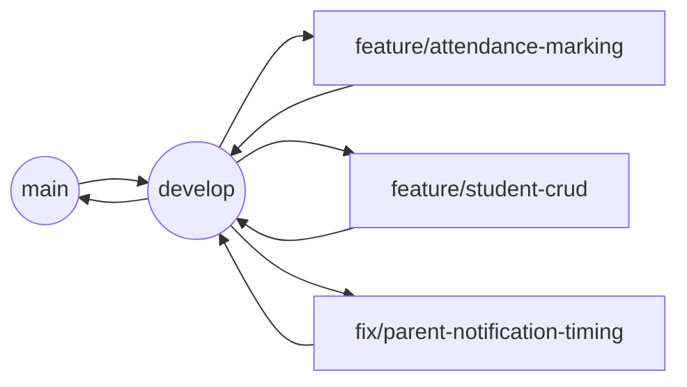

# Development Standards — Attendance Management System for Coaching Institutes

## 1. Purpose & Scope

This document defines the engineering standards, workflows, and conventions for building and maintaining the Attendance Management System (AMS). It is the primary reference for human developers and AI coding agents contributing code, and covers:

- Coding conventions (frontend, backend, database)
- Git workflow, branching, and commit standards
- Naming conventions across the codebase
- Reusable component and module rules
- Documentation standards
- Testing expectations
- Code review practices
- Dependency management
- Environment configuration
- Best practices for AI-assisted development

**Out of scope** (covered in separate docs): feature specifications, API contracts, database schema definitions, deployment/infrastructure (CI/CD, hosting), and UI/UX design guidelines. This document assumes those exist as companion files (e.g. `requirements.md`, `api-spec.md`, `schema.md`, `deployment.md`, `design-system.md`) and does not duplicate their content.

### Assumptions
- Stack: React (frontend, mobile-first responsive web) + Node.js/Express (backend) + PostgreSQL (relational data — students, batches, attendance, fees) is assumed as the default stack since attendance data is highly relational and requires strong consistency (e.g., one attendance record per student per session).
- Monorepo structure (`/frontend`, `/backend`, `/docs`) is assumed for simplicity of coordination in a small team; this can be split into polyrepos later without changing the standards below.
- TypeScript is assumed across frontend and backend for type safety, given the number of interlinked entities (Student, Batch, Attendance, Fee, User).

---

## 2. Repository Structure

```
ams/
├── frontend/
│   ├── src/
│   │   ├── components/       # Reusable, presentation-only components
│   │   ├── modules/          # Feature modules (attendance, students, batches, reports)
│   │   ├── hooks/            # Reusable React hooks
│   │   ├── services/         # API client calls
│   │   ├── store/            # Global state (auth, session)
│   │   ├── utils/            # Pure utility functions
│   │   ├── types/            # Shared TypeScript types/interfaces
│   │   └── pages/            # Route-level components
│   └── tests/
├── backend/
│   ├── src/
│   │   ├── modules/          # Feature modules (auth, students, batches, attendance, reports, notifications)
│   │   ├── middleware/        # Auth, validation, error handling
│   │   ├── db/                # Migrations, seeders, models
│   │   ├── utils/
│   │   └── config/
│   └── tests/
├── docs/                      # All project documentation (this file lives here)
└── scripts/                   # Dev tooling, DB seed scripts, one-off scripts
```

Each `module` (e.g., `attendance`) follows a consistent internal structure: `controller`, `service`, `routes`, `validation`, `types`, `tests`. Business logic must live in `service` files — never in `controller` or `routes` files. This keeps modules testable in isolation and predictable for AI agents modifying one layer at a time.

---

## 3. Coding Conventions

### 3.1 General Principles

| Principle | Rule |
|---|---|
| Single Responsibility | One function/component does one thing. Split if a function exceeds ~40 lines or handles more than one concern. |
| Explicitness over cleverness | Prefer readable code over compact one-liners, especially in attendance/fee calculation logic where correctness matters more than brevity. |
| Pure functions first | Business logic (e.g., attendance % calculation) should be pure functions, separated from I/O (DB calls, API calls) for testability. |
| Fail loudly in dev, gracefully in prod | Validation errors and unexpected states must throw/log clearly in development; production must return structured error responses, never raw stack traces. |
| No magic values | Status strings (`Present`, `Absent`, `Late`, `Leave`), roles (`Admin`, `Teacher`, `Student`, `Parent`), and student statuses (`Active`, `Left`, `Suspended`) must be defined as shared enums/constants, imported wherever used — never hardcoded as raw strings. |

### 3.2 TypeScript / JavaScript Style

- Use TypeScript strict mode (`strict: true`) in both frontend and backend `tsconfig.json`.
- Prefer `interface` for object shapes that represent entities (Student, Batch, AttendanceRecord); use `type` for unions and utility types.
- All API request/response payloads must have explicit typed interfaces shared (via a `types/` package or duplicated with a sync convention) between frontend and backend.
- No implicit `any`. If a third-party library lacks types, isolate it behind a typed wrapper.
- Async code must use `async/await`; avoid mixing with raw `.then()` chains.
- Every async function that performs I/O (DB, external API, file) must be wrapped in try/catch or use a centralized error-handling middleware (backend) / error boundary + query wrapper (frontend).

### 3.3 React (Frontend) Conventions

| Rule | Detail |
|---|---|
| Component type | Functional components with hooks only. No class components. |
| File naming | `PascalCase` for component files: `AttendanceGrid.tsx`, `StudentCard.tsx`. |
| One component per file | Except tightly-coupled sub-components (e.g., a `StatusBadge` used only inside `AttendanceGrid`), which may live in the same file. |
| Props typing | Every component must declare a `Props` interface, even if empty. |
| State locality | Local UI state (`useState`) stays in the component; cross-page state (logged-in user, selected batch) goes into global store. |
| Styling | Utility-first CSS (e.g., Tailwind) assumed for speed and consistency with the mobile-first requirement. No inline style objects except for dynamic values (e.g., computed colors). |
| Mobile-first | All components must be designed and tested at 360px width first, then scaled up. Touch targets minimum 44x44px (critical for the one-click attendance screen used by teachers on phones). |

### 3.4 Backend (Node/Express) Conventions

| Rule | Detail |
|---|---|
| Routing | Routes only map HTTP verb + path to controller function. No logic in route files. |
| Controllers | Parse/validate request, call service, format response. No direct DB access. |
| Services | Contain business logic and DB access (via ORM/query layer). Must be independently unit-testable with mocked DB. |
| Validation | All incoming payloads validated via schema (e.g., Zod/Joi) at the controller boundary before reaching services. |
| Error handling | Services throw typed application errors (e.g., `NotFoundError`, `ValidationError`, `ConflictError`); a centralized error-handling middleware maps these to HTTP status codes. |
| Response shape | Consistent envelope for all API responses: `{ success: boolean, data?: T, error?: { code: string, message: string } }`. |

### 3.5 Database Conventions

- Table names: `snake_case`, plural (`students`, `batches`, `attendance_records`, `fee_payments`).
- Column names: `snake_case` (`created_at`, `parent_phone`, `roll_number`).
- Every table includes `id` (UUID primary key), `created_at`, `updated_at`. Soft-delete via `deleted_at` (nullable) instead of hard deletes for `students`, `batches`, and `attendance_records` — attendance history must never be physically deleted, only marked inactive, to preserve report accuracy and auditability.
- Foreign keys always indexed.
- Enum-like columns (attendance status, student status, role) use DB-level `CHECK` constraints or native enums, not free-text, to prevent invalid data at the source.

---

## 4. Naming Conventions Summary

| Context | Convention | Example |
|---|---|---|
| React components | PascalCase | `AttendanceGrid.tsx` |
| React hooks | camelCase, `use` prefix | `useAttendanceDraft.ts` |
| Variables/functions | camelCase | `calculateAttendancePercent()` |
| Constants/enums | UPPER_SNAKE_CASE | `ATTENDANCE_STATUS.PRESENT` |
| Backend files | kebab-case | `attendance.service.ts`, `attendance.controller.ts` |
| DB tables/columns | snake_case | `attendance_records`, `marked_by_teacher_id` |
| API routes | kebab-case, plural nouns | `/api/students`, `/api/attendance-records` |
| Git branches | kebab-case with type prefix | `feature/bulk-attendance-marking` |
| Environment variables | UPPER_SNAKE_CASE | `DATABASE_URL`, `SMS_API_KEY` |

---

## 5. Git Workflow

### 5.1 Branching Strategy

Trunk-based development with short-lived feature branches, assumed appropriate given a small team and the need to ship incrementally across many modules (auth, students, batches, attendance, reports, notifications).



| Branch | Purpose | Rules |
|---|---|---|
| `main` | Production-ready code only | Protected. Only merges from `develop` via release PR. Always deployable. |
| `develop` | Integration branch | Protected. All feature branches merge here first. Must pass all tests before merge. |
| `feature/<name>` | New feature work | Branched from `develop`. Deleted after merge. |
| `fix/<name>` | Bug fixes | Branched from `develop` (or `main` for hotfixes). |
| `hotfix/<name>` | Urgent production fix | Branched from `main`, merged into both `main` and `develop`. |
| `chore/<name>` | Tooling, config, deps, non-feature work | Branched from `develop`. |

**Branch naming pattern:** `<type>/<short-kebab-description>` — e.g., `feature/one-click-attendance`, `fix/duplicate-attendance-entry`, `chore/upgrade-eslint`.

### 5.2 Commit Message Convention

Follow [Conventional Commits](https://www.conventionalcommits.org/):

```
<type>(<scope>): <short summary>

[optional body]

[optional footer]
```

| Type | Use for |
|---|---|
| `feat` | New feature |
| `fix` | Bug fix |
| `refactor` | Code change that neither fixes a bug nor adds a feature |
| `test` | Adding/updating tests |
| `docs` | Documentation only |
| `chore` | Build process, tooling, dependencies |
| `perf` | Performance improvement |
| `style` | Formatting only, no logic change |

**Examples:**
```
feat(attendance): add one-click mark-all-present action
fix(notifications): correct absent SMS not triggering when status is Leave
refactor(students): extract status transition logic into service layer
docs(development): add commit message convention section
```

Rules:
- Subject line ≤ 72 characters, imperative mood ("add", not "added" or "adds").
- Scope should match the module name (`attendance`, `students`, `batches`, `auth`, `reports`, `notifications`).
- Breaking changes noted with `BREAKING CHANGE:` in the footer.
- Each commit should represent one logical change; avoid bundling unrelated changes.

### 5.3 Pull Request Standards

Every PR must include:
- A clear title following the commit convention (e.g., `feat(batches): add capacity validation on assignment`).
- A description covering: what changed, why, how to test.
- Linked issue/ticket reference if applicable.
- Screenshots or screen recordings for any UI change (mandatory given the mobile-first, low-literacy-user context of this product).
- Checklist confirmation: tests added/updated, no console errors, responsive on mobile viewport, no hardcoded secrets.

PRs should be small and scoped to one module/feature where possible. A PR touching more than ~400 lines of non-generated code should be flagged for splitting unless it's a mechanical refactor.

---

## 6. Reusable Component & Module Rules

- Before creating a new component, check `frontend/src/components/` for an existing one that can be extended via props. Duplicate components (e.g., two separate "student card" implementations) are treated as a defect, not a style choice.
- Shared, cross-module UI primitives (buttons, badges, modals, form inputs) live in `components/ui/` and must be visually and behaviorally consistent — critical for the attendance-marking screen where teachers rely on muscle memory (✓ / ✗ / L / LV button positions should never shift between screens).
- Status badges (Present/Absent/Late/Leave, Active/Left/Suspended) must use a single shared `StatusBadge` component driven by the shared enum — never re-implemented per screen.
- Backend business logic that is used by more than one module (e.g., "calculate attendance percentage," used by both student profile and reports) must live in a shared `utils/` or `services/shared/` location, not duplicated per module.
- Any component or service duplicated in 3+ places must be refactored into a shared version before the next release, tracked as a `chore` ticket.

---

## 7. Documentation Standards

- Every module (`backend/src/modules/<name>`) includes a short `README.md` describing its responsibility, key entry points, and dependencies on other modules.
- All public functions/services include a docblock comment describing purpose, parameters, return value, and thrown errors — mandatory for any function implementing a **business rule** (e.g., attendance percentage calculation, fee due calculation, batch capacity check).
- API endpoints are documented in the companion `api-spec.md` (OpenAPI/Swagger format assumed) — this file does not duplicate endpoint documentation.
- Non-obvious business rules (e.g., "a student marked Leave does not count as Absent in attendance %, but does count in total sessions") must be documented inline as a comment **at the point of calculation**, not only in external docs, so the rule survives refactors.
- Keep documentation changes in the same PR as the code change they describe. Documentation updated after the fact in a separate PR is treated as incomplete work.

---

## 8. Testing Expectations

| Layer | Requirement | Tooling Assumption |
|---|---|---|
| Backend unit tests | All service-layer functions with business logic (attendance %, fee calculation, batch capacity checks, status transitions) must have unit tests covering normal, boundary, and invalid input cases. | Jest / Vitest |
| Backend integration tests | Every API endpoint must have at least one integration test covering the success path and one covering a validation/auth failure path. | Supertest |
| Frontend component tests | Components with logic (not pure presentational) must have tests for key interaction states (e.g., attendance grid: mark present, mark absent, bulk mark all). | React Testing Library |
| End-to-end tests | Critical user flows must have E2E coverage: teacher marks attendance for a batch; parent views child's attendance; admin creates a batch and assigns a teacher. | Playwright/Cypress (assumed) |

### Coverage Expectations
- Minimum 80% statement coverage on backend `services/` directories (business logic).
- No formal minimum enforced on `components/` presentational files, but interaction logic must be tested regardless of coverage %.
- Coverage is a signal, not a target — a test suite that hits 80% via trivial assertions is treated as a code review failure.

### Required Test Scenarios (non-exhaustive, illustrative of rigor expected)
- Marking attendance twice for the same student/session/date does not create duplicate records (update, not insert).
- Marking attendance for a student not enrolled in the batch is rejected.
- Attendance % calculation correctly excludes days the institute was marked as a holiday.
- A student with status `Suspended` or `Left` cannot be marked present/absent (should be blocked or flagged at the UI/API level).
- Parent notification is not sent twice for the same attendance event (idempotency).
- Batch capacity check rejects assignment once capacity is reached, with a clear error message.

---

## 9. Code Review Practices

- No self-merges to `develop` or `main`. Minimum one approving review required.
- Reviewers check for: correctness of business logic against the spec, adherence to naming/structure conventions in this document, test coverage of new logic, and no hardcoded secrets/config.
- Reviews on attendance-calculation or fee-calculation logic require a second reviewer or explicit sign-off, given these are the core trust-critical features of the product (parents and institutes will directly act on this data).
- Reviewers should request changes (not just comment) when: business logic is untested, a shared enum/constant is bypassed with a raw string, or a component duplicates existing shared UI.
- Review turnaround target: within 1 business day for small PRs (<200 lines), 2 business days for larger ones.

---

## 10. Dependency Management

- New dependencies require justification in the PR description (why existing tools/libraries in the repo can't solve it).
- Prefer well-maintained, widely-adopted libraries; avoid adding a dependency for functionality that is a few lines of utility code.
- Lockfiles (`package-lock.json` / `pnpm-lock.yaml`) are committed and must not be manually edited.
- Dependency upgrades (especially major versions) go through a dedicated `chore/upgrade-<package>` branch with its own PR, never bundled into a feature PR.
- Security-sensitive dependencies (auth libraries, SMS/WhatsApp/email provider SDKs) are pinned to exact versions, not ranges.

---

## 11. Environment Configuration

- All secrets and environment-specific values (DB connection strings, SMS/WhatsApp/Email API keys, JWT secrets) are stored in `.env` files, never committed to version control. `.env.example` with placeholder keys is committed instead.
- Minimum required environments: `development`, `staging`, `production`. Each has its own isolated database and notification-provider credentials — **notifications must never fire to real parent phone numbers/emails from `development` or `staging`**; these environments use sandbox/mock notification providers by default.
- Config loading is centralized (`backend/src/config/`) and validated at startup — the app should fail fast at boot if a required environment variable is missing, rather than failing later mid-request.

| Variable | Purpose | Required in |
|---|---|---|
| `DATABASE_URL` | PostgreSQL connection string | All |
| `JWT_SECRET` | Auth token signing | All |
| `SMS_PROVIDER_API_KEY` | Parent SMS notifications | Staging, Production (mocked in dev) |
| `WHATSAPP_PROVIDER_API_KEY` | Parent WhatsApp notifications | Staging, Production (mocked in dev) |
| `EMAIL_PROVIDER_API_KEY` | Email notifications | Staging, Production (mocked in dev) |
| `NODE_ENV` | Environment flag | All |

---

## 12. Best Practices for AI-Assisted Development

Given this project is explicitly intended to be implemented with AI coding agents, the following practices apply in addition to the above:

- **Scope every task to one module.** Prompt/task an AI agent to work within a single module (e.g., `attendance`) per session where possible; cross-module changes should be reviewed more carefully since agents have less implicit context on ripple effects.
- **Always point to the source of truth.** AI agents must be given (or told to read) the relevant section of the finalized feature list and this document before generating code — never asked to infer business rules (e.g., how "Leave" affects attendance %) from assumption.
- **Enums and constants are non-negotiable.** AI agents must reuse existing shared enums/constants (status values, roles) rather than generating new string literals — this is the single most common source of drift in AI-generated code across a large feature set like this one.
- **Generate tests alongside logic.** Any AI-generated service function containing business logic must be accompanied by unit tests in the same task/PR, not deferred.
- **Small, reviewable diffs.** Prefer multiple small AI-assisted PRs over one large one; large AI-generated diffs are harder to review for subtle business-rule errors (e.g., off-by-one errors in attendance percentage, timezone bugs in "today's attendance" queries).
- **Flag ambiguity instead of guessing silently.** When a feature requirement is ambiguous (e.g., whether "Late" counts toward attendance %), the agent should surface the ambiguity and propose the most practical assumption explicitly in the PR description, rather than silently picking one.
- **Timezone and date-handling discipline.** Attendance is inherently date/session-based; all date logic must explicitly use the institute's configured timezone (assume IST as default, configurable per institute in future multi-tenant scenarios) rather than server-local or UTC-naive comparisons — a common and costly class of bug in attendance systems.

---

## 13. Future Extensibility Notes

- The module structure (`modules/<feature>`) is designed so new features (Homework, Notes, Announcements, Timetable) can be added as new modules without modifying existing ones, following the same controller/service/routes/validation pattern.
- Notification channel abstraction (SMS/WhatsApp/Email) should be built behind a single `NotificationProvider` interface from the start, even though only one channel may be implemented initially, so adding channels later is additive, not a rewrite.
- Multi-tenancy (supporting multiple coaching institutes on one deployment) is not in the current scope but the schema and module conventions above (UUID keys, no cross-module hardcoding) are chosen to make adding an `institute_id` scoping layer feasible later without a full rewrite.
