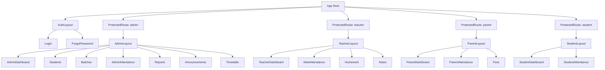

# Frontend Architecture — Attendance Management System for Coaching Institutes

## 1. Purpose & Scope

This document is the **single source of truth** for frontend implementation: folder structure, routing, layouts, component architecture, state management, forms, responsiveness, accessibility, and UI conventions. It does not cover backend API contracts (`api.md`), database design (`database.md`), or infrastructure/deployment (`deployment.md`).

It is written to be directly consumable by AI coding agents and developers to scaffold and build the frontend without further architectural decisions.

---

## 2. Tech Stack & Core Assumptions

| Concern | Choice | Rationale |
|---|---|---|
| Framework | **React 18+ with TypeScript** | Type safety across a form-heavy, role-based app; industry default for AI-agent-assisted codegen. |
| Build tool | **Vite** | Fast dev server, first-class TS/React support. |
| Routing | **React Router v6+** | Nested routes map cleanly to role-based layouts (see §4). |
| Styling | **Tailwind CSS** | Utility-first, enables rapid, consistent, mobile-first UI — critical given §13's "large buttons, minimal typing" requirement. |
| Component primitives | **Headless UI / Radix primitives** wrapped in a local design system | Accessible-by-default modals, dropdowns, tabs. |
| Server state | **TanStack Query (React Query)** | Caching, background refetch, optimistic updates — essential for the attendance marking screen (§16). |
| Client/UI state | **Zustand** for cross-page UI state; local `useState`/`useReducer` for component-local state | Avoids Redux boilerplate; scoped stores per domain (see §8). |
| Forms | **React Hook Form + Zod** | Performant uncontrolled forms + schema validation shared/mirrored from backend rules (`database.md` §5). |
| Icons | **lucide-react** | Consistent, tree-shakeable icon set. |
| Charts (Reports & Analytics) | **Recharts** | Matches feature list's "graphs" requirement (monthly %, trends, comparisons). |
| Date/time | **date-fns** | Lightweight; used for attendance date logic, timetable rendering. |
| Testing | Vitest + React Testing Library | Assumption — full detail belongs in a separate `testing.md`. |

**Assumption:** This is a single-page application (SPA) consumed via mobile browser and desktop browser — no native mobile app in this phase, per the "Mobile Friendly UI" feature being a responsive web requirement, not a separate React Native codebase. This should be revisited if native apps are scoped later (see §19).

---

## 3. Folder Structure

```
src/
├── app/
│   ├── App.tsx                  # Root component, providers
│   ├── router.tsx                # Route tree definition
│   └── providers/                # QueryClientProvider, AuthProvider, ThemeProvider
│
├── layouts/
│   ├── AuthLayout.tsx
│   ├── AdminLayout.tsx
│   ├── TeacherLayout.tsx
│   ├── ParentLayout.tsx
│   └── StudentLayout.tsx
│
├── pages/                        # One folder per route/page (see §6)
│   ├── auth/
│   ├── admin/
│   │   ├── dashboard/
│   │   ├── students/
│   │   ├── batches/
│   │   ├── reports/
│   │   └── announcements/
│   ├── teacher/
│   │   ├── dashboard/
│   │   ├── attendance/
│   │   ├── homework/
│   │   └── notes/
│   ├── parent/
│   └── student/
│
├── features/                     # Domain logic grouped by feature, not by type
│   ├── auth/
│   │   ├── api.ts                # React Query hooks (useLogin, useMe)
│   │   ├── schema.ts             # Zod validation schemas
│   │   └── types.ts
│   ├── students/
│   ├── batches/
│   ├── attendance/
│   ├── notifications/
│   ├── announcements/
│   ├── homework/
│   ├── notes/
│   └── reports/
│
├── components/                   # Shared, feature-agnostic UI (see §7)
│   ├── ui/                       # Design-system primitives: Button, Input, Modal...
│   ├── layout/                   # Sidebar, Topbar, MobileNav
│   ├── data-display/             # Table, StatusBadge, EmptyState, Avatar
│   └── feedback/                 # Toast, Skeleton, ErrorBoundary
│
├── hooks/                        # Cross-cutting hooks: useAuth, useDebounce, useMediaQuery
├── stores/                       # Zustand stores (see §8)
├── lib/                          # api-client.ts (axios/fetch wrapper), utils, constants
├── styles/                       # Tailwind config, global.css, design tokens
└── types/                        # Shared TypeScript types/interfaces
```

**Convention:** `features/*` owns data-fetching, validation, and business logic. `pages/*` owns composition and layout only — pages import from `features` and `components`, never the other way around. This keeps page components thin and logic testable/reusable.

---

## 4. Routing Architecture

### 4.1 Route Guard Strategy

- A single `<ProtectedRoute role={[...]}>` wrapper checks authentication (via `useAuth`) and role membership before rendering nested routes.
- Unauthenticated users are redirected to `/login`.
- Authenticated users hitting a route outside their role are redirected to their own role's dashboard (`/admin`, `/teacher`, `/parent`, `/student`) — not shown a generic 403, to minimize confusion for non-technical users (coaching owners, parents).

### 4.2 Route Map

| Path | Layout | Roles | Page |
|---|---|---|---|
| `/login` | `AuthLayout` | Public | Login |
| `/forgot-password` | `AuthLayout` | Public | Forgot Password |
| `/admin` | `AdminLayout` | Admin | Owner Dashboard |
| `/admin/students` | `AdminLayout` | Admin | Student List |
| `/admin/students/:id` | `AdminLayout` | Admin | Student Profile |
| `/admin/students/new` | `AdminLayout` | Admin | Add Student |
| `/admin/batches` | `AdminLayout` | Admin | Batch List |
| `/admin/batches/:id` | `AdminLayout` | Admin | Batch Detail |
| `/admin/batches/new` | `AdminLayout` | Admin | Create Batch |
| `/admin/attendance` | `AdminLayout` | Admin | Attendance Overview (all batches) |
| `/admin/reports` | `AdminLayout` | Admin | Reports & Analytics |
| `/admin/announcements` | `AdminLayout` | Admin | Announcements |
| `/admin/timetable` | `AdminLayout` | Admin | Weekly Timetable |
| `/teacher` | `TeacherLayout` | Teacher | Teacher Dashboard |
| `/teacher/attendance/:batchId` | `TeacherLayout` | Teacher | Mark Attendance (core screen — §16) |
| `/teacher/batches` | `TeacherLayout` | Teacher | My Batches |
| `/teacher/homework` | `TeacherLayout` | Teacher | Homework Manager |
| `/teacher/notes` | `TeacherLayout` | Teacher | Notes Manager |
| `/parent` | `ParentLayout` | Parent | Parent Dashboard |
| `/parent/attendance` | `ParentLayout` | Parent | Child's Attendance |
| `/parent/fees` | `ParentLayout` | Parent | Fees |
| `/student` | `StudentLayout` | Student | Student Dashboard |
| `/student/attendance` | `StudentLayout` | Student | My Attendance |
| `/student/homework` | `StudentLayout` | Student | Homework |
| `/student/notes` | `StudentLayout` | Student | Notes |
| `*` | — | Any | 404 Not Found |

### 4.3 Route Tree (Mermaid)



### 4.4 Lazy Loading

- Every top-level page is code-split via `React.lazy()` + `Suspense`, grouped by role bundle (`admin.chunk.js`, `teacher.chunk.js`, etc.) so a parent's device never downloads admin-only code.
- Suspense fallback = shared `<PageSkeleton />` (§11).

---

## 5. Layouts

Each role gets a dedicated layout shell, sharing a common structural pattern but different navigation items.

| Layout | Sidebar/Nav items | Notes |
|---|---|---|
| `AdminLayout` | Dashboard, Students, Batches, Attendance, Reports, Announcements, Timetable, Settings | Full desktop sidebar; collapses to bottom nav + hamburger on mobile. |
| `TeacherLayout` | Dashboard, Mark Attendance, My Batches, Homework, Notes | Attendance is the **primary/first** nav item — reflects core-feature priority. |
| `ParentLayout` | Dashboard, Attendance, Fees, Announcements | Minimal nav — parents are the least technical user group. |
| `StudentLayout` | Dashboard, Attendance, Homework, Notes | Read-only throughout; no write actions rendered. |

**Structural pattern (all layouts):**

```
┌─────────────────────────────────────┐
│ Topbar: Logo | Page Title | Avatar   │
├───────────┬───────────────────────────┤
│ Sidebar   │  Page Content             │
│ (desktop) │  (routed <Outlet />)      │
│           │                           │
└───────────┴───────────────────────────┘
```

- **Desktop (≥1024px):** persistent left sidebar.
- **Tablet (768–1023px):** collapsible sidebar (icon-only, expandable).
- **Mobile (<768px):** sidebar replaced by a bottom tab bar (max 4–5 items) + a "More" overflow sheet if needed. This directly serves the "Mobile Friendly UI" requirement, since bottom nav is thumb-reachable.

---

## 6. Page Hierarchy

Pages are organized by role, each composed from `features/*` hooks and `components/*` primitives.

### 6.1 Admin
- **Dashboard**: today's attendance %, present/absent counts, new admissions, today's batches, pending fees widget (cards row + one chart).
- **Students**: List (searchable/filterable table) → Detail (profile, attendance history, edit) → New/Edit (form).
- **Batches**: List (cards or table) → Detail (roster, schedule, attendance summary) → New/Edit (form with schedule builder).
- **Attendance Overview**: cross-batch view, filter by date/batch/standard, drill into any batch's daily record.
- **Reports & Analytics**: report type selector (daily/weekly/monthly/student-wise/batch-wise/teacher-wise) + export action + charts.
- **Announcements**: list + composer (title, message, category, target audience).
- **Timetable**: read-only weekly grid, computed from batch schedules.

### 6.2 Teacher
- **Dashboard**: today's classes list, pending attendance alerts, student count widget.
- **Mark Attendance** (core screen — detailed in §16).
- **My Batches**: roster view per batch.
- **Homework**: list + upload form (title, description, due date, file).
- **Notes**: list + upload form (title, file type, batch/standard scope).

### 6.3 Parent
- **Dashboard**: attendance %, recent attendance list, upcoming class card, fees summary.
- **Attendance**: full history, filterable by month, per child (if multiple children, a child switcher tab).
- **Fees**: pending/paid list, due dates.

### 6.4 Student
- **Dashboard**: attendance %, recent attendance, upcoming class.
- **Attendance**: full personal history.
- **Homework** / **Notes**: read-only lists, grouped by batch/subject.

---

## 7. Component Library / Design System

Organized using an **atomic-inspired** structure (not strict atomic design dogma — pragmatic 3-tier grouping).

### 7.1 UI Primitives (`components/ui/`)

| Component | Purpose | Key props |
|---|---|---|
| `Button` | Primary/secondary/danger/ghost variants | `variant`, `size` (`sm`/`md`/`lg`), `isLoading`, `icon` |
| `Input`, `TextArea`, `Select`, `DatePicker` | Form controls, all React-Hook-Form-compatible via `forwardRef` | `label`, `error`, `helperText` |
| `Checkbox`, `RadioGroup`, `Switch` | Form controls | |
| `Modal` / `Drawer` | Overlay containers; Drawer used on mobile instead of Modal for full-width forms | `isOpen`, `onClose`, `title` |
| `Tabs` | Section switching (e.g., report type selector) | |
| `Badge` | Generic label pill | `color` |
| `Tooltip` | Hover/focus hint | |
| `Spinner`, `Skeleton` | Loading states (§11) | |

### 7.2 Data Display (`components/data-display/`)

| Component | Purpose |
|---|---|
| `DataTable` | Sortable, paginated, searchable table — used for Students list, Reports. Supports a `mobileCardView` prop that renders rows as stacked cards below `md` breakpoint instead of a horizontally-scrolling table. |
| `StatusBadge` | Renders attendance status with color + symbol (see §7.4). |
| `EmptyState` | Shown when a list/table has zero results — icon + message + optional CTA. |
| `Avatar` | Student/teacher photo with initials fallback. |
| `StatCard` | Dashboard metric card (label, value, trend indicator). |
| `Chart` wrappers | `LineChartCard`, `BarChartCard`, `PieChartCard` — thin Recharts wrappers with consistent styling. |

### 7.3 Feature-Specific Composite Components

| Component | Feature | Notes |
|---|---|---|
| `AttendanceGrid` | Mark Attendance screen | Core component — see §16. |
| `StudentSearchBar` | Student search (§10 of feature list) | Debounced, searches name/phone/roll/batch/standard/parent name. |
| `BatchScheduleBuilder` | Batch creation | Day-of-week multi-select + time range picker, mirrors `batch_schedules` shape. |
| `TimetableGrid` | Timetable view | Weekly grid, color-coded by subject. |
| `AnnouncementComposer` | Announcements | Rich-enough text input (plain textarea + category/target selects — no WYSIWYG needed per current scope). |
| `FileUploader` | Homework/Notes | Drag-drop + tap-to-upload, shows type/size validation inline. |

### 7.4 Status & Color Semantics (Design Tokens)

| Status | Color token | Symbol | Usage |
|---|---|---|---|
| Present | `--color-success` (green) | ✓ | Attendance grid, badges |
| Absent | `--color-danger` (red) | ✗ | |
| Late | `--color-warning` (amber) | L | |
| Leave | `--color-info` (blue) | LV | |
| Active (student/batch) | `--color-success` | — | |
| Suspended | `--color-warning` | — | |
| Left/Inactive | `--color-neutral` (gray) | — | |

**Accessibility note:** color is never the sole indicator — every status also renders its letter/symbol and an `aria-label` (e.g., `aria-label="Present"`), satisfying WCAG 1.4.1 (Use of Color).

---

## 8. State Management

| State category | Tool | Examples |
|---|---|---|
| **Server state** (anything from the API) | TanStack Query | Student lists, attendance records, reports, notifications |
| **Auth state** | Zustand store (`useAuthStore`) + httpOnly cookie or token in memory | Current user, role, permissions |
| **Global UI state** | Zustand (`useUIStore`) | Sidebar collapsed/expanded, active theme, global toast queue |
| **Ephemeral form/local state** | `useState` / React Hook Form internal state | Modal open/close, form field values, in-progress attendance draft before save |
| **URL state** | React Router search params | Table filters, pagination page, date range — makes views shareable/bookmarkable (e.g., `/admin/reports?type=monthly&batch=xyz`) |

### 8.1 Server State Conventions

- Query keys follow a consistent hierarchical array pattern: `['students', 'list', filters]`, `['students', 'detail', studentId]`, `['attendance', batchId, date]`.
- Mutations invalidate the narrowest relevant query key on success (e.g., marking attendance invalidates `['attendance', batchId, date]` and `['dashboard', 'teacher']`, not the entire cache).
- **Optimistic updates** are used specifically for the attendance marking screen (toggling a student's status updates the UI instantly, before server confirmation) — critical for the "fast attendance screen" requirement. Rollback on error via React Query's `onError` + cached previous value.
- Stale time defaults: dashboards `30s`, lists `60s`, static reference data (subjects, classrooms) `5min`.

### 8.2 Why not Redux

Given the app's shape — mostly server-driven CRUD + a handful of local UI flags — React Query + light Zustand stores avoid Redux's boilerplate while still giving predictable, debuggable state. This is a deliberate architectural assumption; revisit only if client-side state complexity grows substantially (e.g., a fully offline-capable attendance app — see §19).

---

## 9. Forms & Validation

### 9.1 Pattern

- All forms use **React Hook Form** (`useForm`) with a **Zod schema** passed via `zodResolver`.
- Zod schemas live in `features/<domain>/schema.ts` and mirror the validation rules defined in `database.md` §5 (single source of truth for rules; frontend schema must not silently diverge from backend constraints).
- Field-level errors render inline below the input (`<Input error={errors.phone?.message} />`); a form-level error summary is **not** used — inline errors reduce cognitive load for non-technical users.

### 9.2 Representative Validation Rules (mirrored from `database.md`)

| Field | Rule |
|---|---|
| `phone`, `parentPhone` | Required, 10–15 digits, numeric only |
| `email` | Optional; valid email format if provided |
| `rollNumber` | Required, non-empty, uniqueness checked server-side (async validation on blur, debounced) |
| `admissionDate` | Required, cannot be a future date |
| `batch.capacity` | Required, integer, > 0 |
| `batchSchedule.endTime` | Must be after `startTime` |
| `attendance.date` | Cannot be a future date |
| `homework.dueDate` | Optional; if provided, cannot be before today |

### 9.3 Async/Server-Validated Fields

- Roll number uniqueness and phone/email uniqueness (for user accounts) require a server round-trip. Pattern: debounce (400ms) → API check → show inline spinner in the field → resolve error/success state before allowing submit.

### 9.4 Submission UX

- Submit buttons show `isLoading` state (spinner + disabled) during the mutation — never allow double-submit.
- On success: toast confirmation + redirect (for create/edit flows) or inline success state (for quick actions like attendance save).
- On failure: toast with a human-readable message; form remains populated so the user doesn't retype.

---

## 10. Data Fetching & API Integration Patterns

- A single `lib/api-client.ts` wraps `fetch`/`axios` with: base URL, auth token attachment, automatic 401 → redirect-to-login handling, and centralized error shape normalization.
- Every `features/<domain>/api.ts` exposes typed hooks (`useStudents(filters)`, `useCreateStudent()`, `useMarkAttendance()`) — pages never call the API client directly.
- Pagination: server-side, cursor or page-based (aligned with whatever `api.md` defines) — frontend `DataTable` accepts `page`, `pageSize`, `totalCount` props and stays presentation-only.
- Search inputs are debounced (300–400ms) before triggering a query, to avoid request spam on the search-heavy Student Search feature.

---

## 11. Loading States

| Context | Pattern |
|---|---|
| Full page load | `<PageSkeleton />` — layout-shaped gray blocks matching the eventual content structure (not a generic spinner), to reduce perceived load time and layout shift. |
| Table/list load | Skeleton rows (5–8 shimmering placeholder rows matching column structure). |
| Dashboard cards | Skeleton `StatCard` with shimmering number placeholder. |
| Button actions (save, submit, mark attendance) | In-button spinner + disabled state, never a full-page blocking spinner for small actions. |
| Attendance grid | Skeleton roster rows while student list loads; individual row shows a micro-spinner only on the specific student being toggled (not the whole grid) — reinforces the "fast" feel. |

**Rule:** never show a blank white screen during any async operation — always a skeleton, spinner, or previous cached data (via React Query's `keepPreviousData`) is visible.

---

## 12. Error Handling

### 12.1 Error Boundary Strategy

- A top-level `<ErrorBoundary>` wraps the router — catches render crashes, shows a friendly "Something went wrong" screen with a "Reload" action, and logs to the error-tracking service (assumption: Sentry or equivalent — infra detail out of scope here).
- Route-level boundaries are **not** added individually unless a specific page is known to be high-risk (e.g., report chart rendering with unpredictable data shapes) — keeps the pattern simple.

### 12.2 API Error Handling

| Error type | UX response |
|---|---|
| Network/offline | Toast: "You're offline — check your connection." Attendance marking screen queues changes locally and retries (see §16.4). |
| 400 Validation error | Map field-level server errors back onto the relevant RHF field via `setError`, in addition to any client-side validation. |
| 401 Unauthorized | Silent redirect to `/login`, preserving intended destination via query param for post-login redirect. |
| 403 Forbidden | Toast: "You don't have permission to do this." No redirect — stay on current page. |
| 404 Not Found | Inline `EmptyState`/"Not found" message within the page content area, not a full-page crash. |
| 409 Conflict (e.g., duplicate roll number, double-booked classroom) | Inline field error with the specific conflict message from the API. |
| 500 Server error | Toast: "Something went wrong on our end. Please try again." + optional "Retry" action on the failed mutation. |

### 12.3 Empty States

Every list/table has a distinct empty state (not just "no data"):
- No students yet → "Add your first student" CTA.
- No results for a filter/search → "No students match your search" + "Clear filters" action.
- No attendance marked today → "Attendance not yet marked for this batch" CTA linking to the marking screen.

---

## 13. Responsive Design

### 13.1 Breakpoints (Tailwind defaults, adopted as-is)

| Breakpoint | Width | Primary device |
|---|---|---|
| Base (no prefix) | <640px | Mobile |
| `sm` | ≥640px | Large mobile / small tablet |
| `md` | ≥768px | Tablet |
| `lg` | ≥1024px | Small laptop |
| `xl` | ≥1280px | Desktop |

### 13.2 Mobile-First Principles (directly serving the feature spec's "Mobile Friendly UI" requirement)

- **Design and build mobile-first**: base Tailwind classes target mobile; `md:`/`lg:` prefixes layer on desktop enhancements — never the reverse.
- **Touch targets**: minimum 44×44px for all interactive elements (buttons, checkboxes, attendance status toggles) per WCAG 2.5.5 and standard mobile ergonomics.
- **Large buttons, minimal typing**: attendance status selection uses tap-to-cycle or single-tap chip selection (Present/Absent/Late/Leave), never a dropdown or text field, on mobile.
- **Bottom navigation** replaces sidebar navigation below `lg` (§5).
- **Tables become cards** below `md` for any dense tabular view (student list, reports) via `DataTable`'s `mobileCardView`.
- **Sticky action bars**: on the attendance marking screen, the "Save"/"Mark All Present" action bar is sticky to the bottom of the viewport on mobile, always reachable without scrolling.
- **Reduced typing**: prefer selects, toggles, and search-as-you-type over free-text entry wherever the data is enumerable (status, standard, batch).

---

## 14. Accessibility

- **Semantic HTML** first — `<button>` for actions, `<nav>` for navigation, `<table>` for genuinely tabular data (with proper `<th scope>` usage).
- **Keyboard navigation**: all interactive elements reachable via `Tab`; attendance grid supports arrow-key navigation between student rows and number-key shortcuts (`1`=Present, `2`=Absent, `3`=Late, `4`=Leave) for fast desktop marking.
- **Focus management**: opening a `Modal`/`Drawer` traps focus and returns it to the triggering element on close.
- **ARIA labels**: icon-only buttons always carry `aria-label`; status badges carry `aria-label` per §7.4.
- **Color contrast**: all text/background combinations meet WCAG AA (4.5:1 for normal text, 3:1 for large text) — enforced via design tokens in §15, not ad-hoc colors.
- **Screen reader announcements**: toast notifications use `aria-live="polite"`; critical errors use `aria-live="assertive"`.
- **Form labels**: every input has a visible, associated `<label>` — placeholder text is never used as a label substitute.

---

## 15. Design System Tokens

Defined as CSS custom properties in `styles/tokens.css`, consumed via Tailwind config extension — not hardcoded hex values in components.

| Token category | Examples |
|---|---|
| Color | `--color-primary`, `--color-success`, `--color-danger`, `--color-warning`, `--color-info`, `--color-neutral`, `--color-bg`, `--color-surface`, `--color-text-primary`, `--color-text-secondary` |
| Typography | `--font-sans` (system font stack for fast load on low-end devices), scale: `text-xs` (12px) → `text-3xl` (30px) |
| Spacing | Tailwind's default 4px-based scale (`1`=4px ... `16`=64px) |
| Radius | `--radius-sm` (4px), `--radius-md` (8px), `--radius-lg` (12px) — used consistently for cards, buttons, inputs |
| Shadow | `--shadow-sm`, `--shadow-md` — used sparingly, mainly for modals/dropdowns over content |

**Assumption:** A dark mode is not required by the feature spec and is **not implemented** in this version. Tokens are structured so a `dark:` theme layer could be added later without component rewrites.

---

## 16. Core UI Pattern: Attendance Marking Screen

Given its status as the system's core feature, this screen gets a dedicated specification.

### 16.1 Layout

```
┌───────────────────────────────────────────┐
│ Batch: Class 10 Maths   Date: [Today ▾]    │
├───────────────────────────────────────────┤
│ [Mark All Present]  [Save Draft]  [Save]   │  ← sticky action bar (mobile: bottom)
├───────────────────────────────────────────┤
│ ● Rahul Sharma         [✓][✗][L][LV]       │
│ ● Priya Patel          [✓][✗][L][LV]       │
│ ● ...                                      │
└───────────────────────────────────────────┘
```

### 16.2 Interaction Rules

- Default state on screen load: all students shown as **unmarked** (no pre-selected status) — prevents accidental mass-incorrect submission; exception: if a draft exists (`is_draft = true` in `database.md`), pre-populate from the draft.
- Tapping a status chip selects it and visually deselects the others for that row (single-select per row, not toggle).
- **"Mark All Present"** is a one-tap bulk action that sets every unmarked row to Present; it does **not** override rows already explicitly marked (protects intentional Absent/Late/Leave entries from being overwritten).
- **Bulk edit mode**: a toggle that allows multi-select of rows (checkbox per row) + a single action bar to apply one status to all selected rows.
- Date is defaulted to today; changing the date reloads the roster for that date (with a warning toast if unsaved changes exist).

### 16.3 Save Behavior

- **"Save Draft"**: persists current selections with `is_draft = true`; does not trigger parent notifications (per `database.md` §5.5 business rule); screen shows a "Draft saved" toast and a persistent "Draft" badge until finalized.
- **"Save"**: finalizes attendance (`is_draft = false`), triggers the notification pipeline, and shows a success toast with a count summary ("22 Present, 3 Absent, 1 Late saved").
- Both actions use optimistic UI updates (§8.1) — the UI reflects the save instantly; a failed save reverts the row(s) and shows an inline error + retry option.

### 16.4 Offline/Flaky Network Resilience

- **Assumption:** given the target users (local coaching centers, potentially unreliable connectivity), the attendance screen queues status changes in local component state regardless of network status, and only synchronizes on explicit "Save"/"Save Draft" tap — it does not attempt per-tap network calls. This keeps the interaction fast and functional even on poor connections.
- If "Save" fails due to network loss, the payload is retained in memory and a persistent banner ("Not saved — tap to retry") is shown until successfully synced or the user navigates away (with a confirmation prompt if unsaved changes exist).

---

## 17. Notifications & Toasts (In-App)

- A single global `<ToastProvider>` (Zustand-backed queue) renders transient toasts top-right (desktop) / top-center (mobile).
- Toast types: `success`, `error`, `warning`, `info` — mapped to the same color tokens as §7.4/§15.
- Auto-dismiss after 4s for `success`/`info`; `error`/`warning` persist until manually dismissed, since error context matters more than screen tidiness.
- In-app notification **inbox** (bell icon, distinct from toasts) shows persisted `notifications` records (per `database.md` §5.6) for the logged-in user — relevant for Parent/Student roles receiving attendance/announcement notifications.

---

## 18. Performance Considerations

- Route-based code splitting (§4.4) keeps initial bundle small — critical for low-end Android devices common among this user base.
- Images (student photos) are lazy-loaded (`loading="lazy"`) and served at a capped display size; avatar fallback (initials) used when photo is missing or still loading.
- `DataTable` virtualizes rows beyond ~100 items (e.g., large batch-wide student lists) to avoid DOM bloat.
- Memoize expensive derived computations (e.g., attendance % calculations across a large roster) with `useMemo`; avoid recomputing on every keystroke in unrelated filters.
- Debounce all search/filter inputs (§9.3, §10).
- React Query's cache + `staleTime` (§8.1) minimizes redundant network calls when navigating back and forth between dashboard and detail pages.

---

## 19. Future Extensibility

- **Native mobile app**: if usage patterns show heavy mobile reliance beyond what responsive web can serve well (e.g., push notifications, offline-first attendance), the `features/*` layer (API hooks, validation schemas, types) is framework-agnostic enough to port to React Native with a new `components/`/`pages/` layer — this is the reason business logic is kept out of page components (§3).
- **Dark mode**: token structure (§15) supports adding a `dark:` variant layer without touching component logic.
- **Learning platform expansion** (per feature spec's Notes/Homework note): the `FileUploader`/list pattern used for Homework and Notes is intentionally shared, so a future richer LMS view (video player, quizzes) can extend the same `features/notes` structure rather than replacing it.
- **RBAC granularity**: if roles beyond the current 4 are introduced (per `database.md` §14), `<ProtectedRoute>` and layout selection logic should read from a permissions list rather than a hardcoded role string — flagged here so the frontend guard isn't hardcoded to exactly 4 roles.
- **Internationalization**: not required by current scope; if added later, all user-facing strings should be extracted to a translation layer (e.g., `react-i18next`) — current implementation may use inline strings, which is an explicit, documented shortcut for this version.

---

## 20. Developer Conventions

- **File naming**: `PascalCase.tsx` for components, `camelCase.ts` for hooks/utils, `kebab-case` for non-component asset files.
- **Component structure**: one component per file; co-locate component-specific sub-components in the same file only if trivial (<20 lines) and not reused elsewhere.
- **Imports**: absolute imports via TS path aliases (`@/components`, `@/features`, `@/hooks`) — no deep relative `../../../` chains.
- **Barrel exports**: each `features/<domain>/` and `components/ui/` folder exposes an `index.ts` barrel for clean imports (`import { Button, Input } from '@/components/ui'`).
- **Props typing**: every component's props are an explicit `interface ComponentNameProps`, never inline anonymous types for anything beyond trivial one-off components.
- **No inline styles**: Tailwind utility classes only; use `clsx`/`cn()` helper for conditional class composition.
- **Commit/PR scope**: one feature or fix per PR, mirroring the `features/<domain>` folder boundaries where practical — keeps AI-agent-generated diffs reviewable.
- **Component documentation**: complex composite components (`AttendanceGrid`, `DataTable`, `BatchScheduleBuilder`) include a short JSDoc block above the component describing props and key behaviors, since these are the components most likely to be extended later.
